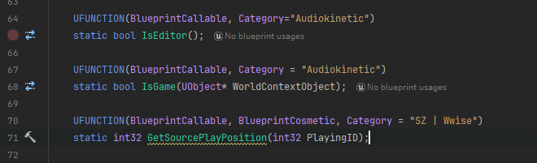

<font color=#4db8ff>Link：</font> https://soundoer.com/Xichen_GADD/A-Practice-of-Music-as-Level-Design-with-UE-Wwise.html

AkGameplayStatics.h

```c++
	UFUNCTION(BlueprintCallable, BlueprintCosmetic, Category = "SZ | Wwise")
	static int32 GetSourcePlayPosition(int32 PlayingID);
```



Blueprint 中的 PostEvent 节点默认隐藏了 `AK_EnableGetSourcePlayPosition` 标志，因此需要做一些额外的修改将其暴露出来。在 AkGameplayTypes 类中的 `enum class EAkCallbackType` 部分添加以下信息。


AkGameplayTypes.h