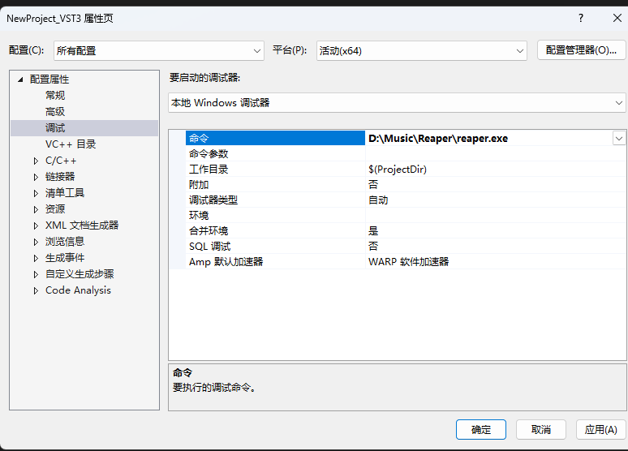
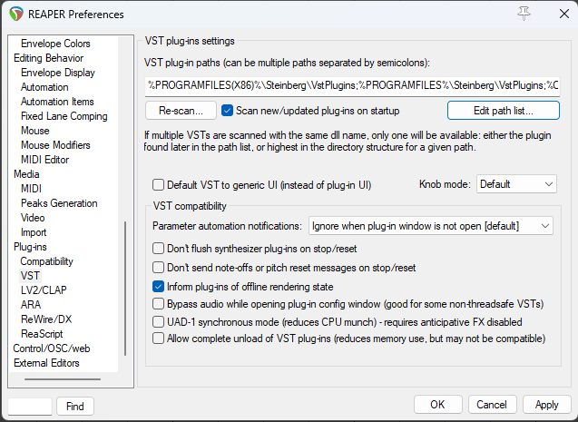
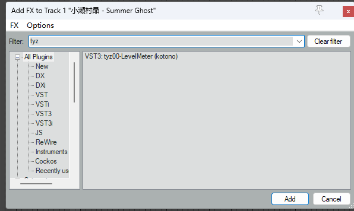
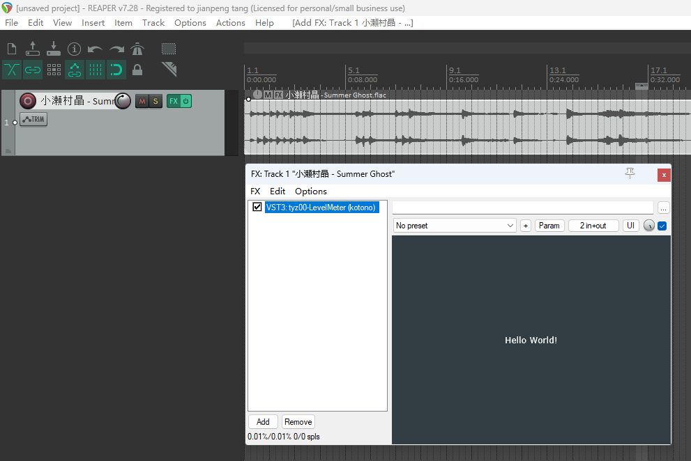
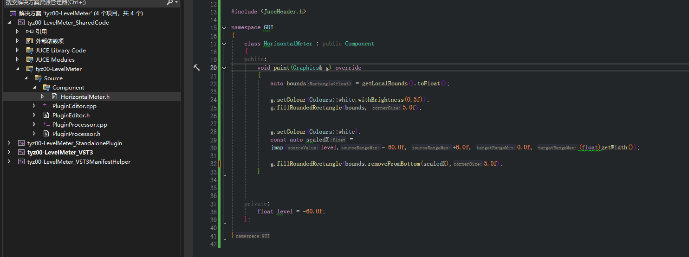
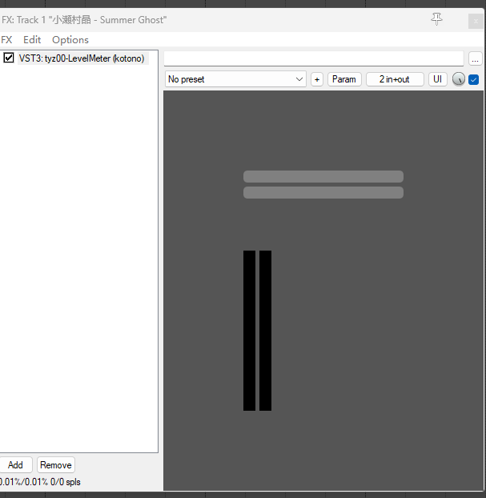

https://www.youtube.com/watch?v=ILMdPjFQ9ps&list=PLbqhA-NKGP6DiGtVK4WhEHgNZQS7NmBH7&index=1


#### 一、调试软件



VST3设置为启动项


编译项目之后会自动打开Reaper

可以在Reaper 中找到，找不到可以添加插件路径， 扫描，重新打开









#### 二、RMS

2.1 


从均值平方根的计算中获得gain 转化为分贝值


添加模块

##### 2.2 H



```c++

#pragma once

#include <JuceHeader.h>

namespace GUI
{
	class HorizontalMeter : public Component
	{
	public:
		void paint(Graphics& g) override
		{
			auto bounds = getLocalBounds().toFloat();

			g.setColour(Colours::white.withBrightness(0.5f));
			g.fillRoundedRectangle(bounds, 5.0f);


			g.setColour(Colours::white);
			const auto scaledX = 
			jmap(level,- 60.0f, +6.0f, 0.0f, (float)getWidth());

			g.fillRoundedRectangle(bounds.removeFromBottom(scaledX),5.0f);
		}


	private:
		float level = -60.0f;
	};

}

```

##### 2.3 V




```c++
/*
  ==============================================================================

    VerticalGradientMeter.h
    Created: 25 Jan 2025 1:05:51am
    Author:  tyz

  ==============================================================================
*/

#pragma once

#include <JuceHeader.h>

namespace GUI
{
	class VerticalGradientMeter : public Component, public  Timer
	{
	public:
		//r 值引用			使用移动，而不是复制构造
		VerticalGradientMeter(std::function<float()>&& valueFunction) : valueSupplier(std::move(valueFunction))
		{
			startTimerHz(24);
		}
		void paint(Graphics& g) override
		{
			const auto level = valueSupplier();

			auto bounds = getLocalBounds().toFloat();

			g.setColour(Colours::black);
			g.fillRect(bounds);


			
			g.setGradientFill(gradient);

			const auto scaledY =
				jmap(level, -60.0f, +6.0f, 0.0f, static_cast<float>(getHeight()));

			g.fillRect(bounds.removeFromBottom(scaledY));
		}

		void setLevel(const float value) { level = value; }

		void resized() override
		{
			auto bounds = getLocalBounds().toFloat();

			gradient = ColourGradient{
				Colours::green,
				bounds.getBottomLeft(),
				Colours::red,
				bounds.getTopLeft(),
				false
			};

			gradient.addColour(0.5, Colours::yellow);

		}


		void timerCallback() override
		{
			repaint();
		}
	private:
		float level;
		std::function<float()> valueSupplier;
		ColourGradient gradient;
	};
}
```


```c++
/*
  ==============================================================================

    This file contains the basic framework code for a JUCE plugin editor.

  ==============================================================================
*/

#include "PluginProcessor.h"
#include "PluginEditor.h"

//==============================================================================
Tyz00LevelMeterAudioProcessorEditor::Tyz00LevelMeterAudioProcessorEditor (Tyz00LevelMeterAudioProcessor& p)
    : AudioProcessorEditor (&p), audioProcessor (p),
    verticalGradientMeterL([&]() { return audioProcessor.GetRmsValue(0); }),
    verticalGradientMeterR([&]() { return audioProcessor.GetRmsValue(1); })
{
    // Make sure that before the constructor has finished, you've set the
    // editor's size to whatever you need it to be.
    addAndMakeVisible(horizontalL);
    addAndMakeVisible(horizontalR);

	addAndMakeVisible(verticalGradientMeterL);
    addAndMakeVisible(verticalGradientMeterR);
    setSize (400, 500);


    startTimerHz(24);
    //startTimer(1000/24);
}

Tyz00LevelMeterAudioProcessorEditor::~Tyz00LevelMeterAudioProcessorEditor()
{
}

void Tyz00LevelMeterAudioProcessorEditor::timerCallback()
{
    horizontalL.setLevel(audioProcessor.GetRmsValue(0));
    horizontalR.setLevel(audioProcessor.GetRmsValue(1));

    horizontalL.repaint();
    horizontalR.repaint();
}

//==============================================================================
void Tyz00LevelMeterAudioProcessorEditor::paint (juce::Graphics& g)
{
    g.fillAll(Colours::darkgrey);
}

void Tyz00LevelMeterAudioProcessorEditor::resized()
{
    horizontalL.setBounds(100, 100, 200, 15);
    horizontalR.setBounds(100, 120, 200, 15);

    verticalGradientMeterL.setBounds(100, 200, 15, 200);
    verticalGradientMeterR.setBounds(120, 200, 15, 200);
}

```

#####  2.4 38.26
