https://www.youtube.com/watch?v=SLx7kjuFheY&list=PLuxj2jXSuTvvqYcDLJ-poN-JxvqX0wq-m&index=1&t=432s

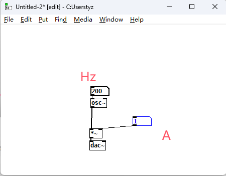

##### 1.1 metro

metro 节拍器

Ctrl 整数， Shfit 小数

abc 麦克风

noise 噪音

osc sine

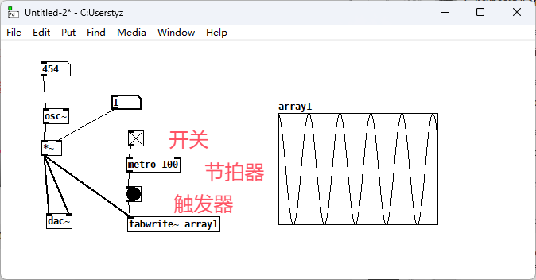

#### 1.2 Line

X 为开关

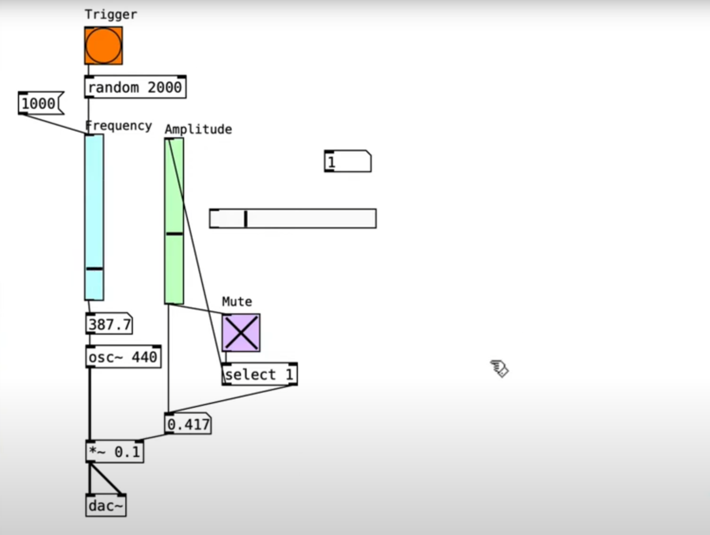

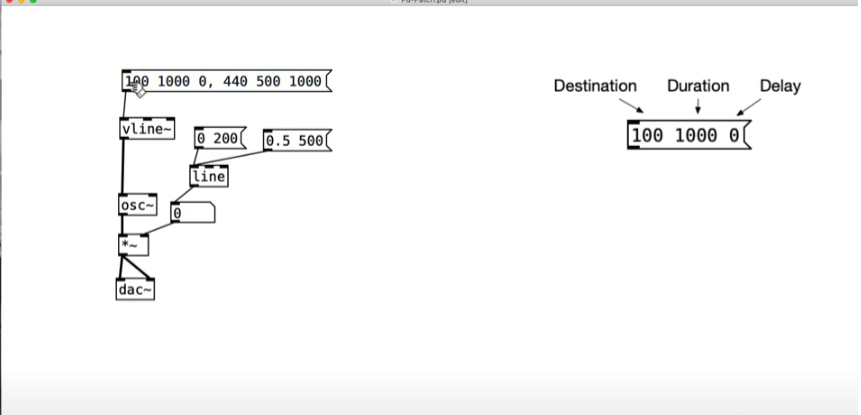

#### 1.3 Modulation

https://www.youtube.com/watch?v=KCmhD3E4dSQ&list=PLuxj2jXSuTvvqYcDLJ-poN-JxvqX0wq-m&index=8&pp=iAQB

##### 1.4 录波器

https://www.youtube.com/watch?v=hPlCwKbRyEk&list=PLuxj2jXSuTvvqYcDLJ-poN-JxvqX0wq-m&index=10&t=6s

带通滤波器

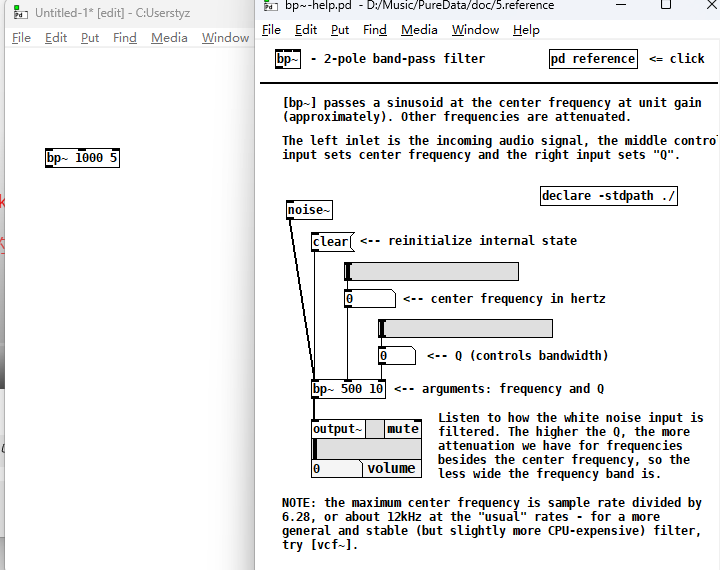

#### 二、

##### 2.1 Gain

https://www.youtube.com/watch?v=YpyPLybY3-E&list=PLuxj2jXSuTvvqYcDLJ-poN-JxvqX0wq-m&index=11

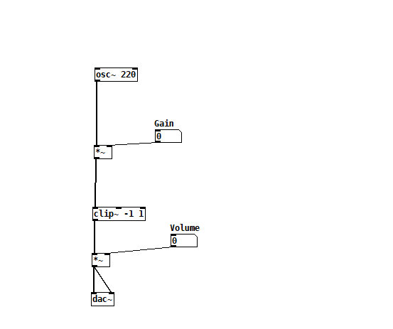

##### 2.2 compress

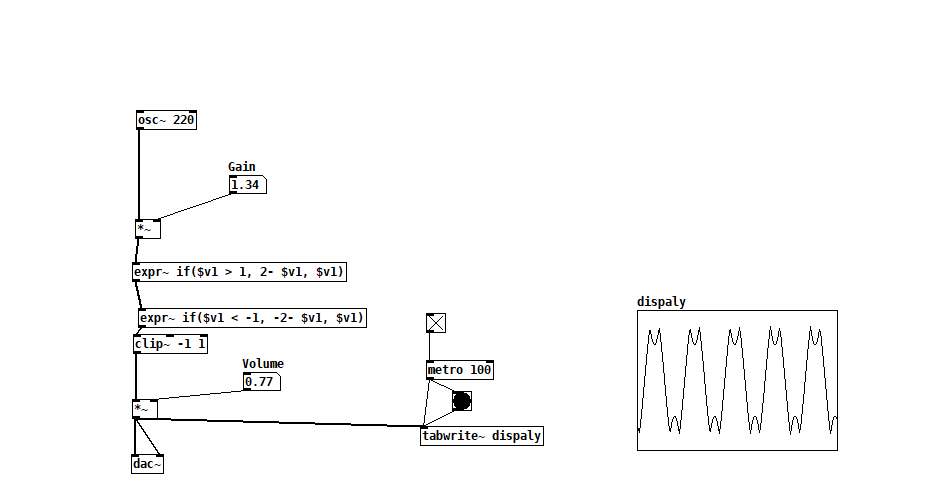

##### 2.3 马赛克降频

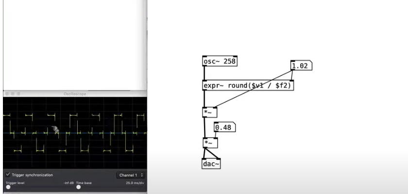

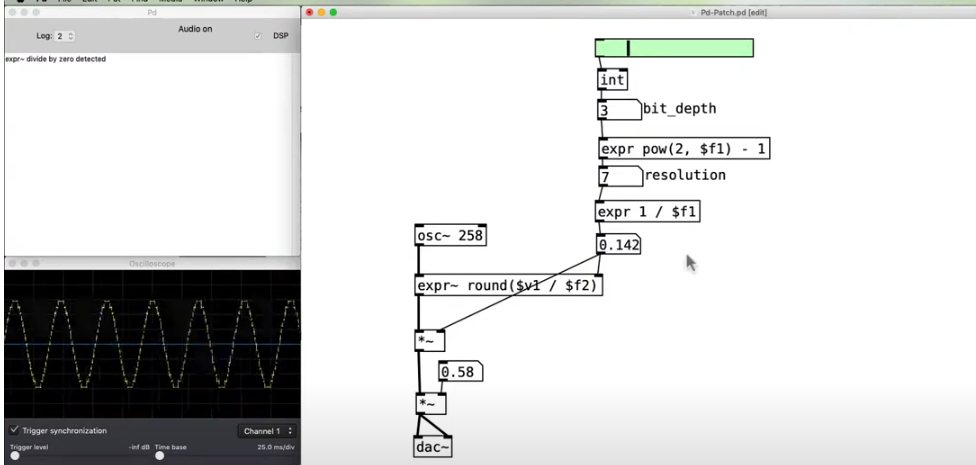

##### 2.4 oscillators

https://www.youtube.com/watch?v=YDL-UwdSSj0&list=PLuxj2jXSuTvvqYcDLJ-poN-JxvqX0wq-m&index=16

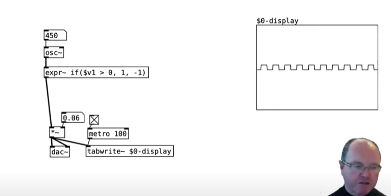

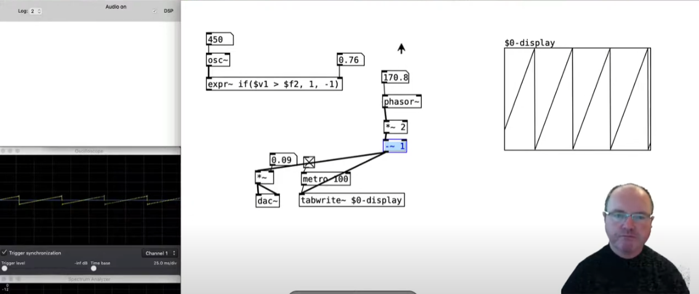

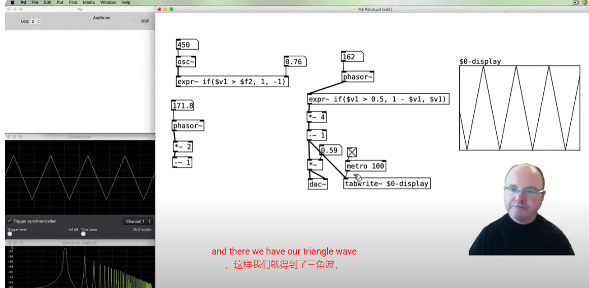

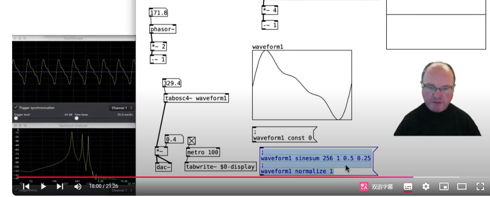

##### 2.5 Low  High band Filter

单机波形

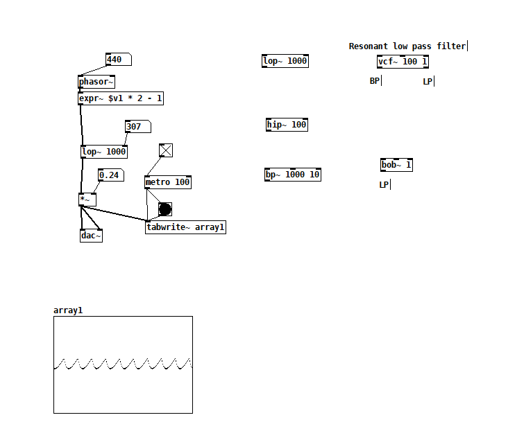

##### 2.6 Amplitude

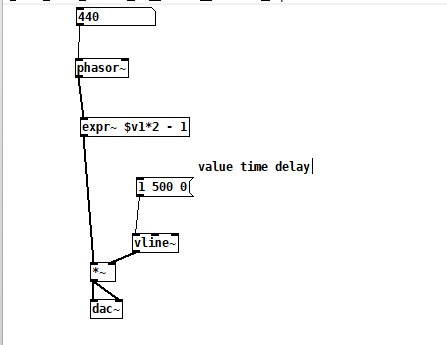

添加一个指数渐进

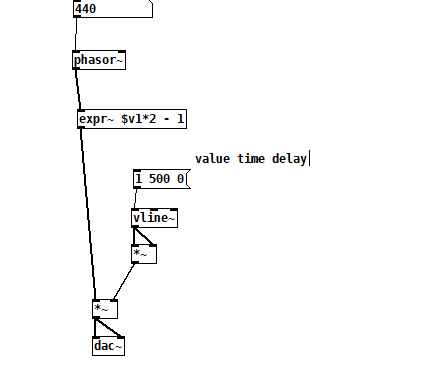

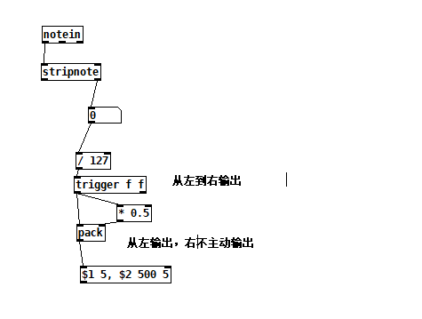

#### 三、子模块

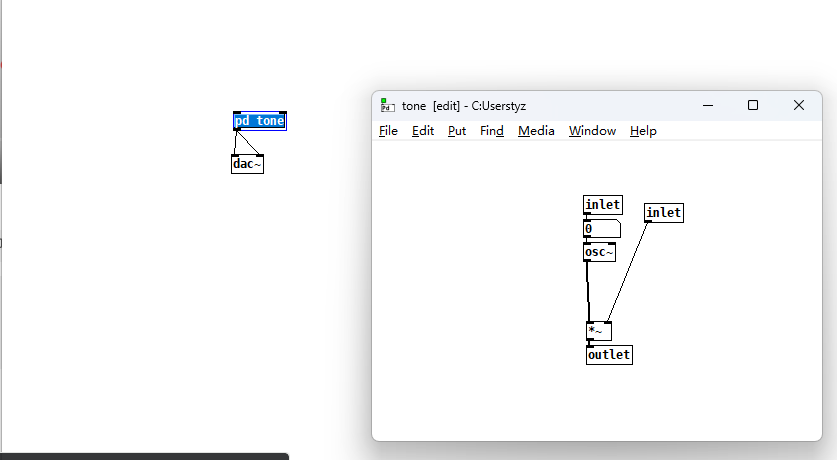

##### 3.1 call

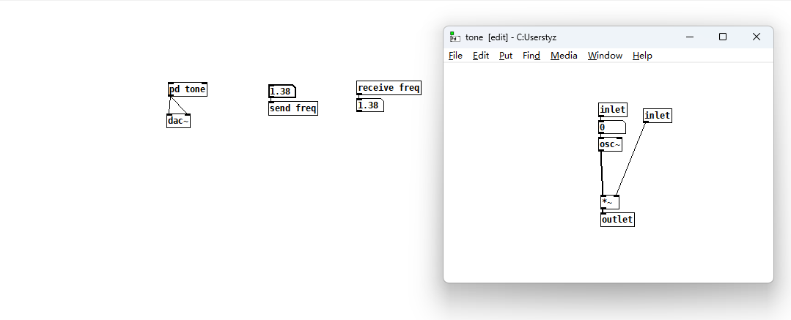

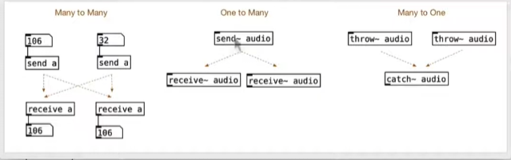

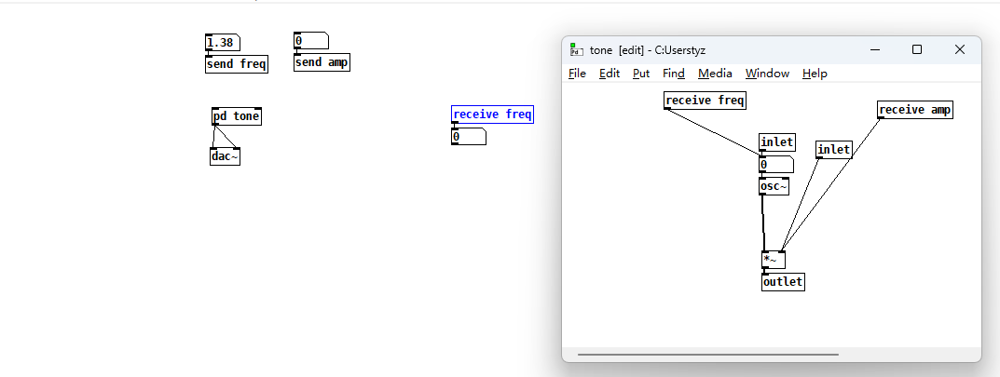

##### 3.2 Class

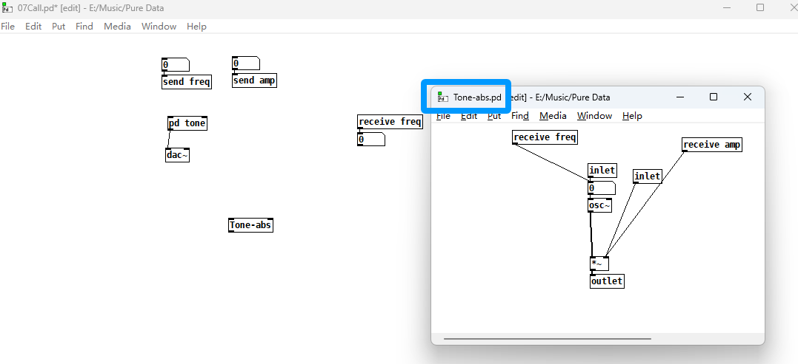

##### 3.3 预设

内部传递，会传入函数重本

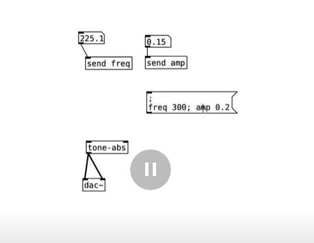

##### 3.4 

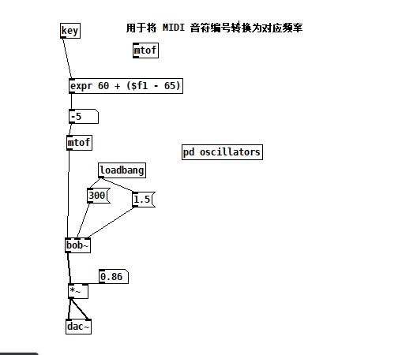

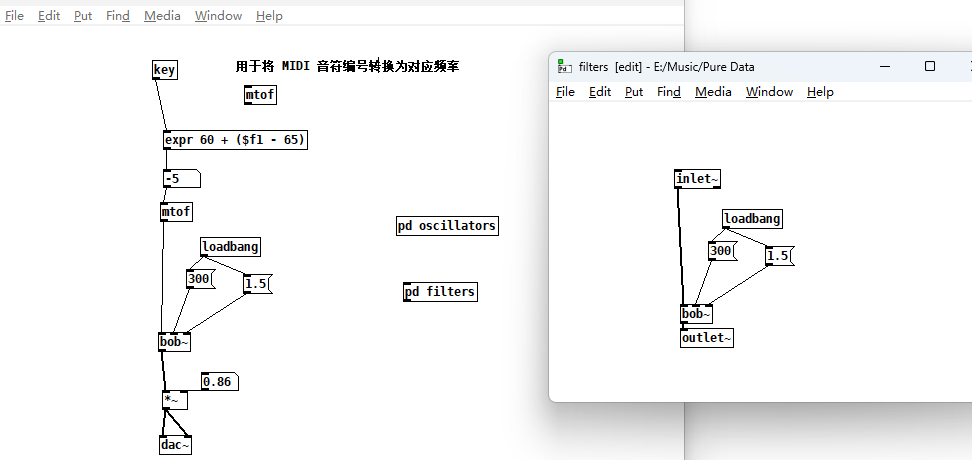