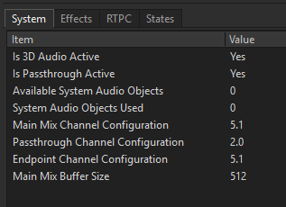
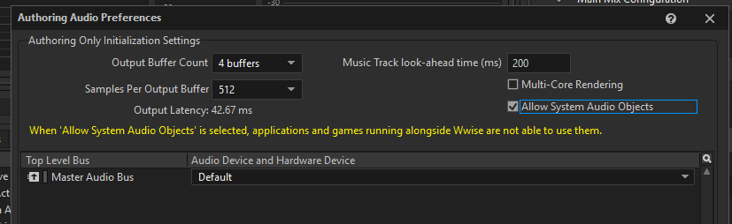
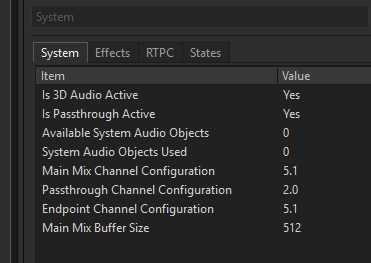
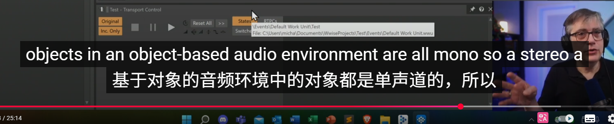
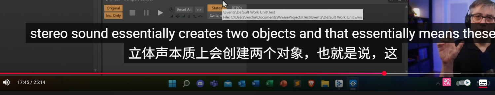
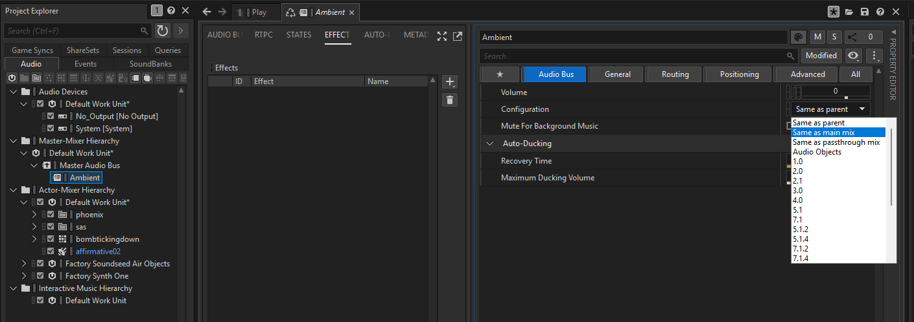

https://www.youtube.com/watch?v=hy6XHiBbAW8

勾选Allow 3D Audio,Wwise将会自动构建在专用的音频设备上的可能性，如果有一个支持系统3D 音频的设备

如果设备支持，那么游戏基本就能播放3D Audio

没反应是因为系统目前没有设置为渲染空间化音频，所以需要再Window上开启空间化音频

当我们开启以后，3D和Passthrough 将会被激活

#### Pass through

HeadLock mix 头锁混音，是所有没有进行Specialized的内容都会通过这里播放

直接进入左右声道，无需其他的渲染，所以也叫直通混音，

会直接发送到耳机的左右扬声器

这个是Wwise自动帮我们做到的，会智能帮我们检测，将音频发送到那种混音中

开启Position ，测试

#### Object

游戏中的类型

EndPoint Render的对象，也就是渲染最终音频的音频设备上渲染的对象

Wwise允许将游戏对象，发送到EndPoint 渲染器的对象中

当然也可以选择不发送到EndPoint中而是发送到Main Mix中

只有一个请求可以实际获得他们，所以默认关闭

#### 3D 

Wwise 理解为一个空间化音频对象，就会发送到EndPoint 中的音频对象占位

这个时候他不是在Game 也不是在Wwise而是在EndPoint中渲染的

不仅传递音频，还传递游戏中的所有定位数据

这是一种完全不同的音频对象熏染方式，不再是在游戏中渲染，而是在EndPoint中渲染

播放两个System 音频 四通道

在 Object-based 音频系统中，每一个音频对象（sound object）通常只包含一条“干净的、未预混的单声道音轨”，并由引擎在运行时根据其位置、方向等信息进行空间渲染。

每个声音对象（Object）**只携带一条音频数据（Mono 单声道）**

它的位置（如 X/Y/Z）、朝向、体积等**由引擎实时计算空间化效果**

空间化后才最终输出为立体声、环绕声或 HRTF 处理的耳机声

如果每个 Object 本身是立体声或多声道，那么：

- 空间化会**变得不精确**（你无法为每个声道单独定位）
- 会造成**声音重影**或失真（多个声道间距固定）
- 与**HRTF 或 Binaural 渲染不兼容**

因此，为了更好的空间化定位，每个 object 通常是单通道的（Mono），这样：

> 🎯 每个声音都可以被当作“一个点”，在三维空间中任意移动，而不会受到声道结构限制。

这是个非常核心的问题，牵涉到 **Dolby Atmos 的核心工作机制：Object-based 渲染**。

每个 Atmos 音频 Object 是“单通道”的，但 Atmos 渲染器会根据每个 Object 的位置、方向、听者视角等参数，实时计算声场，并输出到任意数量的扬声器或耳机声道上（比如双声道、5.1、7.1、9.1.6，或 Binaural）。

Atmos 音频分为两类：

- **Bed（床位）音轨**：比如传统的 7.1 音轨，用于背景音乐/环境音，**是固定的多通道内容**
- **Object（对象）音轨**：每个对象是一段 **Mono 单声道音频 + 元数据（位置、移动等）**

背后有直升机飞过，你听到的是从后方逐渐移向前方的声音。

这个声音实际只是一段单声道音频，Atmos 渲染器根据它的 3D 路径、你当前的监听方向，把它“模拟”为空间移动声音，并输出两个耳机声道。

那么为什么是两个对象

> 在 Wwise 中，如果你播放一个 **立体声（Stereo）声音源**，但启用了 **System Audio Object 输出**，**Wwise 会自动将每个声道（L/R）拆分为两个独立的单通道 Audio Object**，分别发送给系统级音频渲染器（如 Dolby Atmos）进行空间渲染。

这就是你看到“**立体声其实是两个对象**”的原因。

那么 Wwise 会自动将这个立体声：

> 📦 **拆分成两个单声道对象**，每个声道作为独立的 Audio Object 输出！

这两个 Object：

- 共享同一个声音内容的两个声道（L 和 R）
- 分别获得空间定位（通常略微错开）
- 被底层渲染器（如 Dolby Atmos）当作两个单独声音处理

这是为了符合 **Object-based 渲染的标准要求**：

- Atmos 渲染器不接受多声道对象 —— 它只接受“**一个 Mono 声道 + 空间信息**”作为一个处理单位
- 所以 Wwise 要“**自动拆分**”才能让立体声参与系统级空间渲染

超过对象则会降级到Main Mix

如果没有空间化或者和其他非空间化的音频混合在一起，Wwise会认为

强制发送Main Mix

氛围对选个，环境混音

不把环境音发给对象

当然也可以强制发送到Pass Through

杜比只有16个系统音频对象

