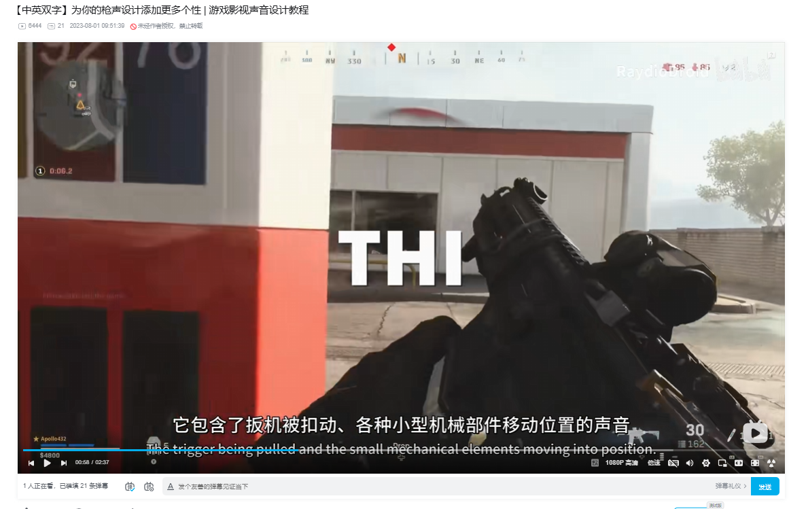

Link：https://www.bilibili.com/video/BV1UE411S7SM/?spm_id_from=333.1391.0.0&vd_source=fc3995fc21714a345f57a951f8232fb7

侧链压缩、闪避：播放重要声音的时候，降低次要声音的音量

编曲剔除贝斯和鼓声的吸入效应

##### Kill

击杀：低频爆炸、金属撞击、风声

#### gun

主要的枪声

机械层，如：进弹，提高音量提示子弹数量

低频层：爆炸低频

后景Or 尾音：环境细节增添的动态变化，桥洞之类的滤波、混响

空间音频

### 分析二

#### 录音

