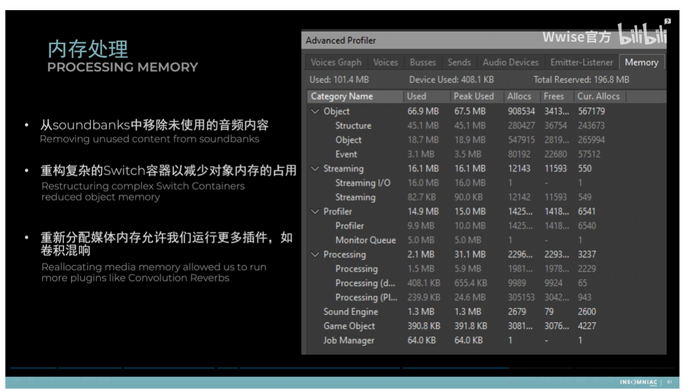
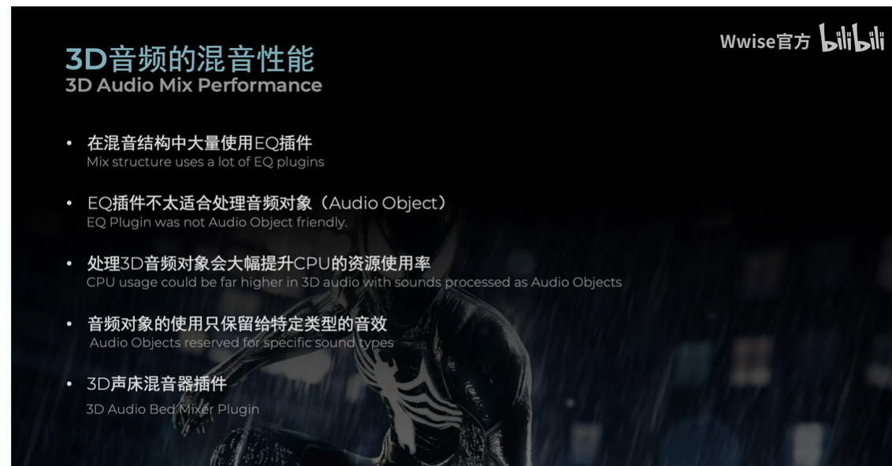
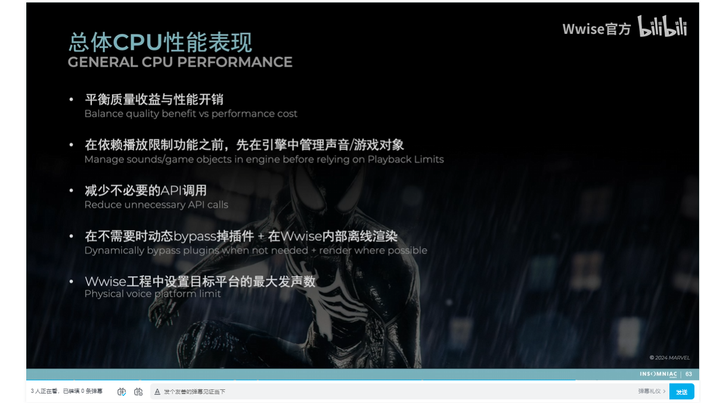

s

解决项目中声音方面的问题，在尽可能满足声音设计师需求的同时，提升声音的生产效率及其在游戏中的使用表现

```c++
Graph View - Shader Graph
优化-> Swith 都是同一个。单独任务单独Bank

对话 True ->  RTPC ->  
Event 则 Silence
RTPC 则 侧链
    
战斗 -> 配合特效以及架构
过场动画，Cue 触发
```

```c++
不同武器不同Script Object，Data Asset，使用加载Bank
空间音频的射线数，深度
Capture ： Default 和Low Engine  Default 
```

```c++
不规则区域环境声，空间音频，wwise打包机什么的
多平台优化，内存和io取舍什么的
钩子函数监测提交，统一打包soundbank
资源冲突和打包异常
转码器，多平台，质量设置，减少大小，采样率
```

```c++
微软Project Acoustics 空间音频 烘焙加速悠哈
```

```c++
内存分配，则是极端测试后Profilter 哪里可以看内存 查看 Default 和low Engine Default
```


#### 内存处理



大Sitch 噶为小的Switch





