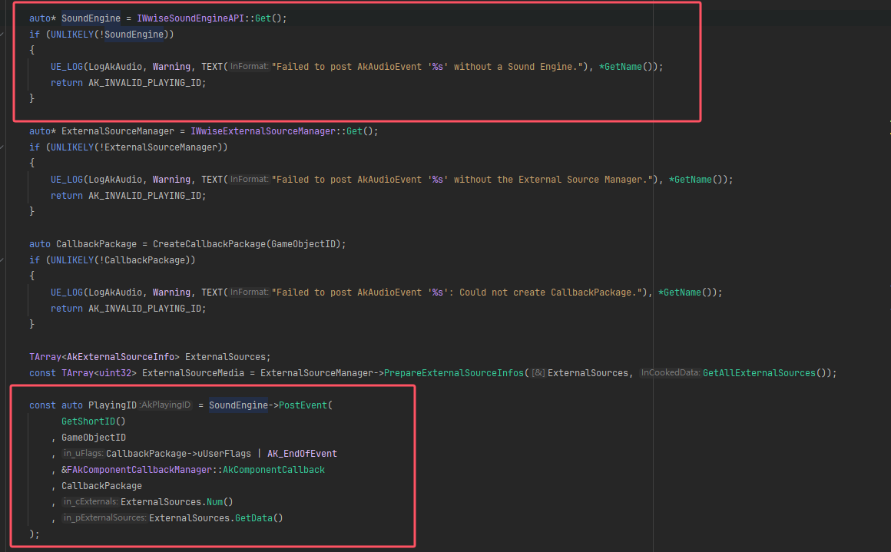
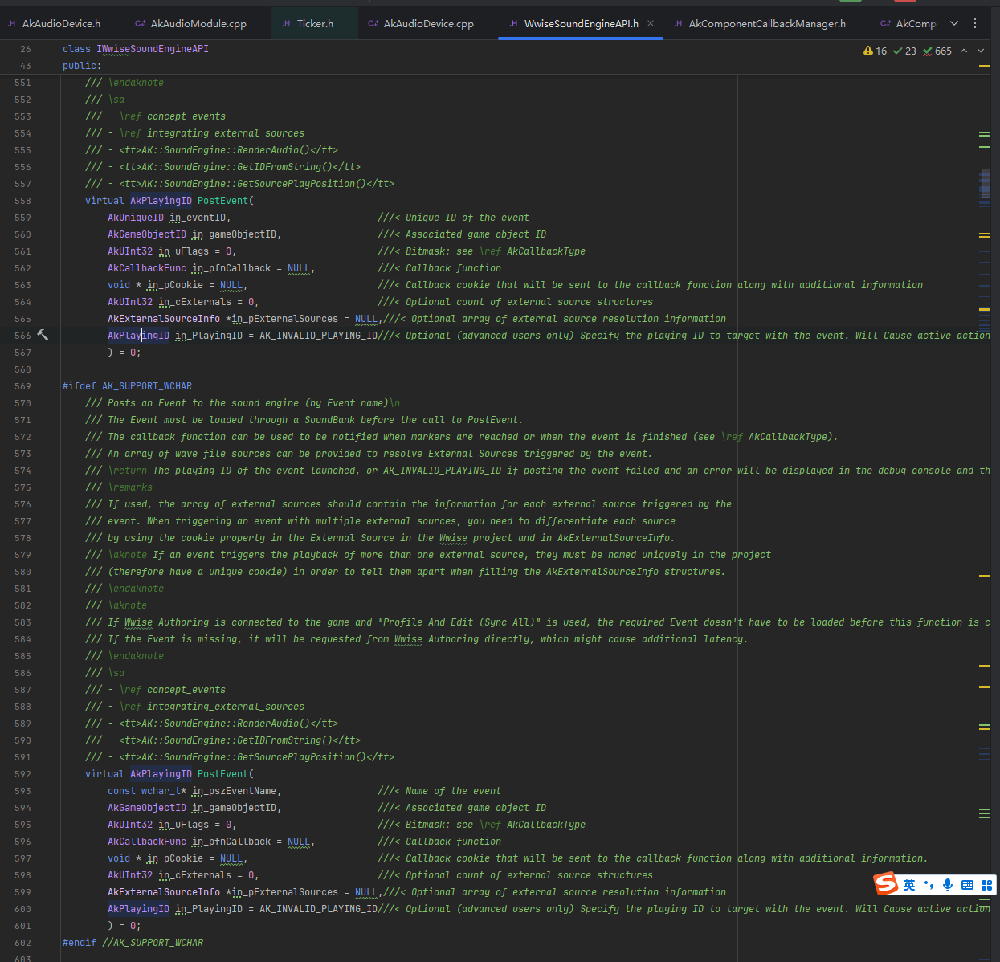
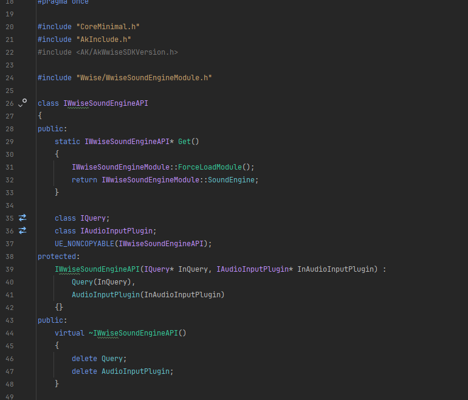
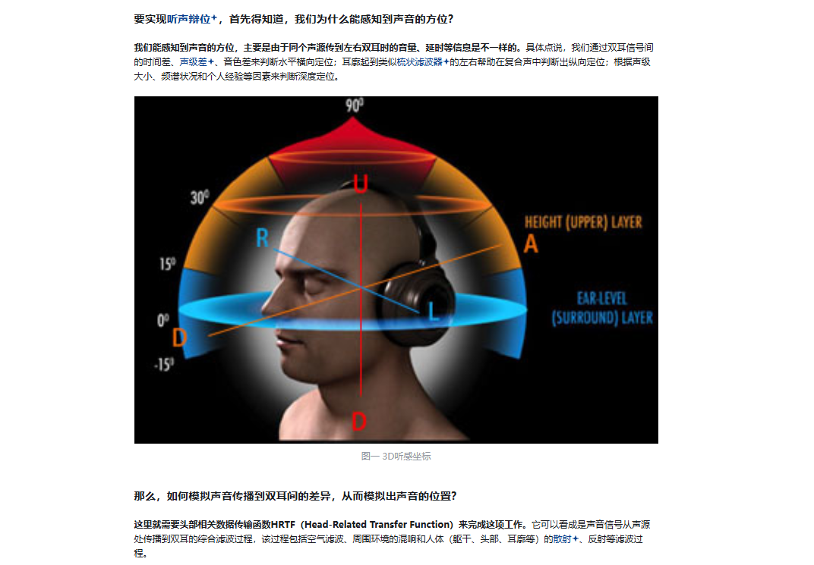

#### 沙罗斯

#### Post Event 到Buffer Sample

首先定位到

```c++
AkPlayingID UAkAudioEvent::PostEvent(const AkGameObjectID GameObjectID, FCreateCallbackPackage&& CreateCallbackPackage,
	const EAkAudioContext AudioContext)
```







是虚函数，所以定位子类



#### midi开枪，连发枪

#### 空间音频中间到边缘

#### 阁楼音怎么做

HRTF
1.https://zhuanlan.zhihu.com/p/187477892
2.https://github.com/liaoyuzh/hrtf
3.https://github.com/mrDIMAS/hrtf/tree/main
4.https://www.bilibili.com/video/BV1Z5411S7yn/?spm_id_from=333.337.search-card.all.click&vd_source=90775c281579fa6d0295f1d285af4f1b
5.https://www.youtube.com/watch?v=p1mew43JGpU
6.https://www.bilibili.com/video/BV1ob411L7U4/?spm_id_from=333.337.search-card.all.click&vd_source=90775c281579fa6d0295f1d285af4f1b
7.https://www.bilibili.com/video/BV1DA411N7Ar/?spm_id_from=333.337.search-card.all.click&vd_source=90775c281579fa6d0295f1d285af4f1b
8.https://www.bilibili.com/video/BV1gt4y1E7z8/?spm_id_from=333.337.search-card.all.click&vd_source=90775c281579fa6d0295f1d285af4f1b
9.https://sound.media.mit.edu/resources/KEMAR.html
10.https://www.grasacoustics.com/industries/audiology/kemar
11.https://docs.unrealengine.com/5.0/zh-CN/spatialization-overview-in-unreal-engine/
12.https://docs.unity3d.com/ScriptReference/AudioSource-spatialize.html
13.https://en.wikipedia.org/wiki/Head-related_transfer_function
14.https://github.com/sofacoustics/API_Cpp/tree/master
15.https://www.youtube.com/watch?v=U7Ia0oknJQA
16.https://resonance-audio.github.io/resonance-audio/
17.https://zhuanlan.zhihu.com/p/270865704
18.https://www.youtube.com/watch?v=ZEr0vpyo1K0
19.https://www.youtube.com/watch?v=3CXtmG4nXIM
20.https://www.youtube.com/watch?v=p1mew43JGpU
21.https://www.youtube.com/watch?v=KDTeZVmYg4c
22.https://www.youtube.com/watch?v=4BltHXngvlk
23.https://www.youtube.com/watch?v=a4mpK_2koR4
24.https://www.youtube.com/watch?v=tS8myG3LX34
25.https://github.com/aechoi/hrtfmixer

在 Wwise 和 Unreal Engine (UE) 中实现声音的 **上下方向定位（垂直空间感）** 需要结合 Wwise 的 **3D 定位功能**、**衰减曲线控制**、**空间音频技术**（如 HRTF 或 Ambisonics）以及 UE 的 **位置坐标传递**。虽然 Wwise 的 3D Positioning 默认更侧重于水平方向（前后左右），但通过以下方法可以显著增强上下方向的音频感知：

1. 利用 Z 轴坐标和衰减曲线

(1) 在 Wwise 中配置垂直方向的衰减

- **步骤**：
  1. 在 Wwise 中选择需要垂直定位的 **Sound Object**。
  2. 打开 **Positioning** 选项卡，启用 **3D Spatialization**。
  3. 在 **Attenuation（衰减）** 设置中，调整 **Z 轴（垂直方向）的衰减曲线**，使声音在上下方向有明显音量变化。
     - **示例**：将声音源的 Z 轴衰减曲线设置为陡峭下降，当玩家与声源高度差较大时，音量迅速降低。
- **效果**：
  当玩家和声源处于不同高度时，音量会根据 Z 轴距离动态变化，形成上下方向的感知。

2. 使用 RTPC 动态控制音效

通过 **RTPC（实时参数控制）** 将高度差映射到音效参数（如音高、滤波频率），增强垂直方向感知。

(1) 在 Wwise 中设置 RTPC

- **步骤**：

  1. 创建一个 RTPC 参数（如 `VerticalDistance`），绑定到声音的 **Low-Pass Filter（低通滤波）** 或 **Pitch（音高）**。
  2. 在 UE 中，根据玩家与声源的 Z 轴高度差，实时更新 `VerticalDistance` 的值。
     - **示例**：
       - 当玩家位于声源下方时，`VerticalDistance` 值增大，触发低通滤波（模拟声音被地板阻隔的沉闷感）。
       - 当玩家接近声源高度时，恢复原始音色。

- **效果**：
  通过音效的频谱变化，增强玩家对上下位置的感知。

- 3. 启用 HRTF（头相关传输函数）

  HRTF 技术可以模拟人耳对上下方向声音的细微差异，结合 UE 的空间音频插件实现立体声或耳机的垂直定位。

  (1) 在 Wwise 中配置 HRTF

  - **步骤**：
    1. 在 Wwise 的 **Master-Mixer Hierarchy** 中，为需要垂直定位的总线启用 **Spatial Audio**。
    2. 在 **Spatial Audio Settings** 中，选择 **Headphones（HRTF）** 模式。

  (2) 在 UE 中启用 HRTF

  - **步骤**：
    1. 打开 UE 的 **Project Settings → Plugins → Wwise**，启用 **Enable Spatial Audio**。
    2. 在玩家角色的音频组件中，设置音频输出为 **Headphones** 模式。

4. 使用 Ambisonics 或 Object-Based Audio

对于复杂的垂直空间音效（如空中飞行、多层建筑），可以使用 Ambisonics 技术 或 Object-Based Audio 实现更精确的 3D 定位。

(1) Ambisonics 配置

- **步骤**：
  1. 在 Wwise 中，将声音的 **3D Spatialization** 模式设为 **Ambisonics**。
  2. 在 UE 中，使用 Ambisonics 解码插件（如 Steam Audio）渲染音频。

(2) Object-Based Audio

- **步骤**：
  1. 在 Wwise 中，将声音标记为 **Audio Object**。
  2. 在 UE 中，通过音频引擎动态更新 Object 的 3D 位置。

总结

通过以下组合实现上下方向的声音定位：

1. **Z 轴衰减曲线**：控制音量随高度变化。
2. **RTPC 动态滤波/音高**：增强垂直感知。
3. **HRTF 或 Ambisonics**：提供空间音频支持。
4. **UE 坐标传递**：确保 Z 轴数据准确。

最终效果示例：

- 当玩家位于阁楼下方时，脚步声通过低通滤波和音量衰减，听起来更沉闷且音量较小。
- 当玩家爬上阁楼时，脚步声恢复清晰，音量增大。



