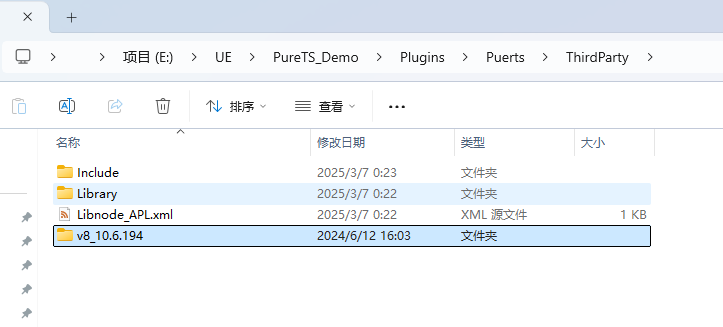
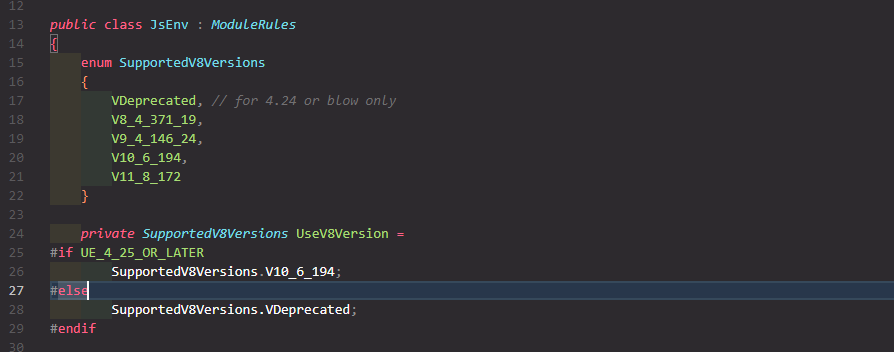
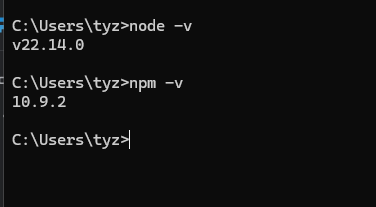
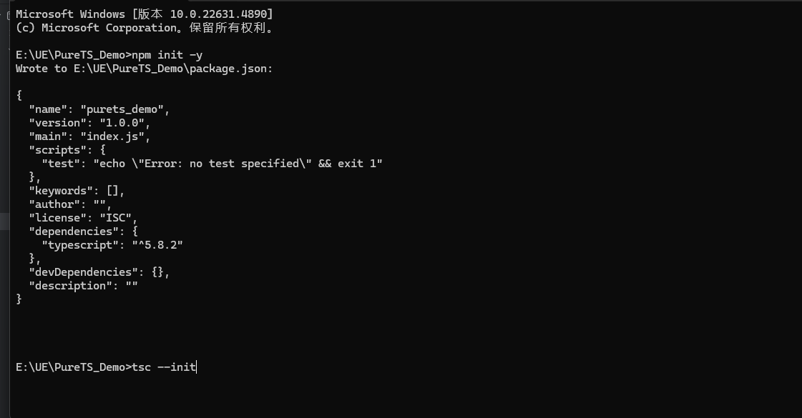
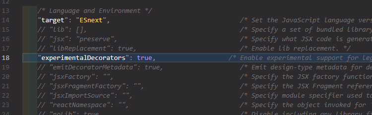
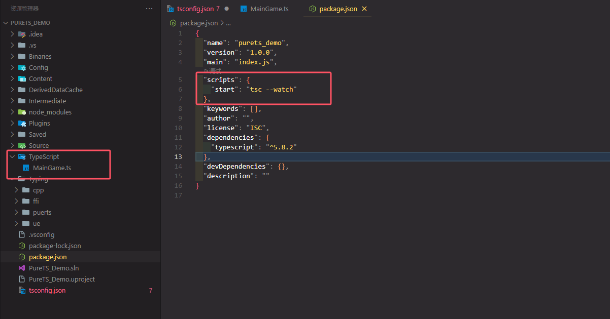
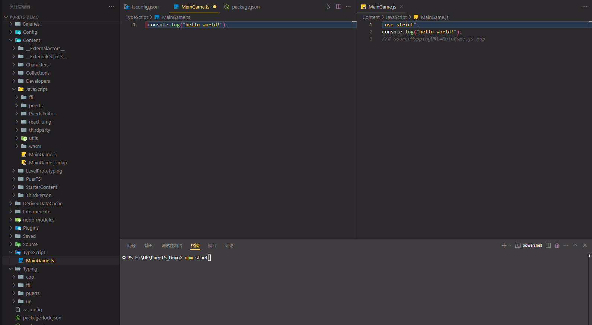

Puerts仓库：https://github.com/Tencent/puerts

下载V8：https://puerts.github.io/docs/puerts/unreal/install/







#### 二、

NodeJS官网：https://nodejs.org/zh-cn 

NPM镜像：https://npmmirror.com/ 

设置镜像命令：npm config set registry https://registry.npmmirror.com


安装Node Js 检查



镜像命令

```c++
npm install -G typescript
```


#### 根目录








