Link：https://unreal.shadeup.dev/docs/compute/base


官方：https://dev.epicgames.com/community/learning/tutorials/WkwJ/unreal-engine-simple-compute-shader-with-cpu-readback

https://coda.io/d/Unreal-Engine-Documentation_ddc4DRCa7bn/Compute-Shader-UE-5_suGR5dnU#_lu_yltQ9

UAV

UAV用于保存ComputeShader的计算结果，它的创建步骤如下：


#include失败可以

```c++
PublicIncludePaths.AddRange(
        new string[] {
            // ... add public include paths required here ...
            Path.Combine(GetModuleDirectory("Renderer"), "Private"),
        }
        );
```

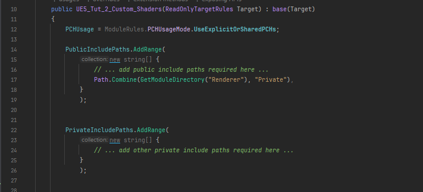


可以修复

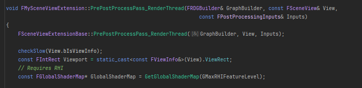


1、改动

1.1

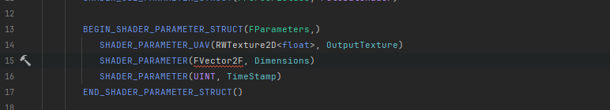


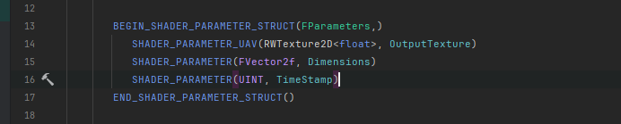

##### 一、

https://www.youtube.com/watch?v=arPFxTrOkog&t=310s

##### 1.1 自定义插件

LearnShader.uplugin

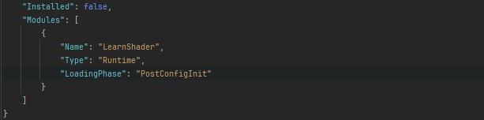

LearnShader.Build.cs


```c++
PublicDependencyModuleNames.AddRange(
			new string[]
			{
				"Core",
				"Engine"
			}
			);
			
		
		PrivateDependencyModuleNames.AddRange(
			new string[]
			{
				"CoreUObject",
				"Engine",
				"Slate",
				"SlateCore",
				"Projects",
				"RHI",
				"Renderer",
				"RenderCore",
			}
			);
```

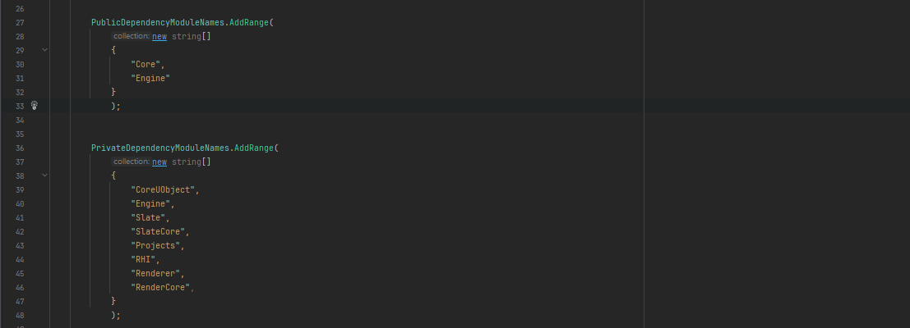

##### 1.2 Module or Plugin

定义虚拟路径，在这里加载实际的Shader 文件

```c++
#include "LearnShader.h"
#include "Interfaces/IPluginManager.h"
#define LOCTEXT_NAMESPACE "FLearnShaderModule"

void FLearnShaderModule::StartupModule()
{
	const FString PluginShaderDir = FPaths::Combine(IPluginManager::Get().FindPlugin(TEXT("LearnShader"))->GetBaseDir(), TEXT("Shaders"));
	// Requires RenderCore
	if(!AllShaderSourceDirectoryMappings().Contains(TEXT("/LearnShader")))
	{
		AddShaderSourceDirectoryMapping(TEXT("/LearnShader"), PluginShaderDir);
	}
}

void FLearnShaderModule::ShutdownModule()
{}

#undef LOCTEXT_NAMESPACE
IMPLEMENT_MODULE(FLearnShaderModule, LearnShader)
```

因此创建一个Shader文件夹

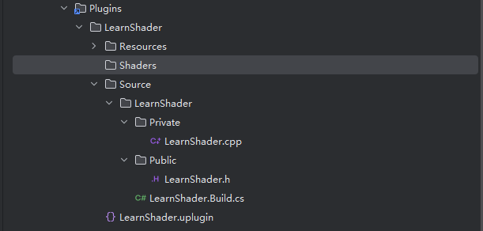

##### 1.3 SenceViewExtension

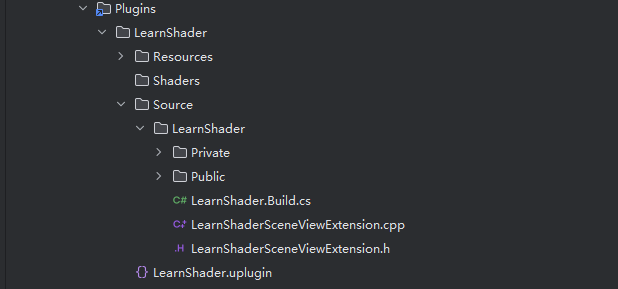

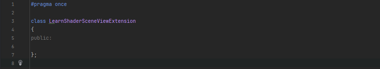

共享代码，为了能让其他的Module使用我们的代码，因此我们需要控制编译器那个类或者函数会被到处，因此

```c++
#pragma once

class LEARNSHADER_API LearnShaderSceneViewExtension
{};

```

通常是[Plugin]_API


让他继承

```c++
#pragma once
#include "SceneViewExtension.h"

class LEARNSHADER_API LearnShaderSceneViewExtension:public FSceneViewExtensionBase
{};

```

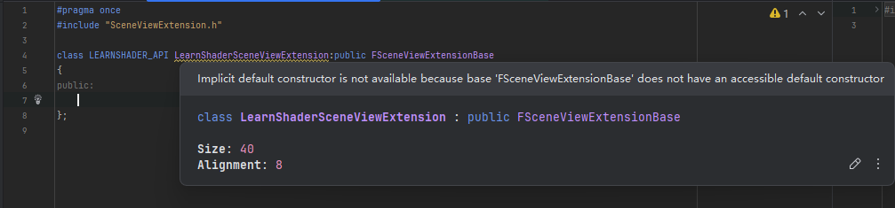


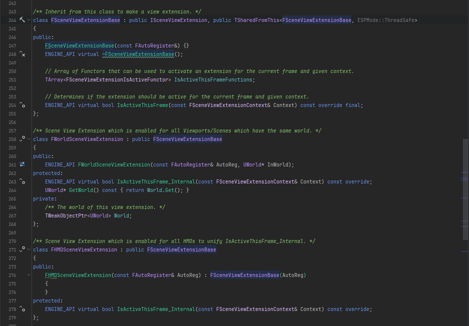

Bug解除

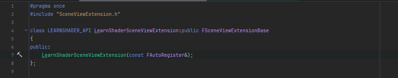


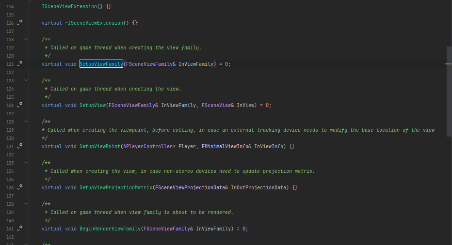


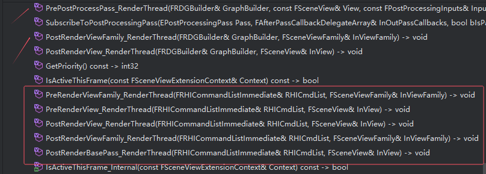

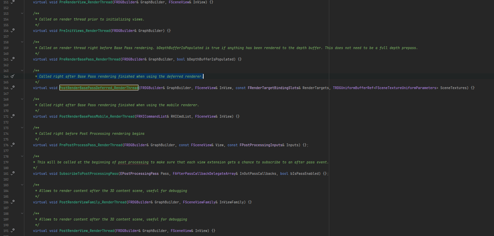


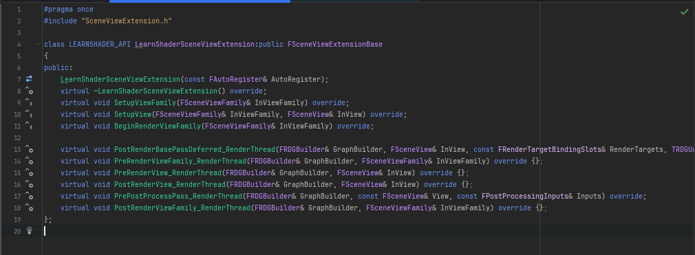

```c++
#pragma once
#include "SceneViewExtension.h"

class LEARNSHADER_API LearnShaderSceneViewExtension:public FSceneViewExtensionBase
{
public:
	LearnShaderSceneViewExtension(const FAutoRegister& AutoRegister);
	virtual ~LearnShaderSceneViewExtension() override;
	virtual void SetupViewFamily(FSceneViewFamily& InViewFamily) override;
	virtual void SetupView(FSceneViewFamily& InViewFamily, FSceneView& InView) override;
	virtual void BeginRenderViewFamily(FSceneViewFamily& InViewFamily) override;

	virtual void PostRenderBasePassDeferred_RenderThread(FRDGBuilder& GraphBuilder, FSceneView& InView, const FRenderTargetBindingSlots& RenderTargets, TRDGUniformBufferRef<FSceneTextureUniformParameters> SceneTextures) override {};
	virtual void PreRenderViewFamily_RenderThread(FRDGBuilder& GraphBuilder, FSceneViewFamily& InViewFamily) override {};
	virtual void PreRenderView_RenderThread(FRDGBuilder& GraphBuilder, FSceneView& InView) override {};
	virtual void PostRenderView_RenderThread(FRDGBuilder& GraphBuilder, FSceneView& InView) override {};
	virtual void PrePostProcessPass_RenderThread(FRDGBuilder& GraphBuilder, const FSceneView& View, const FPostProcessingInputs& Inputs) override;
	virtual void PostRenderViewFamily_RenderThread(FRDGBuilder& GraphBuilder, FSceneViewFamily& InViewFamily) override {};
};

```


```c++
#include "E:\UnrealEngineItem\UEFork\UnrealEngine5.4\Engine\Intermediate\Build\Win64\x64\UnrealEditorGPF\Development\UnrealEd\SharedPCH.UnrealEd.Project.ValApi.Cpp20.h"
#include "LearnShaderSceneViewExtension.h"

LearnShaderSceneViewExtension::LearnShaderSceneViewExtension(const FAutoRegister& AutoRegister): FSceneViewExtensionBase(AutoRegister){}
LearnShaderSceneViewExtension::~LearnShaderSceneViewExtension(){}
void LearnShaderSceneViewExtension::SetupViewFamily(FSceneViewFamily& InViewFamily){}
void LearnShaderSceneViewExtension::SetupView(FSceneViewFamily& InViewFamily, FSceneView& InView){}
void LearnShaderSceneViewExtension::BeginRenderViewFamily(FSceneViewFamily& InViewFamily){}

void LearnShaderSceneViewExtension::PrePostProcessPass_RenderThread(FRDGBuilder& GraphBuilder, const FSceneView& View,
	const FPostProcessingInputs& Inputs)
{
	FSceneViewExtensionBase::PrePostProcessPass_RenderThread(GraphBuilder, View, Inputs);
}

```


##### 1.4 Engine Subitem

`UEngineSubsystem` 是一个特殊的子系统类型，它是全局的，只有一个实例，并且在引擎启动时被创建。因此，你的 `ULearnShaderSubsystem` 会在游戏启动时被自动创建和初始化

我们要在FSceneViewExtensionBase中渲染，需要先管理它，我们在UEngineSubsystem

```c++
#pragma once

#include "CoreMinimal.h"
#include "Subsystems/EngineSubsystem.h"
#include "LearnShaderSubsystem.generated.h"

UCLASS()
class LEARNSHADER_API ULearnShaderSubsystem : public UEngineSubsystem
{
	GENERATED_BODY()
};

```


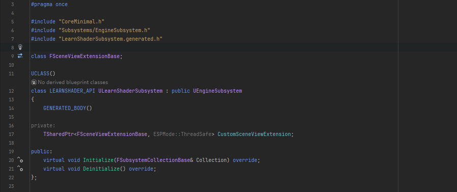


初始化的时候持有创建它，被移除时置空的时候销毁他

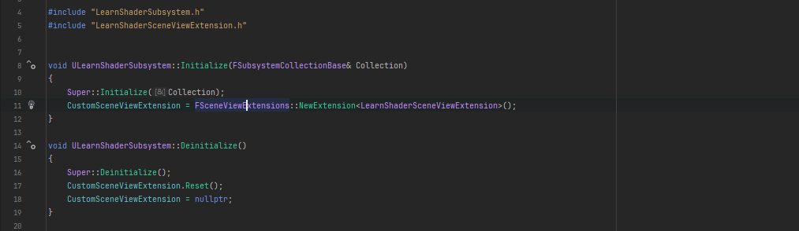


##### 1.5 usf

```c++
#include "/Engine/Private/Common.ush"
#include "/Engine/Public/Platform.ush"


float3 TargetColour;
Texture2D<float4> SceneColorTexture;


float4 MainPS(float4 SvPosition : SV_POSITION) : SV_Target0
{
	const float4 SceneColour = SceneColorTexture.Load(int3(SvPosition.xy, 0));
	const float3 MainColor = SceneColour.rgb * TargetColour;
	
	return float4(MainColor, 1.0); 
}
```

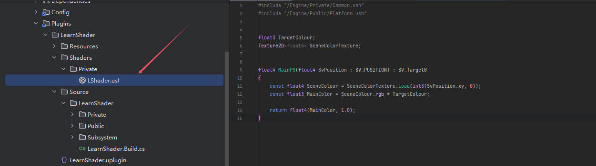

##### 1.6 Global Shader

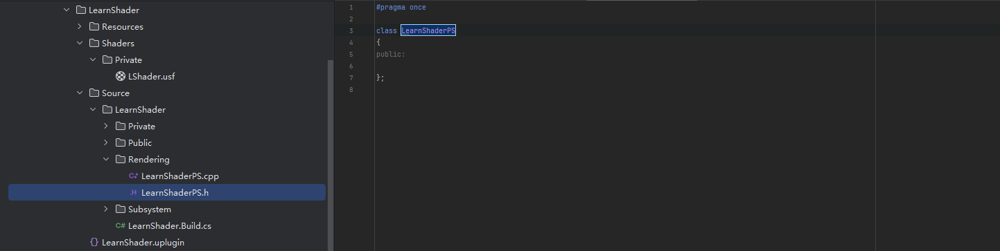

定义个参数结构，可以传入 Shader里面

```c++
#pragma once

#include "CoreMinimal.h"
#include "DataDrivenShaderPlatformInfo.h"
#include "SceneTexturesConfig.h"
#include "PostProcess/PostProcessInputs.h"


//Shader Property Struct
BEGIN_SHADER_PARAMETER_STRUCT(FColourExtractParams,)
	//定义颜色、贴图参数
	SHADER_PARAMETER(FVector3f, TargetColour)
	SHADER_PARAMETER_RDG_TEXTURE(Texture2D, SceneColorTexture)
	SHADER_PARAMETER_STRUCT_REF(FViewUniformShaderParameters, View)
	SHADER_PARAMETER_STRUCT_INCLUDE(FSceneTextureShaderParameters, SceneTextures)

	//运行时绑定渲染目标
	RENDER_TARGET_BINDING_SLOTS()
END_SHADER_PARAMETER_STRUCT()

class LearnShaderPS : public FGlobalShader
{
public:
	
};

```

绑定了数据


DECLARE_EXPORTED_SHADER_TYPE: 这个宏用于声明一个着色器类型，这里声明为Global Shader

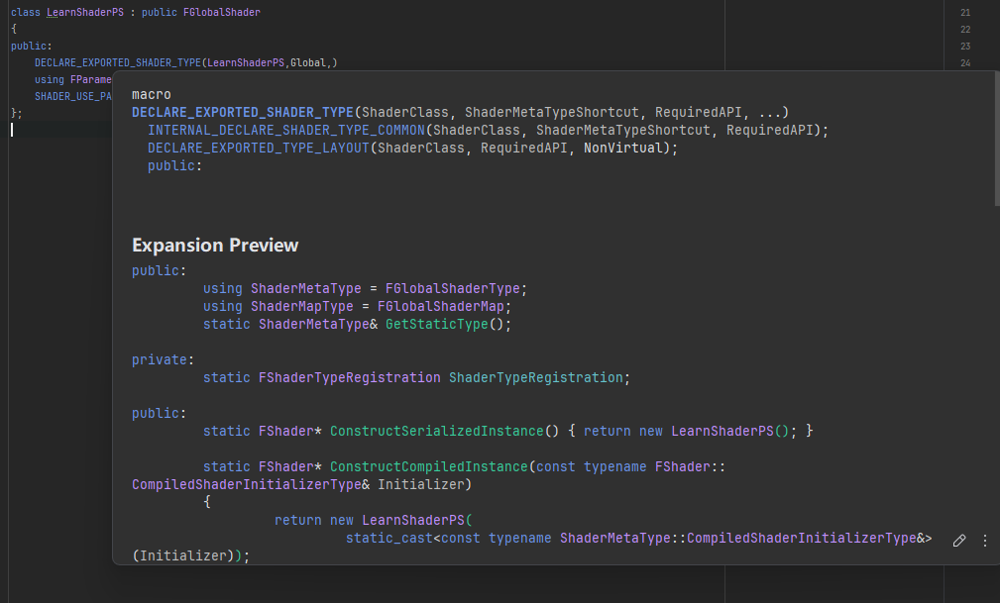

会生成一些必要的代码，比如着色器的构造函数、析构函数、序列化函数、反序列化函数等。在这个例子中，`LearnShaderPS` 是声明的着色器类型，`Global` 是着色器的分类。


```c++
class LearnShaderPS : public FGlobalShader
{
public:
	DECLARE_EXPORTED_SHADER_TYPE(LearnShaderPS,Global,)
	using FParameters = FColourExtractParams;
	SHADER_USE_PARAMETER_STRUCT(LearnShaderPS, FGlobalShader);
};

```

定义了一个类型别名 `FParameters`，指向 `FColourExtractParams` 类型

定义两个辅助函数，一个是要求支持DX11以上才会编译这个Shader

一个是处理预处理指令，SET_SHADER_DEFINE设置了这个Global Shader的使用的usf的宏

```c++
static bool ShouldCompilePermutation(const FGlobalShaderPermutationParameters& Parameters)
	{
		return IsFeatureLevelSupported(Parameters.Platform, ERHIFeatureLevel::SM5);
	}

	static void ModifyCompilationEnvironment(const FGlobalShaderPermutationParameters& Parameters, FShaderCompilerEnvironment& OutEnvironment)
	{
		FGlobalShader::ModifyCompilationEnvironment(Parameters, OutEnvironment);
		
		//SET_SHADER_DEFINE(OutEnvironment, YOUR_SHADER_MARCO, 0);
	}
```

如：

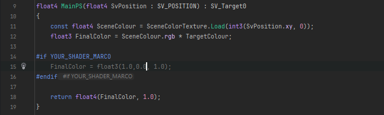


随后CPP中绑定

```c++
#include "LearnShaderPS.h"

IMPLEMENT_SHADER_TYPE(, LearnShaderPS, TEXT("/LearnShader/Privat/LShader.usf"), TEXT("MainPS"), SF_Pixel);
```


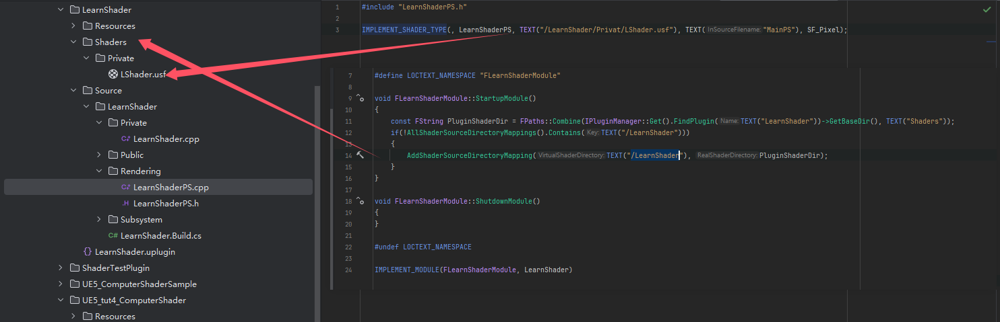

##### 1.7 SenceViewExtension

```c++
DECLARE_GPU_DRAWCALL_STAT(ColourMix);
```

声明一个 GPU 绘制调用的统计信息。在 Unreal Engine 中，统计信息用于收集和报告关于游戏运行时性能的信息，包括 CPU 和 GPU 的使用情况，内存使用情况等

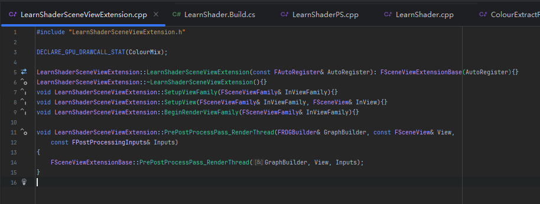


让我们获取一下视口

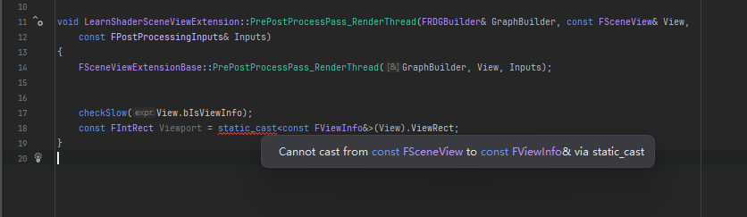

显示无法转换，然而bool 定义的是安全转换，如果checkSlow断言成功不应该会有这种问题

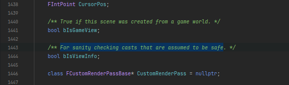


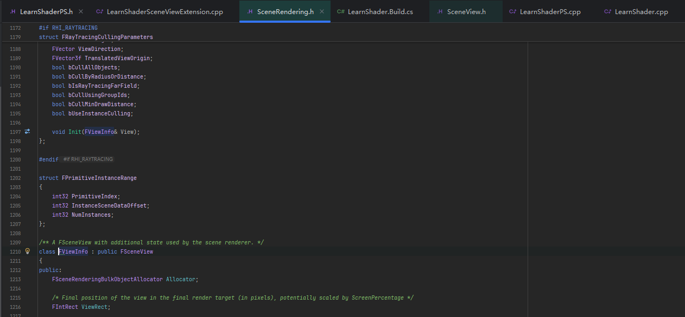

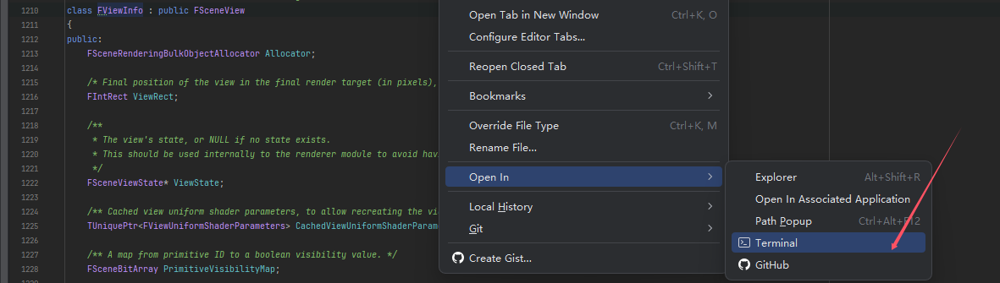

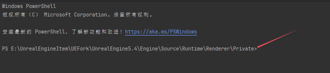

##### 1.8 Combine

构建一个路径，该路径指向 "Renderer" 模块的 "private" 子目录

```c++
Path.Combine(GetModuleDirectory("Renderer"), "private"),
```

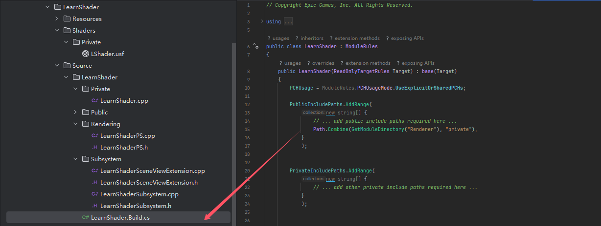

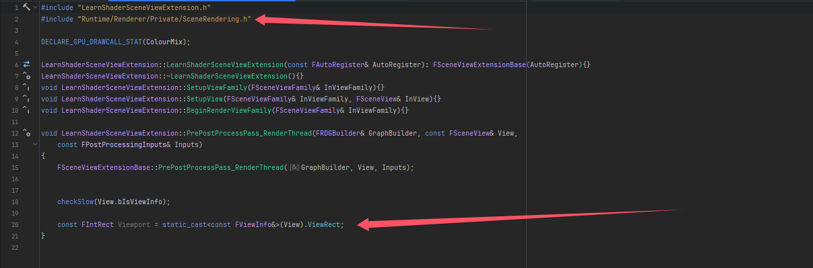

##### 1.9 Property

```c++
void LearnShaderSceneViewExtension::PrePostProcessPass_RenderThread(FRDGBuilder& GraphBuilder, const FSceneView& View,
	const FPostProcessingInputs& Inputs)
{
	FSceneViewExtensionBase::PrePostProcessPass_RenderThread(GraphBuilder, View, Inputs);


	checkSlow(View.bIsViewInfo);
	const FIntRect Viewport = static_cast<const FViewInfo&>(View).ViewRect;
	const FGlobalShaderMap* GlobalShaderMap = GetGlobalShaderMap(GMaxRHIFeatureLevel);

	//Unreal Insights
	RDG_GPU_STAT_SCOPE(GraphBuilder,ColourMix);
	// RenderDoc
	RDG_EVENT_SCOPE(GraphBuilder,"Colour Mix");
}

```

RDG_GPU_STAT_SCOPE 在渲染过程中插入 GPU 性能统计信息

DECLARE_GPU_DRAWCALL_STAT

在渲染过程中插入调试事件。这里，它将会插入一个名为 "Colour Mix" 的事件。这些事件可以在 GPU 调试器（如 NVIDIA Nsight 或 RenderDoc）中看到

类似于UInity的

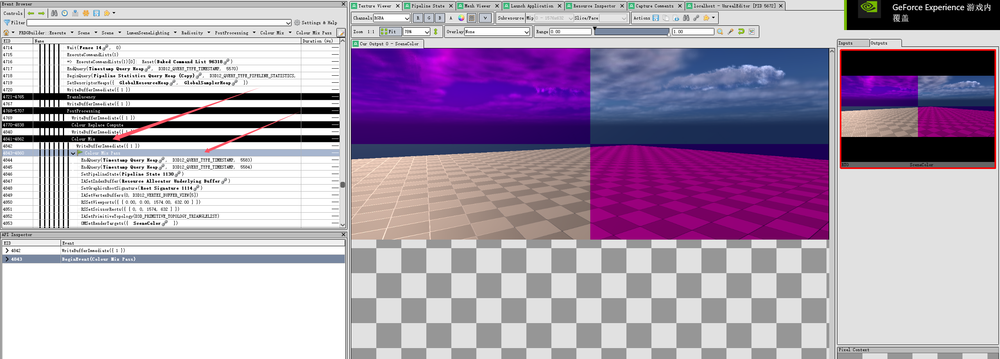

##### 1.10 SceneColour


```c++
//抓取场景纹理
const FSceneTextureShaderParameters SceneTextures = CreateSceneTextureShaderParameters(GraphBuilder, View, ESceneTextureSetupMode::SceneColor | ESceneTextureSetupMode::GBuffers);
	// 这是带有阴影和阴影的颜色
const FScreenPassTexture SceneColourTexture((*Inputs.SceneTextures)->SceneColorTexture, Viewport);
```

1.11 Shader Bind 

我们绑定参数，获取数据

```c++
//设置Global Shader 数据，分配内存
	FLearnShaderPS::FParameters* Parameters = GraphBuilder.AllocParameters<FLearnShaderPS::FParameters>();
	Parameters->SceneColorTexture = SceneColourTexture.Texture;
	Parameters->SceneTextures = SceneTextures;
	Parameters->TargetColour = FVector3f(1.0f, 0.0f, 0.0f);
	Parameters->View = View.ViewUniformBuffer;
```

渲染目标呢，但是返回值呢？我们可以

```c++
Parameters->RenderTargets[0] = FRenderTargetBinding((*Inputs.SceneTextures)->SceneColorTexture, ERenderTargetLoadAction::ELoad);
```

随后开始渲染，这里我们需要引用Shader

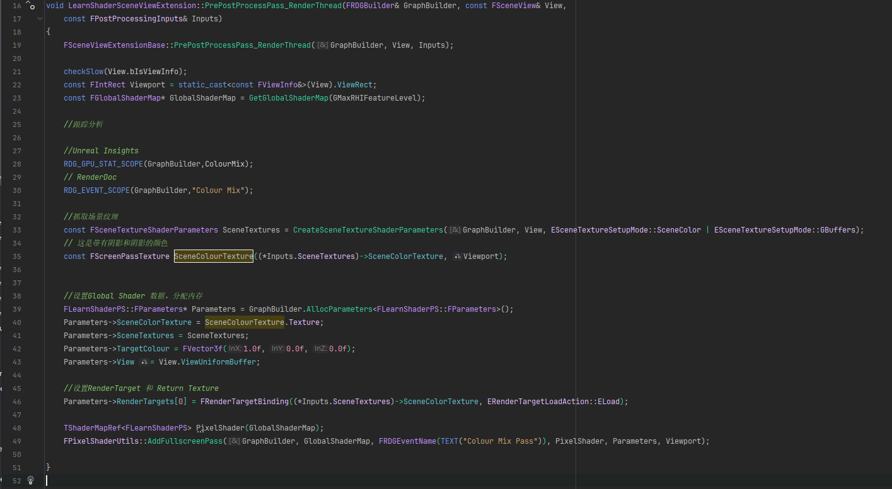

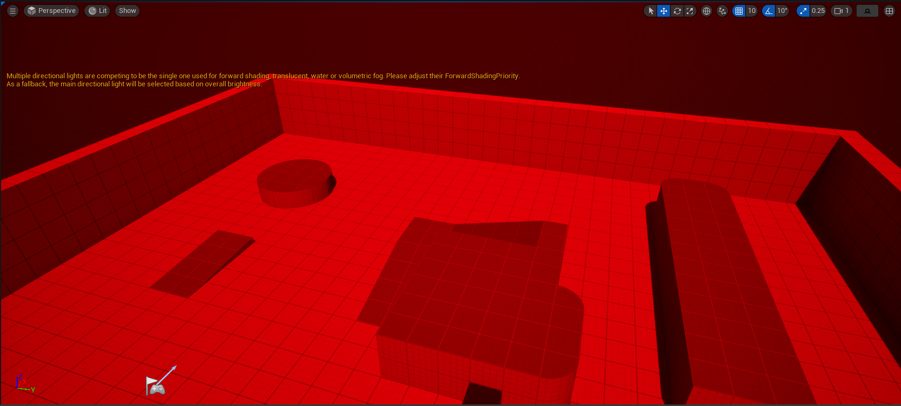

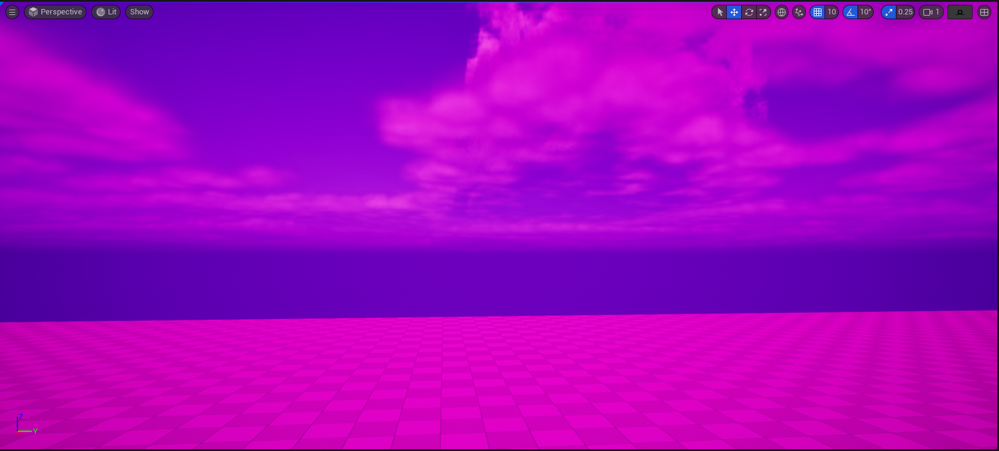

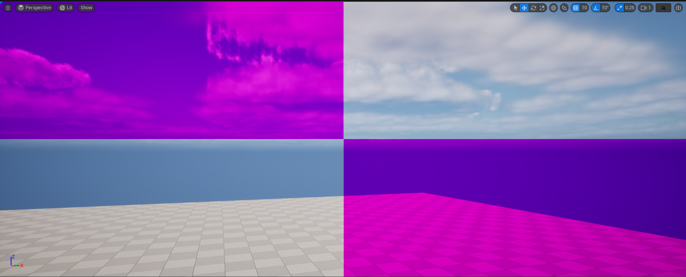

```c++
float3 TargetColour;
Texture2D<float4> SceneColorTexture;


float4 MainPS(float4 SvPosition : SV_POSITION) : SV_Target0
{
	const float4 SceneColour = SceneColorTexture.Load(int3(SvPosition.xy, 0));
	float3 FinalColor = SceneColour.rgb * TargetColour;

	uint width, height;
	SceneColorTexture.GetDimensions(width, height);
	float2 quarterSize = float2(width, height) / 2.0;
	
	float mask1 = step(quarterSize.x, SvPosition.x) * step(quarterSize.y, SvPosition.y);
	float mask2 = step(SvPosition.x, quarterSize.x) * step(SvPosition.y, quarterSize.y);
	float mask = mask1 + mask2;
	
	return lerp(float4(SceneColour), float4(FinalColor, 1.0), mask);
}
```

#### 二、Render Target

##### 2.1 usf

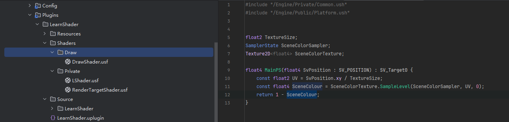

```c++
#include "/Engine/Private/Common.ush"
#include "/Engine/Public/Platform.ush"


float2 TextureSize;
SamplerState SceneColorSampler;
Texture2D<float4> SceneColorTexture;

float4 MainPS(float4 SvPosition : SV_POSITION) : SV_Target0 {
	const float2 UV = SvPosition.xy / TextureSize;
	const float4 SceneColour = SceneColorTexture.SampleLevel(SceneColorSampler, UV, 0);
	return 1 - SceneColour;
}
```

##### 2.2 Global Shader


```c++
#pragma once

#include "CoreMinimal.h"
#include "PostProcess/PostProcessInputs.h"

BEGIN_SHADER_PARAMETER_STRUCT(FRenderTargetParams,)
	SHADER_PARAMETER(FVector2f, TextureSize)
	SHADER_PARAMETER_SAMPLER(SamplerState, SceneColorSampler)
	SHADER_PARAMETER_RDG_TEXTURE(Texture2D, SceneColorTexture)

	RENDER_TARGET_BINDING_SLOTS()
END_SHADER_PARAMETER_STRUCT()


class FRenderTargetShader : public FGlobalShader
{
	DECLARE_EXPORTED_SHADER_TYPE(FRenderTargetShader, Global, );
	using FParameters = FRenderTargetParams;
	SHADER_USE_PARAMETER_STRUCT(FRenderTargetShader, FGlobalShader);
};
```

cpp

```c++
#include "RenderTargetShader.h"
IMPLEMENT_SHADER_TYPE(, FRenderTargetShader, TEXT("/LearnShader/Private/RenderTargetShader.usf"), TEXT("MainPS"), SF_Pixel);
```

##### 2.3 UEngineSubsystem

```c++
#pragma once

#include "CoreMinimal.h"
#include "Subsystems/EngineSubsystem.h"
#include "RenderTargetSubsystem.generated.h"


class FSceneViewExtensionBase;

UCLASS()
class LEARNSHADER_API URenderTargetSubsystem : public UEngineSubsystem
{
	GENERATED_BODY()

private:
	TSharedPtr<FSceneViewExtensionBase, ESPMode::ThreadSafe> CustomSceneViewExtension;

public:
	virtual void Initialize(FSubsystemCollectionBase& Collection) override;
	//被移除时执行
	virtual void Deinitialize() override;
};

```

CPP

```c++
void URenderTargetSubsystem::Initialize(FSubsystemCollectionBase& Collection)
{
	Super::Initialize(Collection);
	// CustomSceneViewExtension = FSceneViewExtensions::NewExtension<LearnShaderSceneViewExtension>();
}

void URenderTargetSubsystem::Deinitialize()
{
	Super::Deinitialize();
	CustomSceneViewExtension.Reset();
	CustomSceneViewExtension = nullptr;
}
```

##### 2.4 FSceneViewExtensionBase

```c++
#pragma once
#include "SceneViewExtension.h"
class LEARNSHADER_API RenderTargetSceneViewExtension:public FSceneViewExtensionBase
{
private:
	TObjectPtr<UTextureRenderTarget2D> RenderTargetSource = nullptr;
	//渲染目标引用计数
	TRefCountPtr<IPooledRenderTarget> PooledRenderTarget;
	
public:
	RenderTargetSceneViewExtension(const FAutoRegister& AutoRegister);
	virtual ~RenderTargetSceneViewExtension() override;
	virtual void SetupViewFamily(FSceneViewFamily& InViewFamily) override;
	virtual void SetupView(FSceneViewFamily& InViewFamily, FSceneView& InView) override;
	virtual void BeginRenderViewFamily(FSceneViewFamily& InViewFamily) override;

	virtual void PostRenderBasePassDeferred_RenderThread(FRDGBuilder& GraphBuilder, FSceneView& InView, const FRenderTargetBindingSlots& RenderTargets, TRDGUniformBufferRef<FSceneTextureUniformParameters> SceneTextures) override {};
	virtual void PreRenderViewFamily_RenderThread(FRDGBuilder& GraphBuilder, FSceneViewFamily& InViewFamily) override {};
	virtual void PreRenderView_RenderThread(FRDGBuilder& GraphBuilder, FSceneView& InView) override {};
	virtual void PostRenderView_RenderThread(FRDGBuilder& GraphBuilder, FSceneView& InView) override {};
	virtual void PrePostProcessPass_RenderThread(FRDGBuilder& GraphBuilder, const FSceneView& View, const FPostProcessingInputs& Inputs) override;
	virtual void PostRenderViewFamily_RenderThread(FRDGBuilder& GraphBuilder, FSceneViewFamily& InViewFamily) override {};

	void SetRenderTarget(UTextureRenderTarget2D* RenderTarget);
private:
	//默认要求_RenderThread
	void CreatePooledRenderTarget_RenderThread();
};
```


#### 二、Library

用于创建可以在蓝图系统中使用的静态函数。这些函数可以在任何蓝图中调用，而不需要创建类的实例

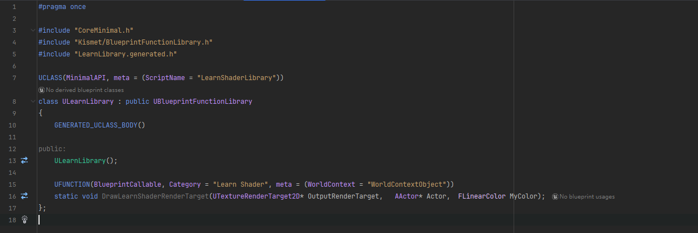


#### X

https://www.youtube.com/watch?v=toYXfFrmXbk&t=11s

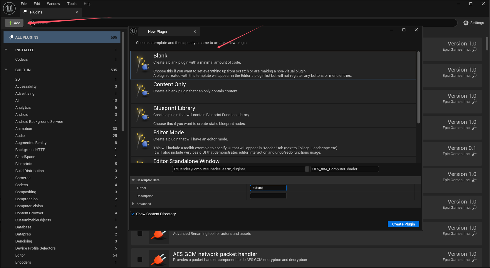

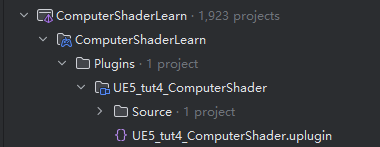


UE5_tut4_ComputerShader.Build.cs

```c++
PrivateDependencyModuleNames.AddRange(
			new string[]
			{
				"CoreUObject",
				"Engine",
				"Slate",
				"SlateCore",
				"Projects",
				"RHI",
				"Renderer",
				"RenderCore",
				"UE5ShaderUtils" 
				// ... add private dependencies that you statically link with here ...	
			}
			);
		
```


```c++

void FUE5_tut4_ComputerShaderModule::StartupModule()
{
	// This code will execute after your module is loaded into memory; the exact timing is specified in the .uplugin file per-module

	// Shaders is the folder with a private folder inside
	// Requires Projects
	const FString PluginShaderDir = FPaths::Combine(IPluginManager::Get().FindPlugin(TEXT("UE5_tut4_ComputerShader"))->GetBaseDir(), TEXT("Shaders"));
	// Requires RenderCore
	if(!AllShaderSourceDirectoryMappings().Contains(TEXT("/TutorialShaders")))
	{
		AddShaderSourceDirectoryMapping(TEXT("/TutorialShaders"), PluginShaderDir);
	}
}

```

随后过一遍

```c++
ComputeTutorialShader.usf
```


```c++
// Include this
#include "/Engine/Private/Common.ush"
// Or this, this is included in Common.ush
// #include "/Engine/Public/Platform.ush"

// These contain various functions and structs that may be useful - not a complete list
// #include "/Engine/Generated/GeneratedUniformBuffers.ush" 
#include "/Engine/Private/DeferredShadingCommon.ush"
// #include "/Engine/Private/ColorUtils.ush"
// #include "/Engine/Private/DistanceField/GlobalDistanceFieldShared.ush"
// #include "/Engine/Private/Random.ush"
// #include "/Engine/Private/SceneTexturesCommon.ush"
// #include "/Engine/Private/SceneData.ush"
// #include "/Engine/Private/Common.ush"
// #include "/Engine/Private/DeferredShadingCommon.ush"
// #include "/Engine/Private/ScreenPass.ush"
// #include "/Engine/Private/SceneTexturesCommon.ush"
// #include "/Engine/Private/SceneTextureParameters.ush"

#include "HelperFunctions.ush"

// For better colour matching need to use better colours spaces such as CIELAB
// https://en.wikipedia.org/wiki/CIELAB_color_space

// And use DeltaE to get the perceptual difference between colours
// https://zschuessler.github.io/DeltaE/learn/

// Colour math function psuedo code https://www.easyrgb.com/en/math.php

struct FColourReplace
{
	float3 TargetColourLab;
	float Tolerance;
	float3 ReplacementColourHSL;
};

int ColourCount;

// Read-write textures
RWTexture2D<float4> SceneColorTexture;

// Readonly buffers
StructuredBuffer<FColourReplace> ColourReplacementDataBuffer;

// Read-write buffers
RWStructuredBuffer<uint> ColourReplacementCount;

// Buffer used to store the indirect execution data
RWByteAddressBuffer ExecuteIndirectBuffer;

[numthreads(THREADS_X, THREADS_Y, 1)]
void ColourChangeMaskCS(uint3 DispatchThreadID : SV_DispatchThreadID, uint3 GroupThreadID : SV_GroupThreadID)
{
	const float4 SceneColour = SceneColorTexture[DispatchThreadID.xy];
	const float3 SceneColourHSL = RGBtoHSL(saturate(SceneColour.rgb));
	
	// Get the current scene colour lab value
#if USE_UNLIT_SCENE_COLOUR
	float3 SceneColourUnlit = GetUnlitSceneColour(DispatchThreadID.xy);
	const float3 SceneColourLab = RGBtoLab(SceneColourUnlit.rgb);
#else
	const float3 SceneColourLab = RGBtoLab(SceneColour.rgb);
#endif

	bool bChanged = false;
	float3 SceneColourOut = SceneColour.rgb;
	// Iterate through the colours, if any are within the threshold, change the colour
	// UNROLL If using a fixed number of colours, you can use this macro to unroll the loop
	for(int i = 0; i < ColourCount; i++)
	{
		const FColourReplace ColourReplace = ColourReplacementDataBuffer[i];
		const float DeltaE = DeltaE2000( ColourReplace.TargetColourLab, SceneColourLab, 1, 1, 1);

		BRANCH
		if(DeltaE < ColourReplace.Tolerance)
		{
			const float LerpAmount = saturate(DeltaE / ColourReplace.Tolerance);
			
			// Lerp between the scene colour and the replacement colour based on the perceptual similarity - as in video
			// SceneColourOut = HSLtoRGB(lerp(SceneColourHSL, ColourReplace.ReplacementColourHSL, 1.0 - LerpAmount));

			// Improved colour change
			const float HueLerp = lerp(SceneColourHSL.x, ColourReplace.ReplacementColourHSL.x, 1.0 - LerpAmount);
			SceneColourOut = HSLtoRGB(float3(HueLerp, SceneColourHSL.y, SceneColourHSL.z));

			// Atomic add to count how many times this colour has been replaced
			InterlockedAdd(ColourReplacementCount[i], 1);

			bChanged = true;
			break;
		}
	}

	// Set the colour back on the colour texture
	BRANCH
	if(bChanged)
	{
		SceneColorTexture[DispatchThreadID.xy] = saturate(float4(SceneColourOut, SceneColour.a));
	}
	
	// This will set the values required for the indirect execution
	// This if block will only run once on the very first compute thread
	if(DispatchThreadID.x == 0 && DispatchThreadID.y == 0)
	{
		float2 SceneDimensions;
		SceneColorTexture.GetDimensions(SceneDimensions.x, SceneDimensions.y);

		// Calculate the number of groups required to cover the scene
		// Divide by 16 as that's the number of threads in each group along the X and Y axis
		const int GroupX = ceil(SceneDimensions.x / 16);
		const int GroupY = ceil(SceneDimensions.y / 16);
		
		// Write the number of elements to the buffer
		// Offset each value by 4 bytes - int
		ExecuteIndirectBuffer.Store(4 * 0, GroupX);
		ExecuteIndirectBuffer.Store(4 * 1, GroupY);
		ExecuteIndirectBuffer.Store(4 * 2, 1);   
	}
}

[numthreads(16, 16, 1)]
void IndirectDispatchCS(uint3 DispatchThreadID : SV_DispatchThreadID, uint3 GroupThreadID : SV_GroupThreadID)
{
	// Convert scene colour to HSL
	const float4 SceneColour = SceneColorTexture[DispatchThreadID.xy];
	const float3 SceneColourHSL = RGBtoHSL(SceneColour.rgb);

	// Any colours that are below the lightness threshold will be darkened to black
	BRANCH
	if(SceneColourHSL.z < 0.1)
	{
		const float GreyScale = 0.21 * SceneColour.r + 0.72 * SceneColour.g + 0.07 * SceneColour.b; 
		SceneColorTexture[DispatchThreadID.xy] = float4(GreyScale.xxx, SceneColour.a);
	} 
}
```


HelperFunctions.ush

```c++
#include "/Engine/Private/Common.ush"

// Functions for converting between colour spaces
// https://www.easyrgb.com/en/math.php

// Colour to greyscale using Luminosity method
// https://www.johndcook.com/blog/2009/08/24/algorithms-convert-color-grayscale/#:~:text=Three%20algorithms%20for%20converting%20color%20to%20grayscale&text=The%20lightness%20method%20averages%20the,G%20%2B%20B)%20%2F%203.


static const float HelperEpsilon = 0.0001f;

float3 GetUnlitSceneColour(const uint2 ScreenPosition)
{
	FScreenSpaceData ScreenSpaceData = GetScreenSpaceDataUint(ScreenPosition, false);
	return ScreenSpaceData.GBuffer.BaseColor;
}

float3 RGBtoLinear(const float3 InColour)
{
	float3 LinearColour;
	
	FLATTEN
	if(InColour.r > 0.04045)
	{
		LinearColour.r = pow((InColour.r + 0.055) / 1.055, 2.4);
	} else
	{
		LinearColour.r = InColour.r / 12.92;
	}

	FLATTEN
	if(InColour.g > 0.04045)
	{
		LinearColour.g = pow((InColour.g + 0.055) / 1.055, 2.4);
	} else
	{
		LinearColour.g = InColour.g / 12.92;
	}

	FLATTEN
	if(InColour.b > 0.04045)
	{
		LinearColour.b = pow((InColour.b + 0.055) / 1.055, 2.4);
	} else
	{
		LinearColour.b = InColour.b / 12.92;
	}

	return LinearColour;
}

// Found this to work with converting from RGB to HSL
// https://stackoverflow.com/a/9493060/8204221
float3 RGBtoHSL(float3 InColour)
{
	//Min. value of RGB
	const float Min = min3(InColour.r, InColour.g, InColour.b);    
	//Max. value of RGB
	const float Max = max3(InColour.r, InColour.g, InColour.b);    
	//Delta RGB value
	const float Delta = Max - Min;            

	const float L = (Max + Min) / 2.0;

	float H = 0.0;
	float S = 0.0;

	// If delta is not grey, it has chroma
	if (Delta > 0.0)                                     
	{
		S = L > 0.5 ? Delta / (2.0 - Max - Min) : Delta / (Max + Min);

		if(Max == InColour.r)
		{
			H = (InColour.g - InColour.b) / Delta + (InColour.g < InColour.b ? 6.0 : 0.0);
		}
		else if(Max == InColour.g)
		{
			H = (InColour.b - InColour.r) / Delta + 2.0;
		}
		else if(Max == InColour.b)
		{
			H = (InColour.r - InColour.g) / Delta + 4.0;
		}

		H /= 6.0;
	}

	return float3(H, S, L);
}

// Found this to work with converting from HSL to RGB
// https://stackoverflow.com/a/64090995/8204221
float3 HSLtoRGB(float3 InColour)
{
	const float H = InColour.r * 360.0;
	const float S = InColour.g;
	const float L = InColour.b;

	const float A = S * min(L, 1.0 - L);

	const float KR = (0.0f + H / 30.0f) % 12;
	const float KG = (8.0f + H / 30.0f) % 12;
	const float KB = (4.0f + H / 30.0f) % 12;

	const float R = L - A * max(min3(KR - 3.0f, 9.0 - KR, 1.0), -1.0f);
	const float G = L - A * max(min3(KG - 3.0f, 9.0 - KG, 1.0), -1.0f);
	const float B = L - A * max(min3(KB - 3.0f, 9.0 - KB, 1.0), -1.0f);

	return float3(R, G, B);
}

float3 RGBtoXYZ(float3 InColour)
{
	float R = InColour.r;
	float G = InColour.g;
	float B = InColour.b;

	if(R > 0.04045)
	{
		R = pow(((R + 0.055) / 1.055), 2.4);
	} else
	{
		R = R / 12.92;
	}
	if(G > 0.04045)
	{
		G = pow(((G + 0.055) / 1.055), 2.4);
	}
	else
	{
		G = G / 12.92;
	}
	if (B > 0.04045)
	{
		B = pow(((B + 0.055) / 1.055), 2.4);
	}
	else
	{
		B = B / 12.92;
	}

	R = R * 100.0;
	G = G * 100.0;
	B = B * 100.0;

	const float X = R * 0.4124 + G * 0.3576 + B * 0.1805;
	const float Y = R * 0.2126 + G * 0.7152 + B * 0.0722;
	const float Z = R * 0.0193 + G * 0.1192 + B * 0.9505;

	return float3(X, Y, Z);
}

float3 XYZtoCIELab(float3 InXYZ)
{
	// Found here https://www.easyrgb.com/en/math.php
	// Under XYZ (Tristimulus) Reference values of a perfect reflecting diffuser
	// D65 illuminant, 2° observer
	const float Xn = 95.047;
	const float Yn = 100.000;
	const float Zn = 108.883;

	const float X = InXYZ.x / Xn;
	const float Y = InXYZ.y / Yn;
	const float Z = InXYZ.z / Zn;

	const float Epsilon = 0.008856;
	const float Kappa = 903.3;
	const float Third = 1.0 / 3.0;

	const float fX = (X > Epsilon) ? pow(X, Third) : (Kappa * X + 16.0) / 116.0;
	const float fY = (Y > Epsilon) ? pow(Y, Third) : (Kappa * Y + 16.0) / 116.0;
	const float fZ = (Z > Epsilon) ? pow(Z, Third) : (Kappa * Z + 16.0) / 116.0;

	const float L = (116.0 * fY) - 16.0;
	const float a = 500.0 * (fX - fY);
	const float b = 200.0 * (fY - fZ);

	return float3(L, a, b);
}

//Function returns CIE-H° value
float CIELabtoHue(const float InA, const float InB)          
{
	float Bias = 0.0;
	
	BRANCH
	if (InA >= 0.0 && InB < HelperEpsilon)
	{
		return 0.0;
	}
	BRANCH
	if (InA < 0.0 && InB < HelperEpsilon)
	{
		return 180.0;
	}
	BRANCH
	if (InA < HelperEpsilon && InB > 0.0)
	{
		return 90.0;
	}
	BRANCH
	if (InA < HelperEpsilon && InB < 0.0)
	{
		return 270.0;
	}

	FLATTEN
	if (InA > 0.0 && InB > 0.0)
	{
		Bias = 0.0;
	}
	FLATTEN
	if (InA < 0.0)
	{
		Bias = 180.0;
	}
	FLATTEN
	if (InA > 0.0 && InB < 0.0)
	{
		Bias = 360.0;
	}

	return degrees(atan(InB / InA)) + Bias;
}

float3 RGBtoLab(float3 InColour)
{
	return XYZtoCIELab(RGBtoXYZ(InColour));
}

float DeltaE2000(float3 CIEA, float3 CIEB, float LWeight, float CWeight, float HWeight)
{
	//Color #1 CIE-L*ab values
	const float CIEL1 = CIEA.x;
	const float CIEa1 = CIEA.y;
	const float CIEb1 = CIEA.z;
	//Color #2 CIE-L*ab values
	const float CIEL2 = CIEB.x;
	const float CIEa2 = CIEB.y;
	const float CIEb2 = CIEB.z;

	float xC1 = sqrt(CIEa1 * CIEa1 + CIEb1 * CIEb1);
	float xC2 = sqrt(CIEa2 * CIEa2 + CIEb2 * CIEb2);
	const float xCX = (xC1 + xC2) / 2.0;
	const float xGX = 0.5 * (1.0 - sqrt(pow(xCX,7.0) / (pow(xCX, 7.0) + pow(25.0, 7.0))));
	float xNN = (1.0 + xGX) * CIEa1;
	xC1 = sqrt(xNN * xNN + CIEb1 * CIEb1);
	float xH1 = CIELabtoHue(xNN, CIEb1);
	xNN = (1.0 + xGX) * CIEa2;
	xC2 = sqrt(xNN * xNN + CIEb2 * CIEb2);
	float xH2 = CIELabtoHue(xNN, CIEb2);
	float xDL = CIEL2 - CIEL1;
	float xDC = xC2 - xC1;

	float xDH = 0.0;

	if (xC1 * xC2 < HelperEpsilon)
	{
		xDH = 0.0;
	}
	else
	{
		xNN = round(xH2 - xH1);
		if (abs(xNN) <= 180.0)
		{
			xDH = xH2 - xH1;
		}
		else
		{
			if (xNN > 180.0)
			{
				xDH = xH2 - xH1 - 360.0;
			}
			else
			{
				xDH = xH2 - xH1 + 360.0;
			}
		}
	}

	xDH = 2.0 * sqrt(xC1 * xC2) * sin(radians(xDH / 2.0));
	float xLX = (CIEL1 + CIEL2) / 2.0;
	float xCY = (xC1 + xC2) / 2.0;

	float xHX = 0.0;
	
	if (xC1 * xC2 < HelperEpsilon)
	{
		xHX = xH1 + xH2;
	}
	else
	{
		xNN = abs(round(xH1 - xH2));

		if (xNN > 180.0)
		{
			if ((xH2 + xH1) < 360.0)
			{
				xHX = xH1 + xH2 + 360.0;
			}
			else
			{
				xHX = xH1 + xH2 - 360.0;
			}
		}
		else
		{
			xHX = xH1 + xH2;
		}

		xHX /= 2.0;
	}
	const float xTX = 1.0 - 0.17 * cos(radians(xHX - 30.0)) + 0.24
		* cos(radians(2.0 * xHX)) + 0.32
		* cos(radians(3.0 * xHX + 6.0)) - 0.20
		* cos(radians(4.0 * xHX - 63.0));
	const float xPH = 30.0 * exp(-((xHX - 275.0) / 25.0) * ((xHX - 275.0) / 25.0));
	const float xRC = 2.0 * sqrt(pow(xCY, 7.0) / (pow(xCY, 7.0) + pow(25.0, 7.0)));
	const float xSL = 1.0 + ((0.015 * ((xLX - 50.0) * (xLX - 50.0)))
		/ sqrt(20.0 + ((xLX - 50.0) * (xLX - 50.0))));

	const float xSC = 1.0 + 0.045 * xCY;
	const float xSH = 1.0 + 0.015 * xCY * xTX;
	const float xRT = -sin(radians(2.0 * xPH)) * xRC;
	xDL = xDL / (LWeight * xSL);
	xDC = xDC / (CWeight * xSC);
	xDH = xDH / (HWeight * xSH);

	return sqrt(pow(xDL, 2.0) + pow(xDC, 2.0) + pow(xDH, 2.0) + xRT * xDC * xDH);
}
```

 ColourReplaceComputePass.h

##### 2.4 Struct

```c++
//定义 XY的大小
namespace ColourReplaceCompute
{
	static constexpr int32 THREADS_X = 16;
	static constexpr int32 THREADS_Y = 16;
}

//传入Shader的结构
//3d 改为3f
struct FColourReplace
{
	FVector3f TargetColourLab;
	float PerceptionThreshold;
	FVector3f ReplacementColourHSL;
};
```

##### 2.5 Property

定义传入Computer Shader 的参数和数值

```c++

//这可以包含在你的FGlobalShader类中
//方便保持他们分开，因为你可以使用相同的参数多个着色器
BEGIN_SHADER_PARAMETER_STRUCT(FTutorialColourReplaceParams,)
	SHADER_PARAMETER(int, ColourCount)

	// The texture we're going to be reading from and writing to
	SHADER_PARAMETER_RDG_TEXTURE_UAV(RWTexture2D<float4>, SceneColorTexture)

	// Texture type is same as set in shader - for getting the unlit colour
	SHADER_PARAMETER_STRUCT_REF(FViewUniformShaderParameters, View)
	SHADER_PARAMETER_STRUCT_INCLUDE(FSceneTextureShaderParameters, SceneTextures)

	// The different colours we want to replace
	SHADER_PARAMETER_RDG_BUFFER_SRV(StructuredBufffer<FColourReplace>, ColourReplacementDataBuffer)

	// How many pixels we've replaced
	SHADER_PARAMETER_RDG_BUFFER_UAV(RWStructureBuffer<int>, ColourReplacementCount)

	// For setting up the indirect dispatch
	SHADER_PARAMETER_RDG_BUFFER_UAV(RWByteAddressBuffer, ExecuteIndirectBuffer)
END_SHADER_PARAMETER_STRUCT()
```


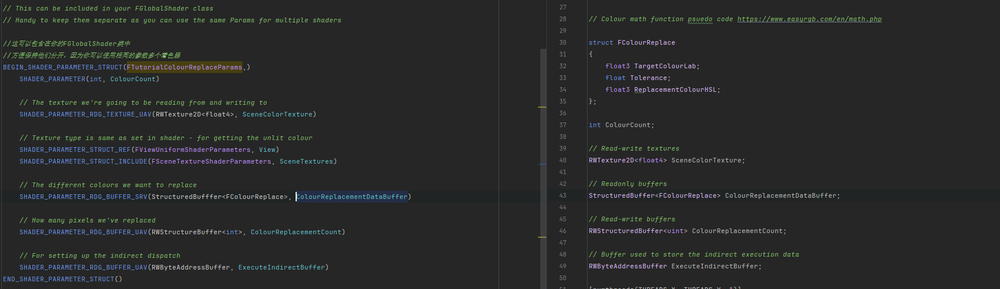


##### 2.6 FGlobalShader

1. <font color=#4db8ff>DECLARE_EXPORTED_SHADER_TYPE </font>宏

```C++
DECLARE_EXPORTED_SHADER_TYPE(FTutorialColourReplaceCS, Global, );
```

**作用**：

- 该宏用于声明和导出着色器类 `FTutorialColourReplaceCS`。它的作用是告诉引擎这是一个全局着色器。
- 参数解释：
  - 第一个参数 `FTutorialColourReplaceCS` 是类名。
  - 第二个参数 `Global` 表示这是一个全局着色器（在整个渲染管线中使用，不依赖特定的材质）。
  - 第三个参数是模块导出宏，如果为空，则表示该类在当前模块内使用。如果是跨模块使用的着色器（例如动态加载模块），则需要填写对应模块的 API 宏。

2. <font color=#4db8ff>SHADER_USE_PARAMETER_STRUCT </font>宏

```C++
SHADER_USE_PARAMETER_STRUCT(FTutorialColourReplaceCS, FGlobalShader);
```

**作用**：

- 该宏用于将着色器参数结构体与着色器类关联。
- `FGlobalShader` 是基类，指定该类是一个全局着色器。
- `FParameters` 定义在类的上方，用于指定着色器的输入和输出数据。

3. <font color=#4db8ff>ShouldCompilePermutation </font>函数

```C++
static bool ShouldCompilePermutation(const FGlobalShaderPermutationParameters& Parameters)
{
    return IsFeatureLevelSupported(Parameters.Platform, ERHIFeatureLevel::SM5);
}
```

**作用**：

- 该函数定义了着色器编译的条件。`IsFeatureLevelSupported` 函数用于检查当前平台是否支持 Shader Model 5（SM5）。
- **SM5** 支持 DirectX 11/12 及其等效的图形 API，如果平台不支持这个特性，则不会编译此着色器。

4. ModifyCompilationEnvironment 函数

```C++
static void ModifyCompilationEnvironment(const FGlobalShaderPermutationParameters& Parameters, FShaderCompilerEnvironment& OutEnvironment)
{
    FGlobalShader::ModifyCompilationEnvironment(Parameters, OutEnvironment);

    // 添加编译标志，允许着色器加载类型化的 UAV（无序访问视图）数据
    OutEnvironment.CompilerFlags.Add(CFLAG_AllowTypedUAVLoads);

    // 设置自定义编译器定义，用于控制着色器行为
    SET_SHADER_DEFINE(OutEnvironment, USE_UNLIT_SCENE_COLOUR, 1);
    SET_SHADER_DEFINE(OutEnvironment, THREADS_X, ColourReplaceCompute::THREADS_X);
    SET_SHADER_DEFINE(OutEnvironment, THREADS_Y, ColourReplaceCompute::THREADS_Y);
}
```

**作用**：

- 该函数用来修改着色器的编译环境，即为着色器添加特定的宏定义和编译标志。

- **CFLAG_AllowTypedUAVLoads**：这个标志允许使用类型化的无序访问视图（UAV），这种视图是 GPU 进行并行计算时访问内存的一种方式。

- SET_SHADER_DEFINE：宏 

  ```C++
  SET_SHADER_DEFINE
  ```

   用于将常量传递给 HLSL 着色器。例如：

  - `USE_UNLIT_SCENE_COLOUR` 设置为 1，可能表示在着色器中使用未光照的场景颜色。
  - THREADS_X 和 THREADS_Y 控制了着色器线程组的大小，它们决定了计算着色器的并行计算网格的分辨率。

5. 着色器参数结构体

```C++
BEGIN_SHADER_PARAMETER_STRUCT(FTutorialIndirectComputeParams,)
    SHADER_PARAMETER_RDG_TEXTURE_UAV(RWTexture2D<float4>, SceneColorTexture)
END_SHADER_PARAMETER_STRUCT()
```

**作用**：

- <font color=#4db8ff>BEGIN_SHADER_PARAMETER_STRUCT</font> 是一个宏，用于定义着色器参数的结构体。在这个例子中，FTutorialIndirectComputeParams 用于指定计算着色器的输入参数。
- <font color=#4db8ff>SHADER_PARAMETER_RDG_TEXTURE_UAV</font>：这是一个无序访问视图（UAV）纹理，用于读写纹理数据。RWTexture2D<float4> 是 HLSL 中的格式，代表一个 2D 纹理，像素值为 float4 类型（包含 RGBA 4 个通道）。

6. FTutorialIndirectComputeCS 类

```C++
class FTutorialIndirectComputeCS : public FGlobalShader
{
    DECLARE_EXPORTED_SHADER_TYPE(FTutorialIndirectComputeCS, Global, );
    using FParameters = FTutorialIndirectComputeParams;
    SHADER_USE_PARAMETER_STRUCT(FTutorialIndirectComputeCS, FGlobalShader);

    static bool ShouldCompilePermutation(const FGlobalShaderPermutationParameters& Parameters)
    {
        return IsFeatureLevelSupported(Parameters.Platform, ERHIFeatureLevel::SM5);
    }
    
    static void ModifyCompilationEnvironment(const FGlobalShaderPermutationParameters& Parameters, FShaderCompilerEnvironment& OutEnvironment)
    {
        FGlobalShader::ModifyCompilationEnvironment(Parameters, OutEnvironment);
        OutEnvironment.CompilerFlags.Add(CFLAG_AllowTypedUAVLoads);
    }
};
```

**解释**：

- **`FTutorialIndirectComputeCS`** 类与 **`FTutorialColourReplaceCS`** 类类似，都是一个 **Compute Shader（计算着色器）**。区别在于，`FTutorialIndirectComputeCS` 可能用于间接计算操作。
- `SHADER_USE_PARAMETER_STRUCT` 宏绑定参数结构体 `FTutorialIndirectComputeParams`，并在 `ModifyCompilationEnvironment` 函数中为计算操作设置了 `CFLAG_AllowTypedUAVLoads`。

总结

这段代码主要展示了如何创建和使用全局着色器类，其中：

1. **`DECLARE_EXPORTED_SHADER_TYPE`** 和 **`SHADER_USE_PARAMETER_STRUCT`** 用于定义着色器类及其参数结构体。
2. **`ShouldCompilePermutation`** 决定了在哪些平台上编译着色器。
3. **`ModifyCompilationEnvironment`** 用于修改着色器的编译环境，指定编译标志和宏定义，以控制着色器的行为。
4. 两个着色器的主要区别在于，它们可能执行不同的计算操作，一个是颜色替换，一个是间接计算。


##### 2.7 cpp

```c++
#include "ColourReplaceComputePass.h"


IMPLEMENT_SHADER_TYPE(, FTutorialColourReplaceCS, TEXT("/TutorialShaders/Shaders/ComputeTutorialShader.usf"),
	TEXT("ColourChangeMaskCS"), SF_Compute);
IMPLEMENT_SHADER_TYPE(, FTutorialIndirectComputeCS, TEXT("/TutorialShaders/Shaders/ComputeTutorialShader.usf"),
	TEXT("IndirectDispatchCS"), SF_Compute);
```

<font color=#4db8ff>IMPLEMENT_SHADER_TYPE </font>是一个宏，用于在编译时创建并注册着色器类型。这个宏的参数包括：

1. 空参数：这个参数通常用于指定着色器的模板参数，但在这个例子中没有使用，所以是空的。
2. 着色器类型：这是你定义的着色器类的名称，例如 `FTutorialColourReplaceCS` 和 `FTutorialIndirectComputeCS`。
3. 着色器文件路径：这是包含着色器代码的文件的路径，例如 `TEXT("/TutorialShaders/private/ComputeTutorialShader.usf")`。这个文件通常包含 HLSL 或 GLSL 代码。
4. 着色器入口点函数：这是着色器代码中的入口点函数的名称，例如 `TEXT("ColourChangeMaskCS")` 和 `TEXT("IndirectDispatchCS")`。
5. 着色器频率：这是着色器的类型，例如 `SF_Compute` 表示这是一个计算着色器。

#### 三、Scene

##### 3.1 SceneViewExtension

```c++
// Fill out your copyright notice in the Description page of Project Settings.

#pragma once

#include "CoreMinimal.h"
#include "SceneViewExtension.h"
#include "RenderGraphUtils.h"
// #include "PostProcess/PostProcessing.h"

/**
 * 
 */
class UE5_TUT4_COMPUTERSHADER_API FComputeSceneViewExtension : public FSceneViewExtensionBase
{
	FRHIGPUBufferReadback* Readback = nullptr;
	TArray<uint32> ColourReplacementCounts;
	
public:
	FComputeSceneViewExtension(const FAutoRegister& AutoRegister);
	virtual ~FComputeSceneViewExtension() override;

	virtual void SetupViewFamily(FSceneViewFamily& InViewFamily) override {};
	virtual void SetupView(FSceneViewFamily& InViewFamily, FSceneView& InView) override {};
	virtual void BeginRenderViewFamily(FSceneViewFamily& InViewFamily) override {};

	virtual void PostRenderBasePassDeferred_RenderThread(FRDGBuilder& GraphBuilder, FSceneView& InView, const FRenderTargetBindingSlots& RenderTargets, TRDGUniformBufferRef<FSceneTextureUniformParameters> SceneTextures) override {};
	virtual void PreRenderViewFamily_RenderThread(FRDGBuilder& GraphBuilder, FSceneViewFamily& InViewFamily) override {};
	virtual void PreRenderView_RenderThread(FRDGBuilder& GraphBuilder, FSceneView& InView) override {};
	virtual void PostRenderView_RenderThread(FRDGBuilder& GraphBuilder, FSceneView& InView) override {};
	virtual void PrePostProcessPass_RenderThread(FRDGBuilder& GraphBuilder, const FSceneView& View, const FPostProcessingInputs& Inputs) override;
	virtual void PostRenderViewFamily_RenderThread(FRDGBuilder& GraphBuilder, FSceneViewFamily& InViewFamily) override {};
	
};
```

##### 3.2 cpp


```c++
//追踪和分析 GPU 的性能
DECLARE_GPU_DRAWCALL_STAT(ColourReplace); // Unreal Insights
DECLARE_GPU_DRAWCALL_STAT(DownloadReplaceCount); // Unreal Insights

```

定义辅助函数

```c++
namespace ComputeHelperFunctions
{
	FVector3f RGBToXYZ(const FVector3f Colour)
	{
		float R = Colour.X;
		float G = Colour.Y;
		float B = Colour.Z;

		if(R > 0.04045)
		{
			R = FMath::Pow(((R + 0.055) / 1.055), 2.4);
		} else
		{
			R = R / 12.92;
		}
		if(G > 0.04045)
		{
			G = FMath::Pow(((G + 0.055) / 1.055), 2.4);
		}
		else
		{
			G = G / 12.92;
		}
		if (B > 0.04045)
		{
			B = FMath::Pow(((B + 0.055) / 1.055), 2.4);
		}
		else
		{
			B = B / 12.92;
		}

		R = R * 100;
		G = G * 100;
		B = B * 100;

		const float X = R * 0.4124 + G * 0.3576 + B * 0.1805;
		const float Y = R * 0.2126 + G * 0.7152 + B * 0.0722;
		const float Z = R * 0.0193 + G * 0.1192 + B * 0.9505;
	
		return {X, Y, Z};
	}

	FVector3f XYZToLab(const FVector3f XYZ)
	{
		// Found here https://www.easyrgb.com/en/math.php
		// Under XYZ (Tristimulus) Reference values of a perfect reflecting diffuser
		// D65 illuminant, 2° observer
		constexpr float Xn = 95.047;
		constexpr float Yn = 100.000;
		constexpr float Zn = 108.883;

		const float X = XYZ.X / Xn;
		const float Y = XYZ.Y / Yn;
		const float Z = XYZ.Z / Zn;

		constexpr float Epsilon = 0.008856;
		constexpr float Kappa = 903.3;
		constexpr float Third = 1.0 / 3.0;

		const float fX = (X > Epsilon) ? FMath::Pow(X, Third) : (Kappa * X + 16.0) / 116.0;
		const float fY = (Y > Epsilon) ? FMath::Pow(Y, Third) : (Kappa * Y + 16.0) / 116.0;
		const float fZ = (Z > Epsilon) ? FMath::Pow(Z, Third) : (Kappa * Z + 16.0) / 116.0;

		const float L = (116.0 * fY) - 16.0;
		const float a = 500.0 * (fX - fY);
		const float b = 200.0 * (fY - fZ);
	
		return {L, a, b};
	}

	FVector3f RGBToLab(const FVector3f Colour)
	{
		return XYZToLab(RGBToXYZ(Colour));
	}

	FVector3f RGBToHSL(const FVector3f Colour)
	{
		//Min. value of RGB
		const float Min = FMath::Min3(Colour.X, Colour.Y, Colour.Z);    
		//Max. value of RGB
		const float Max = FMath::Max3(Colour.X, Colour.Y, Colour.Z);    
		//Delta RGB value
		const float Delta = Max - Min;            

		const float L = (Max + Min) / 2;

		float H = 0;
		float S = 0;

		// If delta is not grey, it has chroma
		if (Delta > 0)                                     
		{
			S = L > 0.5 ? Delta / (2 - Max - Min) : Delta / (Max + Min);

			if(Max == Colour.X)
			{
				H = (Colour.Y - Colour.Z) / Delta + (Colour.Y < Colour.Z ? 6 : 0);
			}
			else if(Max == Colour.Y)
			{
				H = (Colour.Z - Colour.X) / Delta + 2;
			}
			else if(Max == Colour.Z)
			{
				H = (Colour.X - Colour.Y) / Delta + 4;
			}

			H /= 6;
		}

		return FVector3f(H, S, L);
	}
}
```


##### 3.3 RenderThread

```c++
void FComputeSceneViewExtension::PrePostProcessPass_RenderThread(FRDGBuilder& GraphBuilder, const FSceneView& View,
                                                                 const FPostProcessingInputs& Inputs)
{
	FSceneViewExtensionBase::PrePostProcessPass_RenderThread(GraphBuilder, View, Inputs);
	
	checkSlow(View.bIsViewInfo);
	const FIntRect Viewport = static_cast<const FViewInfo&>(View).ViewRect;
	// Requires RHI & RenderCore
	const FGlobalShaderMap* GlobalShaderMap = GetGlobalShaderMap(GMaxRHIFeatureLevel);

	//是否使用异步计算
	constexpr bool bUseAsyncCompute = false;
	const bool bAsyncCompute = GSupportsEfficientAsyncCompute && (GNumExplicitGPUsForRendering == 1) && bUseAsyncCompute;

	//跟踪分析
	RDG_GPU_STAT_SCOPE(GraphBuilder, ColourReplace); // Unreal Insights
	RDG_EVENT_SCOPE(GraphBuilder,  "Colour Replace Compute"); // RenderDoc
	
	// --------------------------------------------------------------------------------

	//定义所有buffer
	// Declaring all the buffers, UAVs and SRVs ahead of time
	FRDGTextureUAVRef SceneColourTextureUAV = nullptr;
	FRDGBufferRef ColourReplacementDataBuffer = nullptr;
	FRDGBufferRef ColourReplacementCountBuffer = nullptr;
	FRDGBufferUAVRef ColourReplacementCountBufferUAV = nullptr;
	FRDGBufferRef ExecuteIndirectBuffer = nullptr;
	FRDGBufferUAVRef ExecuteIndirectBufferUAV = nullptr;
```

抓取场景颜色

```c++
	// This is to get the base colour without shading
	//抓取场景纹理
	const FSceneTextureShaderParameters SceneTextures = CreateSceneTextureShaderParameters(
		GraphBuilder, View, ESceneTextureSetupMode::SceneColor | ESceneTextureSetupMode::GBuffers);
	// This is colour with shading and shadows
	SceneColourTextureUAV = GraphBuilder.CreateUAV((*Inputs.SceneTextures)->SceneColorTexture);
	
	// Creating the data for what colours we want to replace
	//创建我们想要替换的颜色的数据
	TArray<FColourReplace> ColourReplacements = {
		{
			ComputeHelperFunctions::RGBToLab(FVector3f(1.0f, 0.0f, 0.0f)), // Red
			10.0,
			ComputeHelperFunctions::RGBToHSL(FVector3f(0.0f, 1.0f, 0.0f)) // Blue
		}, {
			ComputeHelperFunctions::RGBToLab(FVector3f(0.0f, 1.0f, 0.0f)), // Blue
			10.0,
			ComputeHelperFunctions::RGBToHSL(FVector3f(0.0f, 0.0f, 1.0f))  // Green
		}, {
			ComputeHelperFunctions::RGBToLab(FVector3f(0.0f, 0.0f, 1.0f)), // Green
			10.0,
			ComputeHelperFunctions::RGBToHSL(FVector3f(1.0f, 0.0f, 0.0f)) // Red
		}
	};
```

#### 四、

https://www.youtube.com/watch?v=aGycp6t0OEQ&t=6s

```c++
#include "/Engine/Private/Common.ush"

float2 TextureSize;

SamplerState SceneColorSampler;

Texture2D<float4> SceneColorTexture;

float4 MainPS(float4 SvPosition : SV_POSITION) : SV_Target0 {
	const float2 UV = SvPosition.xy / TextureSize;
	const float4 SceneColour = SceneColorTexture.SampleLevel(SceneColorSampler, UV, 0);
	return 1 - SceneColour;
}
```

C++定义

##### InvertColourRenderPass

```c++
// Fill out your copyright notice in the Description page of Project Settings.

#pragma once

#include "CoreMinimal.h"
#include "PostProcess/PostProcessInputs.h"

// This can be included in your FGlobalShader class
// Handy to keep them separate as you can use the same Params for multiple shaders

//这可以包含在你的FGlobalShader类中
//方便保持他们分开，因为你可以使用相同的参数多个着色器
BEGIN_SHADER_PARAMETER_STRUCT(FInvertColourParams,)
	SHADER_PARAMETER(FVector2f, TextureSize)
	SHADER_PARAMETER_SAMPLER(SamplerState, SceneColorSampler)
	SHADER_PARAMETER_RDG_TEXTURE(Texture2D, SceneColorTexture)

	RENDER_TARGET_BINDING_SLOTS()
END_SHADER_PARAMETER_STRUCT()

//这可以包含在你的FGlobalShader类中
//方便保持他们分开，因为你可以使用相同的参数多个着色器
class FInvertColourPS : public FGlobalShader
{
	//声明着色器类为GLobal
	DECLARE_EXPORTED_SHADER_TYPE(FInvertColourPS, Global, );
	//FParameters代替上面定义的参数 
	using FParameters = FInvertColourParams;
	// FInvertColourPS 使用了一个参数结构，这个参数结构继承自 FGlobalShader
	SHADER_USE_PARAMETER_STRUCT(FInvertColourPS, FGlobalShader);
};
```


```c++
// Fill out your copyright notice in the Description page of Project Settings.

#include "ShaderPasses/InvertColourRenderPass.h"

// MainPS is the entry point for the pixel shader - You can have multiple in a file but you have to specify separately
// 用于实现一个着色器类型。这个宏会生成一些必要的代码，以便 Unreal Engine 可以正确地处理这个着色器类型
IMPLEMENT_SHADER_TYPE(, FInvertColourPS, TEXT("/RenderTargetTutorialShaders/private/RenderTargetTutorial.usf"), TEXT("MainPS"), SF_Pixel);
```

##### 4.2 Subsys Change


是管理一个自定义的场景视图扩展和一个渲染目标纹理

```c++
class FRenderTargetSceneViewExtension;
UCLASS()
//是管理一个自定义的场景视图扩展和一个渲染目标纹理
//DLL导出标志
class UE5_TUT_4_RENDER_TARGETS_API URenderTargetSubsystem : public UEngineSubsystem
{
	GENERATED_BODY()

private:
	TSharedPtr<FRenderTargetSceneViewExtension, ESPMode::ThreadSafe > CustomSceneViewExtension;

	// The source render target texture asset
	UPROPERTY()
	TObjectPtr<UTextureRenderTarget2D> RenderTargetSource = nullptr;
public:
	virtual void Initialize(FSubsystemCollectionBase& Collection) override;
	virtual void Deinitialize() override;
};

```


```c++
void URenderTargetSubsystem::Initialize(FSubsystemCollectionBase& Collection)
{
	Super::Initialize(Collection);
	
	CustomSceneViewExtension = FSceneViewExtensions::NewExtension<FRenderTargetSceneViewExtension>();

	//手动加载渲染目标
	if(UTextureRenderTarget2D* RenderTarget = LoadObject<UTextureRenderTarget2D>(nullptr, TEXT("/Script/Engine.TextureRenderTarget2D'/UE5_Tut_4_Render_Targets/RT_Target.RT_Target'"))) {
		//设置为场景视图扩展的渲染目标
		CustomSceneViewExtension->SetRenderTarget(RenderTarget);
	}
}

void URenderTargetSubsystem::Deinitialize()
{
	Super::Deinitialize();
	
	CustomSceneViewExtension.Reset();
	CustomSceneViewExtension = nullptr;
}

```


##### 4.3 RenderTargetSceneViewExtension


```c++
class UE5_TUT_4_RENDER_TARGETS_API FRenderTargetSceneViewExtension : public FSceneViewExtensionBase
{
private:
	//
	TObjectPtr<UTextureRenderTarget2D> RenderTargetSource = nullptr;
	//渲染目标引用计数
	TRefCountPtr<IPooledRenderTarget> PooledRenderTarget;
public:
	FRenderTargetSceneViewExtension(const FAutoRegister& AutoRegister);

	virtual void SetupViewFamily(FSceneViewFamily& InViewFamily) override {};
	virtual void SetupView(FSceneViewFamily& InViewFamily, FSceneView& InView) override {};
	virtual void BeginRenderViewFamily(FSceneViewFamily& InViewFamily) override {};
	
	virtual void PostRenderBasePassDeferred_RenderThread(FRDGBuilder& GraphBuilder, FSceneView& InView, const FRenderTargetBindingSlots& RenderTargets, TRDGUniformBufferRef<FSceneTextureUniformParameters> SceneTextures) override {};
	virtual void PreRenderViewFamily_RenderThread(FRDGBuilder& GraphBuilder, FSceneViewFamily& InViewFamily) override {};
	virtual void PreRenderView_RenderThread(FRDGBuilder& GraphBuilder, FSceneView& InView) override {};
	virtual void PostRenderView_RenderThread(FRDGBuilder& GraphBuilder, FSceneView& InView) override {};
	virtual void PrePostProcessPass_RenderThread(FRDGBuilder& GraphBuilder, const FSceneView& View, const FPostProcessingInputs& Inputs) override;
	virtual void PostRenderViewFamily_RenderThread(FRDGBuilder& GraphBuilder, FSceneViewFamily& InViewFamily) override {};

	void SetRenderTarget(UTextureRenderTarget2D* RenderTarget);
private:
	void CreatePooledRenderTarget_RenderThread();
};

```

Cpp


```c++
//构造函数
FRenderTargetSceneViewExtension::FRenderTargetSceneViewExtension(const FAutoRegister& AutoRegister) : FSceneViewExtensionBase(AutoRegister)
{
}

void FRenderTargetSceneViewExtension::PrePostProcessPass_RenderThread(FRDGBuilder& GraphBuilder, const FSceneView& View, const FPostProcessingInputs& Inputs)
{
	FSceneViewExtensionBase::PrePostProcessPass_RenderThread(GraphBuilder, View, Inputs);

	if(RenderTargetSource == nullptr)
	{
		return;
	}
	
	if(!PooledRenderTarget.IsValid())
	{
		// Only needs to be done once
		// However, if you modify the render target asset, eg: change the resolution or pixel format, you may need to recreate the PooledRenderTarget object
		//只需要执行一次

		//但是，如果你修改渲染目标资源，例如：改变分辨率或像素格式，你可能需要重新创建PooledRenderTarget对象
		CreatePooledRenderTarget_RenderThread();
	}
}

void FRenderTargetSceneViewExtension::SetRenderTarget(UTextureRenderTarget2D* RenderTarget)
{
	RenderTargetSource = RenderTarget;
}
```

详细的函数


```c++
void FRenderTargetSceneViewExtension::CreatePooledRenderTarget_RenderThread()
{
	//是否在渲染线程或 RHI 线程中
	checkf(IsInRenderingThread() || IsInRHIThread(), TEXT("Cannot create from outside the rendering thread"));

	//渲染目标资源需要渲染线程
	// Render target resources require the render thread
	const FTextureRenderTargetResource* RenderTargetResource = RenderTargetSource->GetRenderTargetResource();
	
	if(RenderTargetResource == nullptr)
	{
		UE_LOG(LogTemp, Warning, TEXT("Render Target Resource is null"));
	}

	//获取RHI 引用
	//获取渲染目标纹理的 RHI 引用
	//将纹理绑定到渲染管线上
	//可以使用 RHI 引用来创建、更新或销毁纹理,duqu xieru 
	const FTexture2DRHIRef RenderTargetRHI = RenderTargetResource->GetRenderTargetTexture();
	if(RenderTargetRHI.GetReference() == nullptr)
	{
		UE_LOG(LogTemp, Warning, TEXT("Render Target RHI is null"));
	}

	//渲染目标秒速
	FSceneRenderTargetItem RenderTargetItem;
	//渲染目标   被着色器作为资源访问
	RenderTargetItem.TargetableTexture = RenderTargetRHI;
	RenderTargetItem.ShaderResourceTexture = RenderTargetRHI;

	// Flags allow it to be used as a render target, shader resource, UAV
	//标志允许它被用作渲染目标，着色器资源，无人机
	FPooledRenderTargetDesc RenderTargetDesc = FPooledRenderTargetDesc::Create2DDesc(
		RenderTargetResource->GetSizeXY(), RenderTargetRHI->GetDesc().Format,
		FClearValueBinding::Black,
		TexCreate_RenderTargetable | TexCreate_ShaderResource | TexCreate_UAV, TexCreate_None, false);

	//创建一个新的池化渲染目标。这个方法的参数包括渲染目标的描述对象
	GRenderTargetPool.CreateUntrackedElement(RenderTargetDesc, PooledRenderTarget, RenderTargetItem);

	//创建了未跟踪的Pooled渲染目标资源
	UE_LOG(LogTemp,Warning, TEXT("Created untracked Pooled Render Target resource"));
}
```


```c++
void FRenderTargetSceneViewExtension::PrePostProcessPass_RenderThread(FRDGBuilder& GraphBuilder, const FSceneView& View, const FPostProcessingInputs& Inputs)
{
	FSceneViewExtensionBase::PrePostProcessPass_RenderThread(GraphBuilder, View, Inputs);

	if(RenderTargetSource == nullptr)
	{
		return;
	}
	
	if(!PooledRenderTarget.IsValid())
	{
		// Only needs to be done once
		// However, if you modify the render target asset, eg: change the resolution or pixel format, you may need to recreate the PooledRenderTarget object
		//只需要执行一次

		//但是，如果你修改渲染目标资源，例如：改变分辨率或像素格式，你可能需要重新创建PooledRenderTarget对象
		CreatePooledRenderTarget_RenderThread();
	}
	
	checkSlow(View.bIsViewInfo);
	const FIntRect Viewport = static_cast<const FViewInfo&>(View).ViewRect;
	const FGlobalShaderMap* GlobalShaderMap = GetGlobalShaderMap(GMaxRHIFeatureLevel);

	const FScreenPassTexture SceneColourTexture((*Inputs.SceneTextures)->SceneColorTexture, Viewport);

	// Needs to be registered every frame
	//Needs to be registered every frame
	FRDGTextureRef RenderTargetTexture = GraphBuilder.RegisterExternalTexture(PooledRenderTarget, TEXT("Bound Render Target"));
	// Since we're rendering to the render target, we're going to use the full size of the render target rather than the screen
	//因为我们渲染到渲染目标，我们将使用渲染目标的完整尺寸，而不是屏幕
	const FIntRect RenderViewport = FIntRect(0, 0, RenderTargetTexture->Desc.Extent.X, RenderTargetTexture->Desc.Extent.Y);


	// 获取参数随后设置
	FInvertColourPS::FParameters* Parameters = GraphBuilder.AllocParameters<FInvertColourPS::FParameters>();
	Parameters->TextureSize = RenderTargetTexture->Desc.Extent;
	Parameters->SceneColorSampler = TStaticSamplerState<SF_Bilinear, AM_Clamp, AM_Clamp, AM_Clamp>::GetRHI();
	Parameters->SceneColorTexture = SceneColourTexture.Texture;
	// We're going to also clear the render target
	Parameters->RenderTargets[0] = FRenderTargetBinding(RenderTargetTexture, ERenderTargetLoadAction::EClear);

	//获取全局Shader
	TShaderMapRef<FInvertColourPS> PixelShader(GlobalShaderMap);
	//添加到RDG
	//开始渲染
	FPixelShaderUtils::AddFullscreenPass(GraphBuilder, GlobalShaderMap, FRDGEventName(TEXT("Render Target Pass")), PixelShader, Parameters, RenderViewport);
}
```

