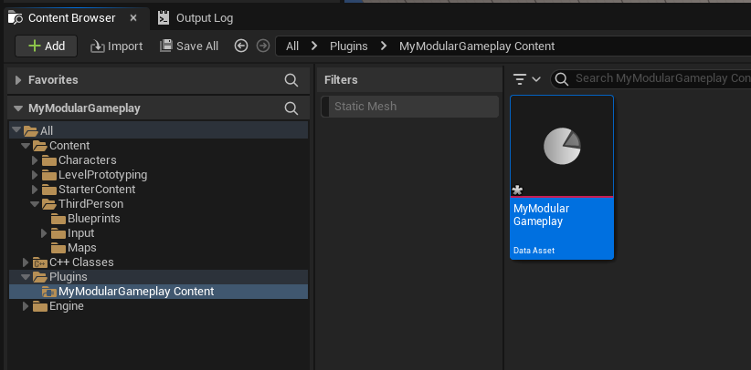
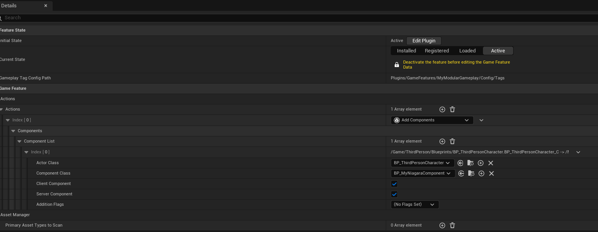
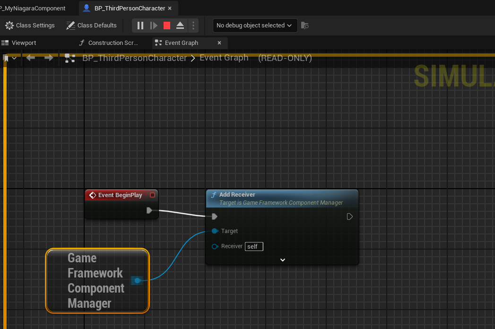
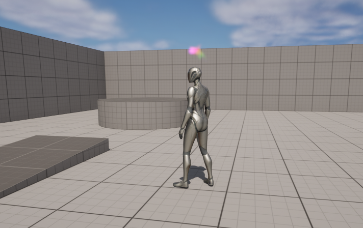
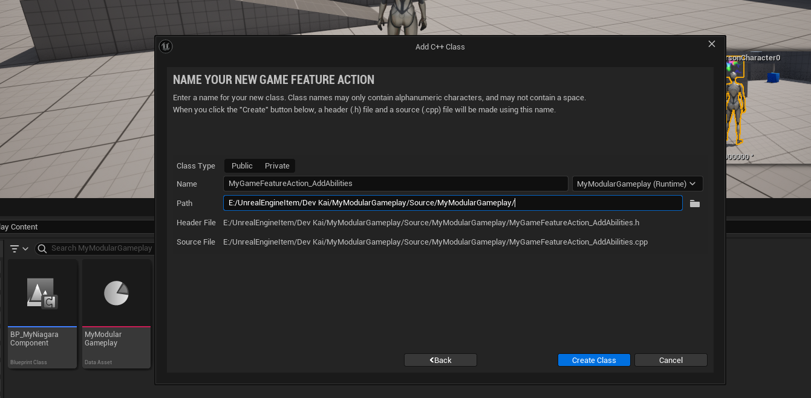
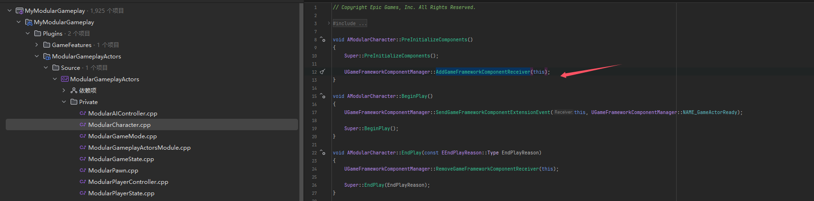
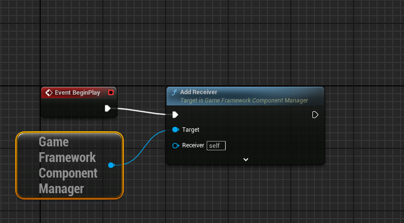
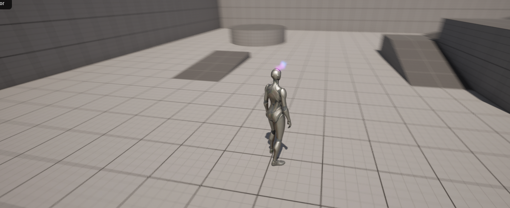
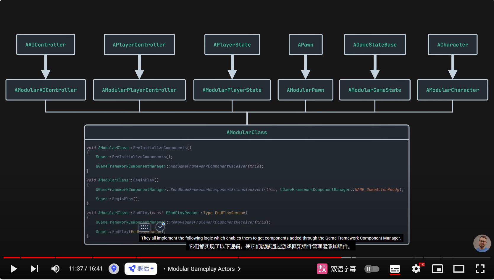
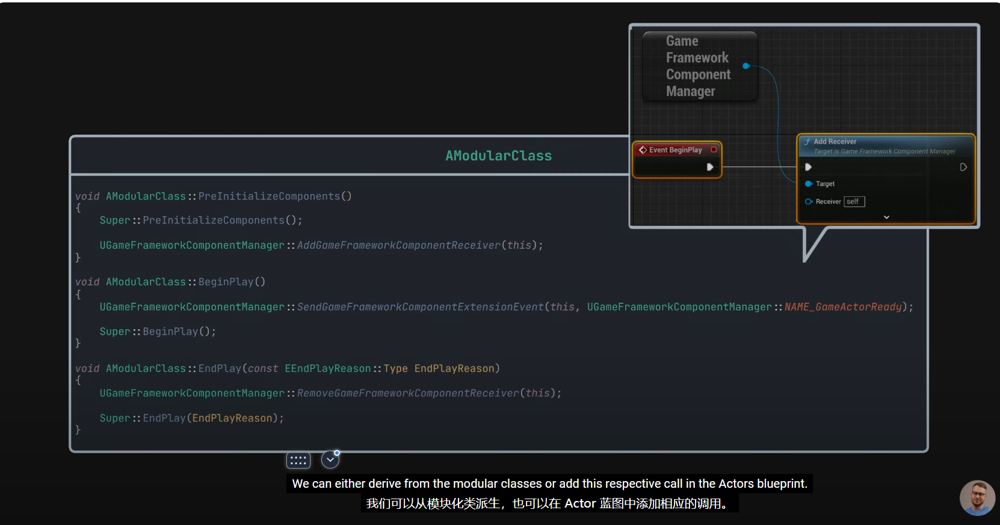

Link：https://www.youtube.com/watch?v=sSoGEO1tnEI


依赖于Game Features和 Modular GamePlay












#### GameFeatureAction



#### Lyar



做了与蓝图相同的事情



删除蓝图之后，依然有效









```c++
void AModularCharacter::PreInitializeComponents()
{
	Super::PreInitializeComponents();

	UGameFrameworkComponentManager::AddGameFrameworkComponentReceiver(this);
}

void AModularCharacter::BeginPlay()
{
	UGameFrameworkComponentManager::SendGameFrameworkComponentExtensionEvent(this, UGameFrameworkComponentManager::NAME_GameActorReady);

	Super::BeginPlay();
}

void AModularCharacter::EndPlay(const EEndPlayReason::Type EndPlayReason)
{
	UGameFrameworkComponentManager::RemoveGameFrameworkComponentReceiver(this);

	Super::EndPlay(EndPlayReason);
}


```

