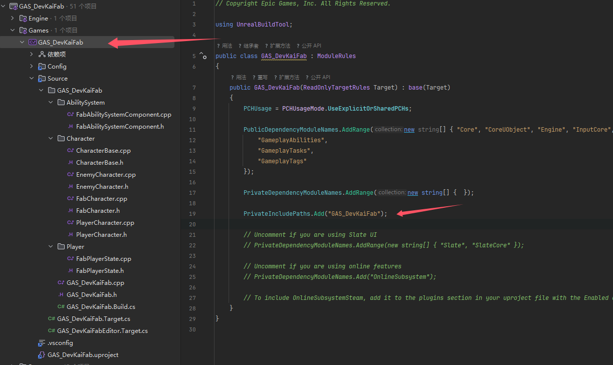
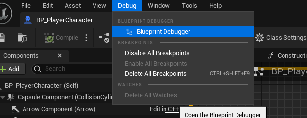
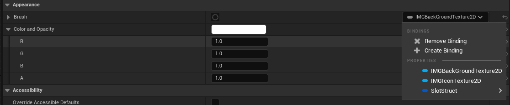

#### 修改缓存

```c++
InstalledDerivedDataBackendGraph
```

```c++
%GAMEDIR%DerivedDataCache
```

#### 包含

```c++
PrivateIncludePaths.Add("GAS_DevKaiFab");
```



#### 蓝图断点

F9 打
	F11 进入
	F10 步进




ctrl Alt M 提取为函数


#### 源码构建

#### 4.27

Link：https://www.youtube.com/watch?v=gh_tBY8BMS0


```c++
public UE4EditorTarget( TargetInfo Target ) : base(Target)
	{
		Type = TargetType.Editor;
		BuildEnvironment = TargetBuildEnvironment.Shared;
		bBuildAllModules = true;
		ExtraModuleNames.Add("UE4Game");

		bCompileChaos = true;
		bUseChaos = true;
	}
```

如果是旧项目用编译的开发则需要加

```c++
bCompileChaos = true;
bUseChaos = true;
bOverrideBuildEnvironment = true;
```

#### 结构体

```c++
#pragma once

#include "CoreMinimal.h"
#include "InventorySlotStruct.generated.h"

USTRUCT(BlueprintType)
struct FInventorySlotStruct 
{
	GENERATED_BODY()
public:
	FInventorySlotStruct();
		/** Please add a variable description */
	UPROPERTY(BlueprintReadWrite, EditAnywhere, meta=(DisplayName="Hasitem", MakeStructureDefaultValue="False"))
	bool Hasitem;

	/** Please add a variable description */
	UPROPERTY(BlueprintReadWrite, EditAnywhere, meta=(DisplayName="StackSize", MakeStructureDefaultValue="0"))
	int32 StackSize;

	/** Please add a variable description */
	// UPROPERTY(BlueprintReadWrite, EditAnywhere, meta=(DisplayName="ItemAsset", MakeStructureDefaultValue="None"))
	// TObjectPtr<UBP_Item_C> ItemAsset;

	/** Please add a variable description */
	UPROPERTY(BlueprintReadWrite, EditAnywhere, meta=(DisplayName="Index", MakeStructureDefaultValue="0"))
	int32 Index;
};


```

#### 接口

```c++
UINTERFACE()
class USlotInterface : public UInterface
{
	GENERATED_BODY()
};

class CUSTOMSLOT_API ISlotInterface
{
	GENERATED_BODY()

	// Add interface functions to this class. This is the class that will be inherited to implement this interface.
public:
	//蓝图调用
	UFUNCTION(BlueprintCallable, BlueprintNativeEvent,Category = Interfae)
	bool OnInteracted(AActor* Actor) ;

	//C++也能使用
	virtual bool OnInteract_Implementation(AActor* Actor)  = 0;
};

```

调用

```c++
	ISlotInterface::Execute_OnInteracted(WorldItem,this);

// WorldItem->OnInteracted(this);
```

#### HUD

```
"UMG","HeadMountedDisplay","Slate","SlateCore" 
```

通过Player初始化

```c++
if(const APlayerController* PlayerController = Cast<APlayerController>(GetController()))
{
    if(AFabHUD* FabHUD = Cast<AFabHUD>(PlayerController->GetHUD()))
    {
        FabHUD->Init();
    }
}
```


绑定



```c++
class UButton;
class UTextBlock;
class UImage;
UCLASS()
class CUSTOMSLOT_API USlotWidget : public UUserWidget
{
	GENERATED_BODY()
	
public:
	UPROPERTY(VisibleAnywhere,BlueprintReadOnly ,Category = UMG, meta = (BindWidget))
	UButton* BaseButton;
	UPROPERTY(VisibleAnywhere,BlueprintReadOnly ,Category = UMG, meta = (BindWidget))
	UImage* IMGBackGround;
	UPROPERTY(BlueprintReadOnly)
	UTexture2D* IMGBackGroundTexture2D;
	UPROPERTY(VisibleAnywhere,BlueprintReadOnly ,Category = UMG, meta = (BindWidget))
	UImage* IMGIcon;
	UPROPERTY(BlueprintReadOnly)
	UTexture2D* IMGIconTexture2D;
	UPROPERTY(VisibleAnywhere,BlueprintReadOnly ,Category = UMG, meta = (BindWidget))
	UTextBlock* TextNumber;
	UPROPERTY(VisibleAnywhere,BlueprintReadOnly ,Category = UMG, meta = (BindWidget))
	FText Text;
	UPROPERTY(VisibleAnywhere,BlueprintReadOnly ,Category = UMG, meta = (BindWidget))
	FInventorySlotStruct SlotStruct;


protected:
	virtual void NativeConstruct() override;
	
	virtual FReply NativeOnPreviewMouseButtonDown(const FGeometry& InGeometry, const FPointerEvent& InMouseEvent) override;
};

```

#### 委托

```c++
	// 定义一个多播委托，没有参数
	DECLARE_MULTICAST_DELEGATE(FOnSomethingHappened)

	// 委托实例
	FOnSomethingHappened OnSomethingHappened;

OnSomethingHappened.AddUObject(this, &USlotWidgetBar::UpdateUMGSlot);
```


如果修改

```c++
	// 使用 DECLARE_DYNAMIC_MULTICAST_DELEGATE 宏来声明你的委托
	DECLARE_DYNAMIC_MULTICAST_DELEGATE(FOnUpdateSlot);

	// 委托实例
	UPROPERTY(BlueprintAssignable, Category = "Delegate Events")
	FOnUpdateSlot OnUpdateSlot;

	// 创建一个蓝图可调用的函数来触发委托
	UFUNCTION(BlueprintCallable, Category = "Delegate Events")
	void TriggerOnSomethingHappened()
	{
		OnUpdateSlot.Broadcast();
	}

	OnUpdateSlot.AddDynamic(this, &USlotWidgetBar::UpdateUMGSlot);
```

