教程路径

Link：https://www.youtube.com/watch?v=7tUwMa1BU3c&list=PLmCw_T2hLwiE4vs7rffbuYgviR0Pd_XMT&index=5


#### 基础准备

创建相应的类，具体的类有

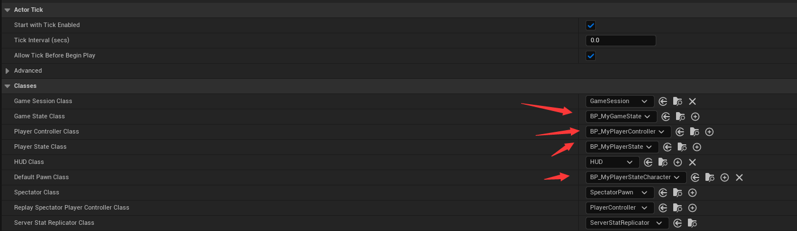

首先是重要的AMyPlayerStateCharacter

```c++
UCLASS()
class GAS_RELAX_API AMyPlayerStateCharacter : public AGSCModularPlayerStateCharacter,public ICharacterHelper
{
GENERATED_BODY()
public:
AMyPlayerStateCharacter(const FObjectInitializer& ObjectInitializer);

UPROPERTY(VisibleAnywhere, BlueprintReadOnly, Category = "Camera", meta = (AllowPrivateAccess))
//class USpringArmComponent* SpringArmComponent;
TObjectPtr<USpringArmComponent> SpringArmComponent;
UPROPERTY(VisibleAnywhere, BlueprintReadOnly, Category = "Camera", meta = (AllowPrivateAccess))
TObjectPtr<UCameraComponent> CameraComponent;

//允许交互 提供技能
UPROPERTY(VisibleAnywhere, BlueprintReadOnly, Category = "Camera", meta = (AllowPrivateAccess))
TObjectPtr<UGSCCoreComponent> GSCCoreComponent;

//输入绑定到角色
UPROPERTY(VisibleAnywhere, BlueprintReadOnly, Category = "Camera", meta = (AllowPrivateAccess))
TObjectPtr<UGSCAbilityInputBindingComponent> GSCAbilityInputBindingComponent;

protected:
virtual void  BeginPlay() override;

public:
virtual  void  Tick(float DeltaSeconds) override;

virtual void SetupPlayerInputComponent(UInputComponent* PlayerInputComponent) override;

};

```

CPP代码如下

```c++
#include "MyPlayerStateCharacter.h"

#include "Camera/CameraComponent.h"
#include "Components/GSCAbilityInputBindingComponent.h"
#include "Components/GSCCoreComponent.h"
#include "GameFramework/SpringArmComponent.h"


AMyPlayerStateCharacter::AMyPlayerStateCharacter(const FObjectInitializer& ObjectInitializer):Super(ObjectInitializer)
{

	PrimaryActorTick.bCanEverTick = true;

	//Set up movement
	bUseControllerRotationYaw = false;
	
	SpringArmComponent = CreateDefaultSubobject<USpringArmComponent>(TEXT("SpringArmComponent"));
	SpringArmComponent->SetupAttachment(RootComponent);
	SpringArmComponent->SetRelativeLocation(FVector(0.f, 0.f, 70.0f));
	SpringArmComponent->TargetArmLength = 450.0f;

	//Paw 旋转
	SpringArmComponent->bUsePawnControlRotation = true;
	SpringArmComponent->bInheritYaw = true;
	//滞后
	SpringArmComponent->bEnableCameraLag = true;
	SpringArmComponent->CameraLagSpeed = 15.f;


	//Setup CameraComponent
	CameraComponent = CreateDefaultSubobject<UCameraComponent>(TEXT("CameraComponent"));
	CameraComponent->SetupAttachment(SpringArmComponent);
	CameraComponent->bUsePawnControlRotation = false;
	CameraComponent->FieldOfView = 75.f;


	//Setup GAS Companion
	GSCCoreComponent = CreateDefaultSubobject<UGSCCoreComponent>(TEXT("GSCCoreComponent"));
	GSCAbilityInputBindingComponent = CreateDefaultSubobject<UGSCAbilityInputBindingComponent>(TEXT("GSCAbilityInputBindingComponent"));

}

void AMyPlayerStateCharacter::BeginPlay()
{
	Super::BeginPlay();
}

void AMyPlayerStateCharacter::Tick(float DeltaSeconds)
{
	Super::Tick(DeltaSeconds);
}

void AMyPlayerStateCharacter::SetupPlayerInputComponent(UInputComponent* PlayerInputComponent)
{
	Super::SetupPlayerInputComponent(PlayerInputComponent);
}

```

主要的继承关系如下

```c++

//GameMode
AMyGameMode->AGSCModularGameModeBase->AGameModeBase


//Character
AMyPlayerStateCharacter->AGSCModularPlayerStateCharacter->
(public ACharacter, public IAbilitySystemInterface, public IGameplayTagAssetInterface)

//PlayerController
AMyPlayerController->AGSCModularPlayerController->APlayerController


//CheatManager
UMyCheatManager->UCheatManager


//PlayerState
AMyPlayerState->AGSCModularPlayerState->
(public APlayerState, public IAbilitySystemInterface)

//GameInstance
UMyGameInstance->UGameInstance

//GameStateBase
AMyGameStateBase->AGSCModularGameStateBase->AGameStateBase
```


#### 1、Input Action

##### 1.1 设置键位

利用Input Action 和Input Mapping

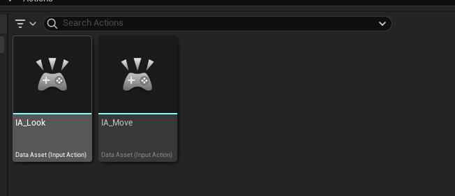

设置上大同小异水平二维输入

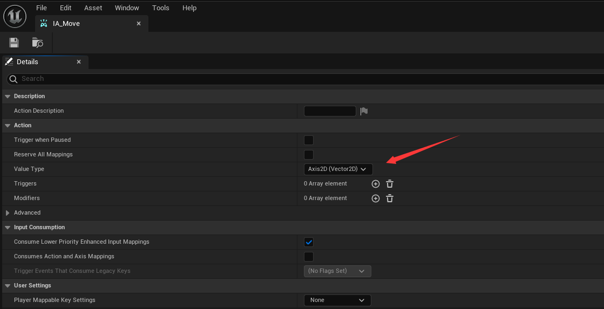

利用Input mapping 进行设备自适应

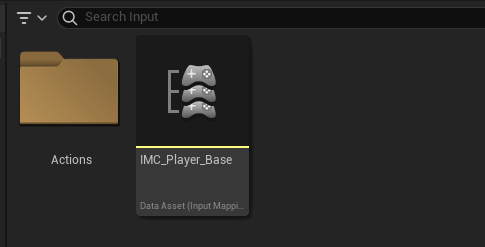

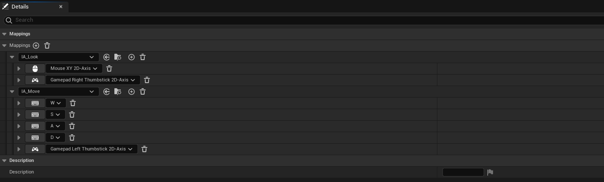


其中鼠标输入需要颠倒Y 轴

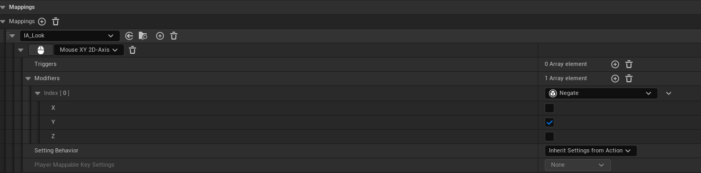

移动里面WS，需要颠倒为Y轴

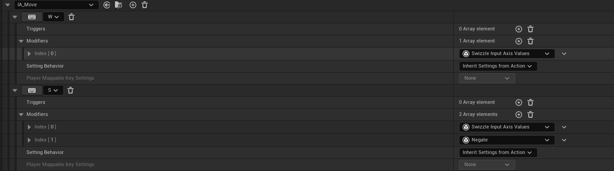

AD 只需要设置A为负值

手柄输入设置死区

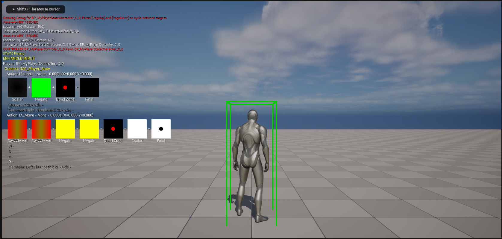

可以看到输入，利用~ 和 show debug 

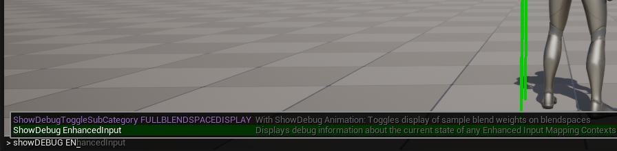

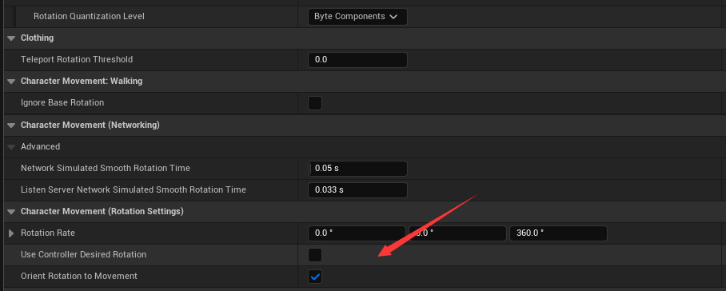

如果不选择这里，旋转将会利用相机旋转，不会使用按键旋转


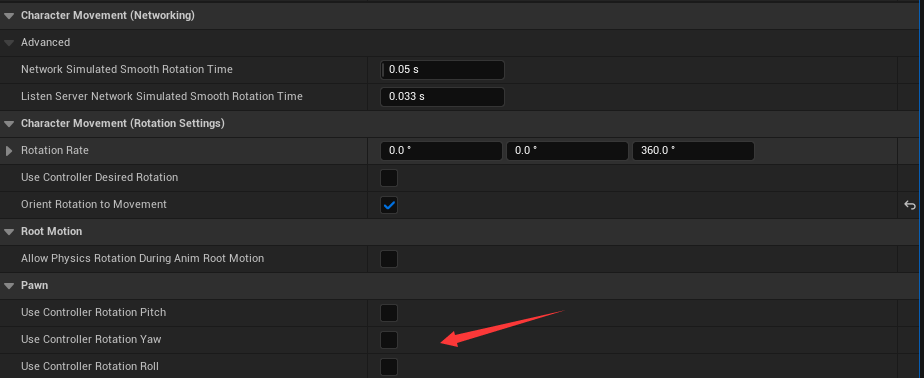

使用控制器旋转


##### 1.2 ICharacterHelper

我们要让其他组件抓取数据，首先需要保存玩家的数据利用接口

```c++
#pragma once

#include "CoreMinimal.h"
#include "UObject/Interface.h"
#include "CharacterHelper.generated.h"

// This class does not need to be modified.
UINTERFACE()
class UCharacterHelper : public UInterface
{
	GENERATED_BODY()
};

/**
 * 
 */
class GAS_RELAX_API ICharacterHelper
{
	GENERATED_BODY()


	//接口在 character 的蓝图中赋值，随后被其他数值调用
public:
	UFUNCTION(BlueprintNativeEvent,BlueprintCallable,Category = "Character Helper")
	FVector2D GetInputActionLookValue();
	
	UFUNCTION(BlueprintNativeEvent,BlueprintCallable,Category = "Character Helper")
	FVector2D GetInputActionMoveValue();
};

```

随后让玩家继承

```c++

class UGSCAbilityInputBindingComponent;
class UCameraComponent;
class UGSCCoreComponent;
/**
 * 
 */
UCLASS()
class GAS_RELAX_API AMyPlayerStateCharacter : public AGSCModularPlayerStateCharacter,public ICharacterHelper
{
	GENERATED_BODY()
public:
	AMyPlayerStateCharacter(const FObjectInitializer& ObjectInitializer);

	UPROPERTY(VisibleAnywhere, BlueprintReadOnly, Category = "Camera", meta = (AllowPrivateAccess))
	//class USpringArmComponent* SpringArmComponent;
	TObjectPtr<USpringArmComponent> SpringArmComponent;
	UPROPERTY(VisibleAnywhere, BlueprintReadOnly, Category = "Camera", meta = (AllowPrivateAccess))
	TObjectPtr<UCameraComponent> CameraComponent;

	//允许交互 提供技能
	UPROPERTY(VisibleAnywhere, BlueprintReadOnly, Category = "Camera", meta = (AllowPrivateAccess))
	TObjectPtr<UGSCCoreComponent> GSCCoreComponent;

	//输入绑定到角色
	UPROPERTY(VisibleAnywhere, BlueprintReadOnly, Category = "Camera", meta = (AllowPrivateAccess))
	TObjectPtr<UGSCAbilityInputBindingComponent> GSCAbilityInputBindingComponent;

protected:
	virtual void  BeginPlay() override;

public:
	virtual  void  Tick(float DeltaSeconds) override;

	virtual void SetupPlayerInputComponent(UInputComponent* PlayerInputComponent) override;

};

```

就可以在玩家蓝图中看到两个函数，随后我们将InPunt Action的值穿进去，缓存

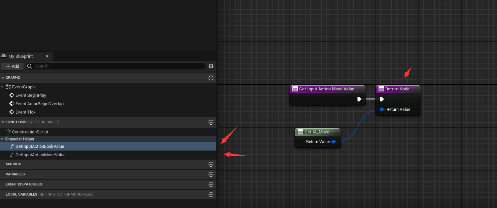


#### 2、Data Set

因此可以创建一个data Asset

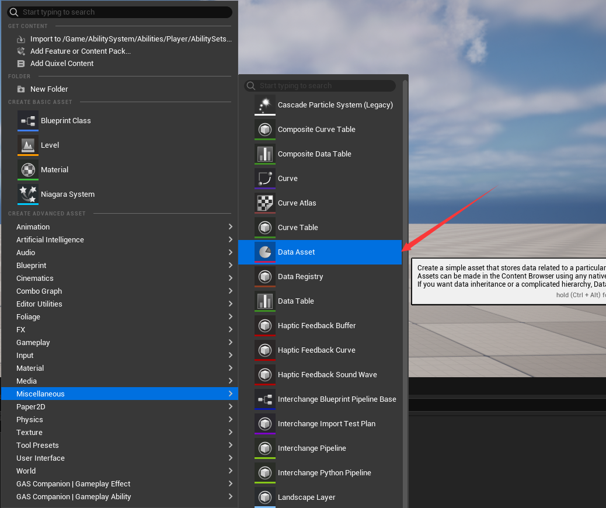

随后创建能力

##### 2.1 UGSCGameplayAbility

基于<font color=#4db8ff>UGSCGameplayAbility</font> 创建Look 和Move

<font color=#4db8ff>GA_Player_Look、GA_Player_Move</font>都继承于<font color=#4db8ff>UGSCGameplayAbility</font>

```c++
#include "CoreMinimal.h"
#include "Abilities/GSCGameplayAbility.h"
#include "MyGamePlayerAbility_Move.generated.h"

/**
 * 
 */
UCLASS()
class GAS_RELAX_API UMyGamePlayerAbility_Move : public UGSCGameplayAbility
{
	GENERATED_BODY()

public:
	UMyGamePlayerAbility_Move();

protected:
	virtual void ActivateAbility(const FGameplayAbilitySpecHandle Handle, const FGameplayAbilityActorInfo* ActorInfo, const FGameplayAbilityActivationInfo ActivationInfo, const FGameplayEventData* TriggerEventData) override;
	virtual void EndAbility(const FGameplayAbilitySpecHandle Handle, const FGameplayAbilityActorInfo* ActorInfo, const FGameplayAbilityActivationInfo ActivationInfo, bool bReplicateEndAbility, bool bWasCancelled) override;


	UFUNCTION(BlueprintCallable,Category = "Player Movement")
	void Move(const FVector2D ActionValue);
	
};

/////
/////

#include "CoreMinimal.h"
#include "Abilities/GSCGameplayAbility.h"
#include "MyGamePlayerAbility_Look.generated.h"
UCLASS()
class GAS_RELAX_API UMyGamePlayerAbility_Look : public UGSCGameplayAbility
{
	GENERATED_BODY()
public:
	UMyGamePlayerAbility_Look();

protected:
	virtual void ActivateAbility(const FGameplayAbilitySpecHandle Handle, const FGameplayAbilityActorInfo* ActorInfo, const FGameplayAbilityActivationInfo ActivationInfo, const FGameplayEventData* TriggerEventData) override;
	virtual void EndAbility(const FGameplayAbilitySpecHandle Handle, const FGameplayAbilityActorInfo* ActorInfo, const FGameplayAbilityActivationInfo ActivationInfo, bool bReplicateEndAbility, bool bWasCancelled) override;


	UFUNCTION(BlueprintCallable,Category = "Player Movement")
	void Look(const FVector2D ActionValue);
};


```

代码大同小异，但是都会有一个函数允许蓝图调用分别是Look和Move

函数如下，首先要判断传入的值，而这个值，是通过接口获得的

```c++
void UMyGamePlayerAbility_Look::Look(const FVector2D ActionValue)
{
	if(!ActionValue.IsZero())
	{
		if(AMyPlayerStateCharacter* MyPlayerStateCharacter = Cast<AMyPlayerStateCharacter>(GetAvatarActorFromActorInfo()))
		{
			MyPlayerStateCharacter->AddControllerYawInput(ActionValue.X);
			MyPlayerStateCharacter->AddControllerPitchInput(ActionValue.Y);
		}
	}
}


///
///
///

void UMyGamePlayerAbility_Move::Move(const FVector2D ActionValue)
{
	if(!ActionValue.IsZero())
	{
		//返回执行此能力的物理角色
		if(AMyPlayerStateCharacter* MyPlayerStateCharacter = Cast<AMyPlayerStateCharacter>(GetAvatarActorFromActorInfo()))
		{
			//获取控制器的旋转角度，通常也就是该 Pawn 的 "视图 "旋转角度。
			const FRotator Rotation = MyPlayerStateCharacter->GetControlRotation();

			//按给定的旋转角度旋转世界右矢量 
			const FVector RightDirection = UKismetMathLibrary:: GetRightVector(FRotator(0.0f,Rotation.Yaw,0.f));
			const FVector ForwardDirection = UKismetMathLibrary:: GetForwardVector(FRotator(0.0f,Rotation.Yaw,0.f));

			//指定方向与值
			MyPlayerStateCharacter->AddMovementInput(RightDirection,ActionValue.X);
			
			MyPlayerStateCharacter->AddMovementInput(ForwardDirection,ActionValue.Y);
		}
	}
}

```

调用在蓝图中使用，也是大同小异

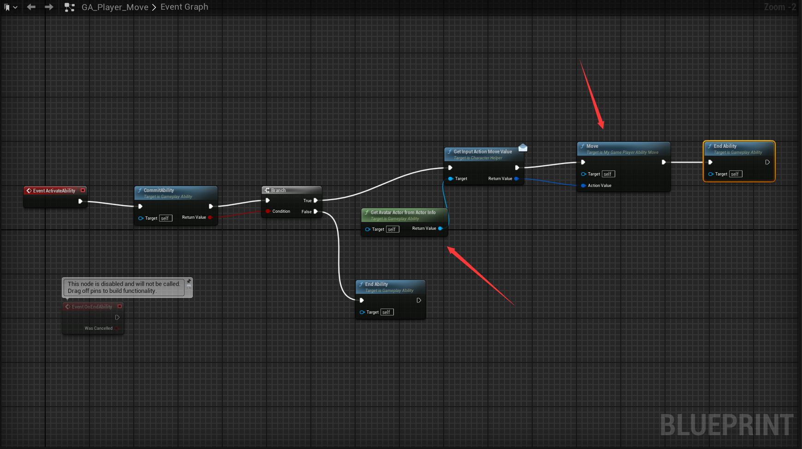

首先抓取角色，随后抓取角色接口保存的值即

```c++
class GAS_RELAX_API ICharacterHelper
{
	GENERATED_BODY()


	//接口在 character 的蓝图中赋值，随后被其他数值调用
public:
	UFUNCTION(BlueprintNativeEvent,BlueprintCallable,Category = "Character Helper")
	FVector2D GetInputActionLookValue();
	
	UFUNCTION(BlueprintNativeEvent,BlueprintCallable,Category = "Character Helper")
	FVector2D GetInputActionMoveValue();
};

```

随后将值传入<font color=#4db8ff>GA_Player_Look、GA_Player_Move</font>去执行对应的Look和Move函数

处理已经实现了，那么就要编写触发


利用这个去获取能力，那么行走移动也是能力

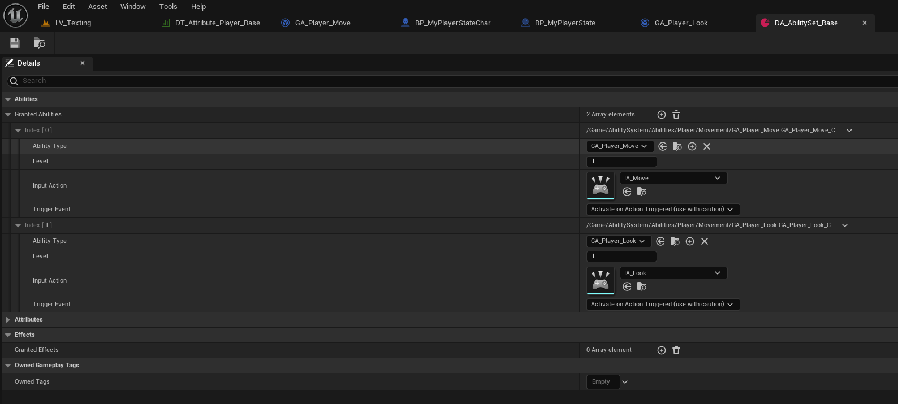

##### 2.2 Event Trigger

将数据放入创建的Data Asset中，可以在这里绑定Input Action与<font color=#4db8ff>GameplayAbility</font>

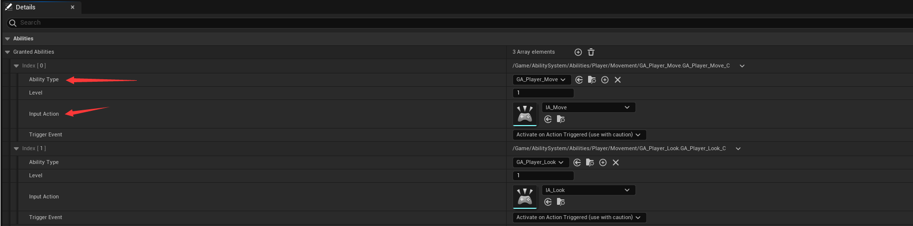

随后在<font color=#4db8ff>BP_MyPlayerState</font>中使用，而他在Game Modes中使用

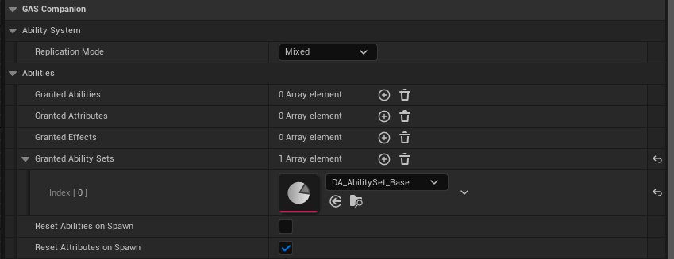

2.3 Debug

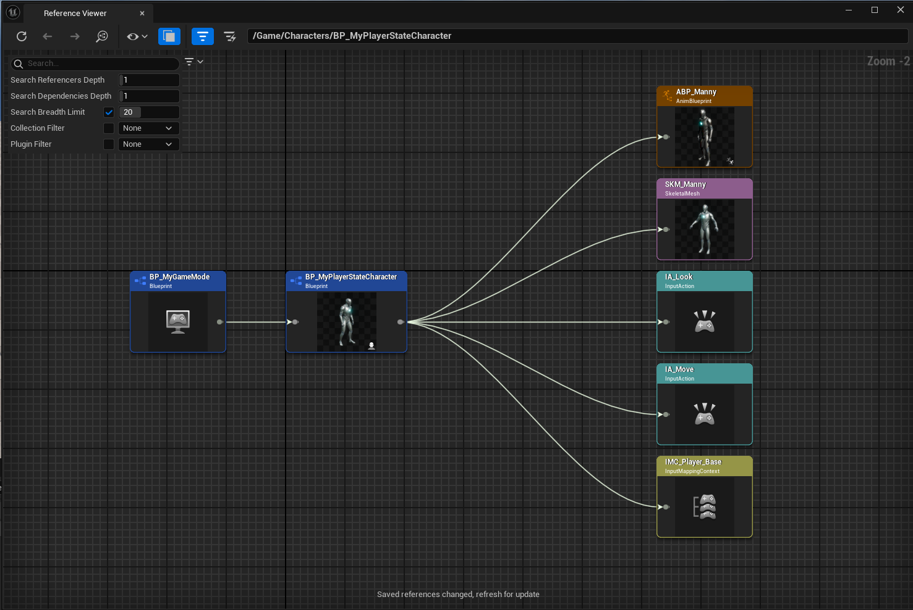


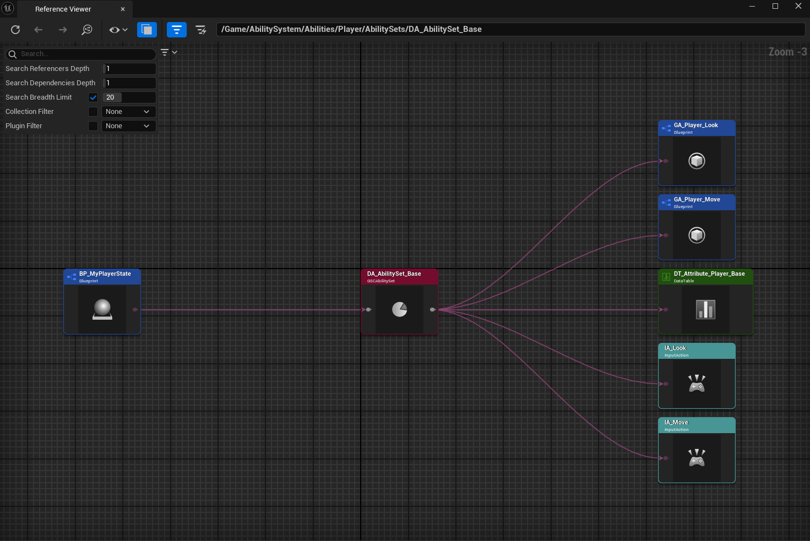


'' 加数字键盘3可以查看

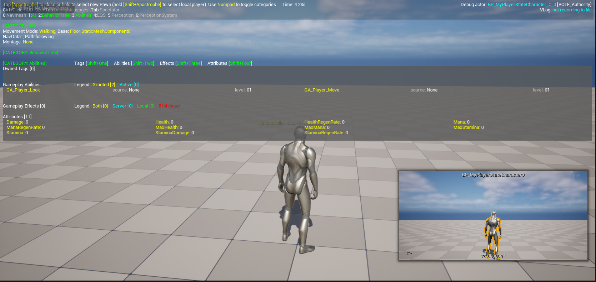

#### 3、Data Table

##### 3.1 Data

利用这个可以制作，数值相关内容

如：Health、Stamina 、Man、RegenRate

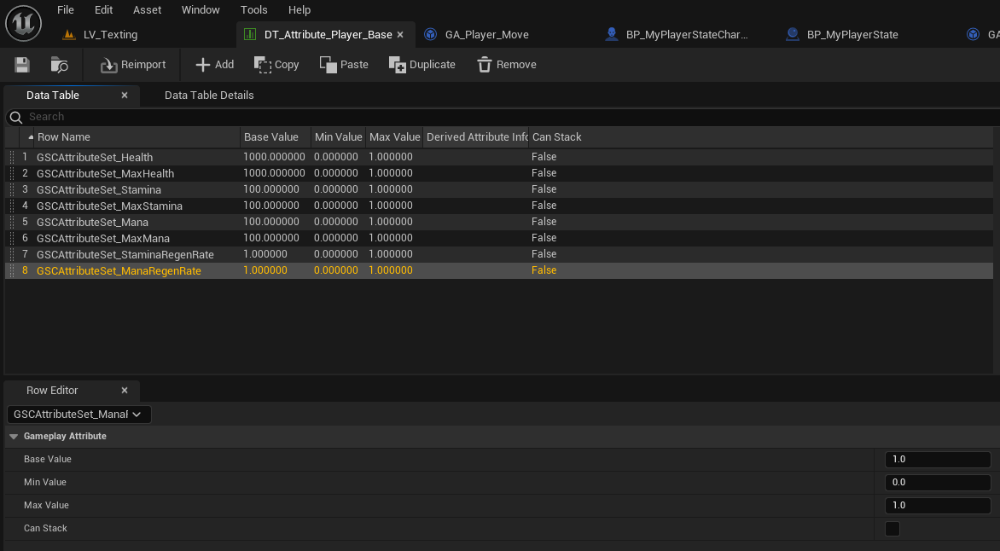

设置按可以在

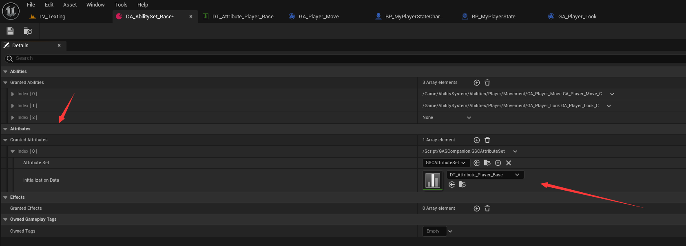

在控制台就会显示

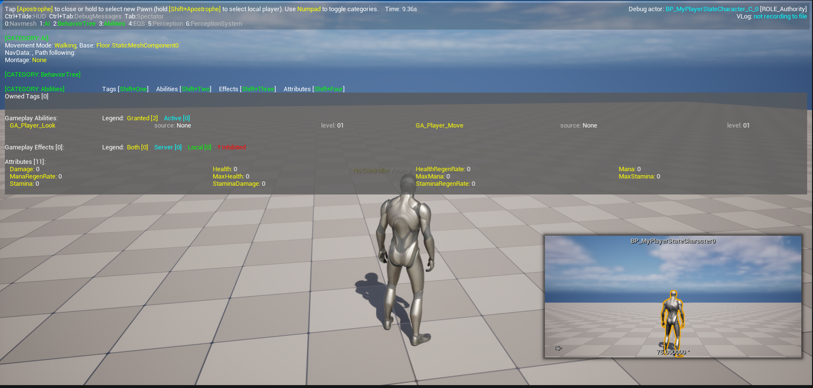

##### 3.2 UI

<font color=#4db8ff>Link: </font>https://www.youtube.com/watch?v=7tUwMa1BU3c&list=PLmCw_T2hLwiE4vs7rffbuYgviR0Pd_XMT&index=5

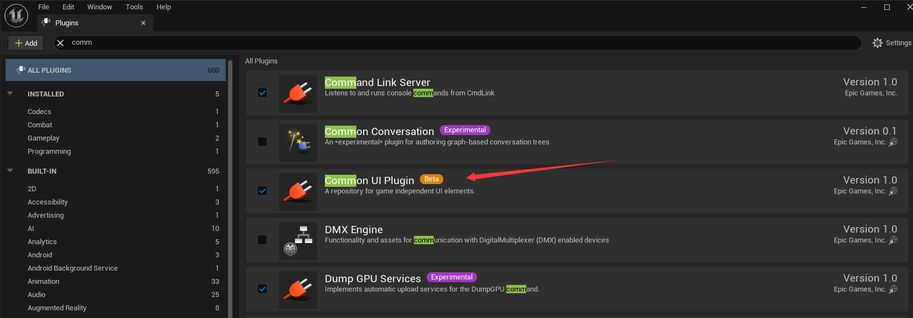

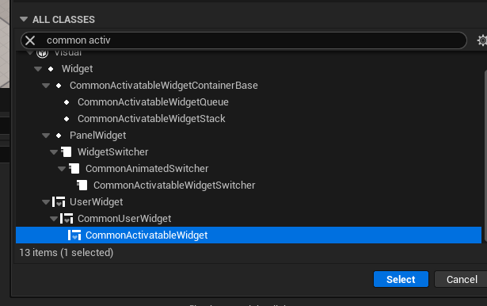

##### 3.3 Cheat manager

可以利用控制台命令

```c++
// Fill out your copyright notice in the Description page of Project Settings.

#pragma once

#include "CoreMinimal.h"
#include "GameplayEffect.h"
#include "Abilities/GSCAbilitySet.h"
#include "Abilities/GSCAbilitySystemComponent.h"
#include "GameFramework/CheatManager.h"
#include "MyCheatManager.generated.h"

/**
 * 
 */
UCLASS()
class GAS_RELAX_API UMyCheatManager : public UCheatManager
{
	GENERATED_BODY()
public:
	UMyCheatManager();

	virtual void InitCheatManager() override;

	//控制台命令
	UFUNCTION(Exec,BlueprintAuthorityOnly)
	virtual void DamageSelf(const float DamageAmount);

public:
	UPROPERTY(EditAnywhere,BlueprintReadWrite,Category="GamePlayEffects")
	TSubclassOf<UGameplayEffect> DamageGE;

protected:
	void ApplySetByCallerDamage(TObjectPtr<UGSCAbilitySystemComponent> ASC,float DamageAmount) const;
	
	TObjectPtr<UGSCAbilitySystemComponent> GetPlayerAbilitySystemComponent() const;
};

```

Cpp

```c++
// Fill out your copyright notice in the Description page of Project Settings.


#include "MyCheatManager.h"

#include "MyPlayerController.h"
#include "MyPlayerState.h"

UMyCheatManager::UMyCheatManager()
{
}

void UMyCheatManager::InitCheatManager()
{
	Super::InitCheatManager();
}

void UMyCheatManager::DamageSelf(const float DamageAmount)
{
	if(TObjectPtr<UGSCAbilitySystemComponent> ASC = GetPlayerAbilitySystemComponent())
	{
		ApplySetByCallerDamage(ASC,DamageAmount);
	}
}

// 向某个角色（或其他对象）施加一个伤害效果。这个伤害效果的数值是动态的，由函数的参数 DamageAmount 决定
void UMyCheatManager::ApplySetByCallerDamage(TObjectPtr<UGSCAbilitySystemComponent> ASC, float DamageAmount) const
{
	//断言
	//ASC 用于管理角色的能力和效果系统
	check(ASC)

	//通常用于描述一个效果，例如伤害、治疗等
	//Gameplay Effect (GE): 这个函数涉及的是 Unreal Engine 的 Gameplay Effect 系统，
	//它用于处理角色之间的状态变化，例如伤害、治疗、增益或减益。DamageEf 代表了一个 GameplayEffect 对象
	if (DamageGE)
	{
		//GE
		//游戏效果的规范（Spec），描述了如何应用游戏效果。这包括效果的类型、强度、持续时间
		FGameplayEffectSpecHandle SpecHandle = ASC->MakeOutgoingSpec(DamageGE, 1.f, ASC->MakeEffectContext());

		// MakeEffectContext() 创建了一个包含效果施加时的上下文信息的对象，这个上下文可以包括施加者、目标、位置等信息。

		if (SpecHandle.IsValid())
		{
			//GameplayTag: FGameplayTag::RequestGameplayTag("SetByCaller.Damage")
			//用于查找或创建一个 GameplayTag。这个标签用于标识这个具体的“SetByCaller”参数，
			//并且需要在 GameplayEffect 中配置为“SetByCaller”类型的输入。

			//RequestGameplayTag
			//这个函数请求或创建一个名为 SetByCaller.Damage 的 GameplayTag。这个标签用于标识即将传递的参数（即伤害值）。
			// 这个标签通常在 GameplayEffect 的配置中预定义，但不会具体赋值，因为它是一个 SetByCaller 类型的标签。
			SpecHandle.Data->SetSetByCallerMagnitude(FGameplayTag::RequestGameplayTag("SetByCaller.Damage"),
			                                         DamageAmount);

			ASC->ApplyGameplayEffectSpecToSelf(*SpecHandle.Data.Get());
		}
	}
}

TObjectPtr<UGSCAbilitySystemComponent> UMyCheatManager::GetPlayerAbilitySystemComponent() const
{
	if (AMyPlayerController* PC = Cast<AMyPlayerController>(GetOuterAPlayerController()))
	{
		//PC->GetPlayerState<AMyPlayerState>() 内含类型转换
		return Cast<UGSCAbilitySystemComponent>(PC->GetPlayerState<AMyPlayerState>()->GetAbilitySystemComponent());
	}
	return nullptr;
}

```


##### 3.4 GE

创建一个GE 蓝图基类，随后让子类继承他

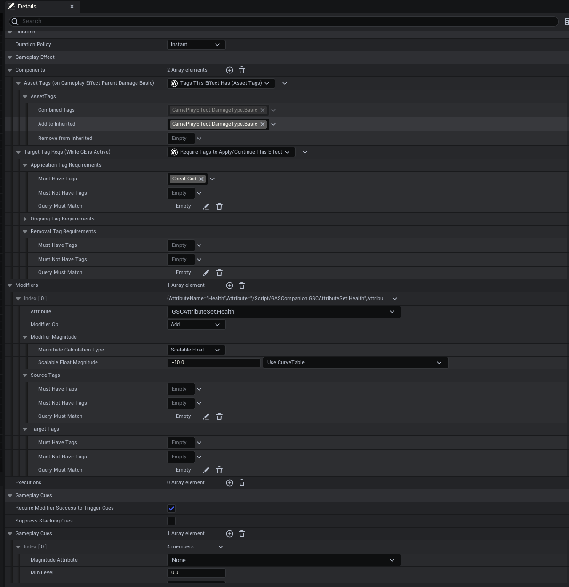

抽象函数，允许子类继承使用

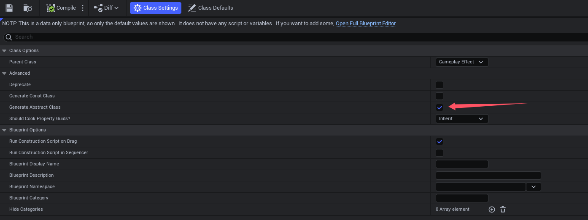

其中计算调用的是Cheat manager中书写的代码

```c++
SpecHandle.Data->SetSetByCallerMagnitude(FGameplayTag::RequestGameplayTag("SetByCaller.Damage"),
			                                         DamageAmount);
```

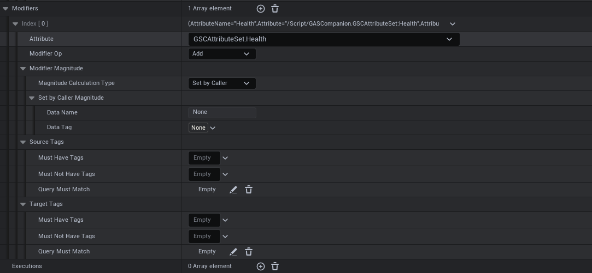

##### 3.5 Damage Calculation

link：https://www.youtube.com/watch?v=40rLuYJ7KJE&list=PLmCw_T2hLwiE4vs7rffbuYgviR0Pd_XMT&index=7

继承于 UGameplayEffectExecutionCalculation

```c++
#include "MyDamageExecutionCalculation.h"

struct FDamageStatics
{
	// capture declarations

	//Target Attributes

	//声明一个 FGameplayEffectAttributeCaptureDefinition 类型的变量
	DECLARE_ATTRIBUTE_CAPTUREDEF(health);

	//可以在 Gameplay Effect 或者 Gameplay Ability 的定义中使用这个捕获定义，来获取目标的 health 属性的当前值或者基础值
};


UMyDamageExecutionCalculation::UMyDamageExecutionCalculation()
{
}


// 函数的实现可能会根据你的具体需求而不同，但一般来说，
// 你可能会先从 ExecutionParams 中获取必要的信息，然后根据这些信息计算效果的结果，最后将结果写入 OutExecutionOutput。
void UMyDamageExecutionCalculation::Execute_Implementation(
	const FGameplayEffectCustomExecutionParameters& ExecutionParams,
	FGameplayEffectCustomExecutionOutput& OutExecutionOutput) const
{
	Super::Execute_Implementation(ExecutionParams, OutExecutionOutput);
}

```

随后利用继承于<font color=#4db8ff>UGSCAttributeSetBase</font>

 AttributeSet 类的声明。AttributeSet 类用于存储和管理角色的所有游戏相关属性，例如生命值、魔法值、攻击力等

- `PreAttributeChange`：这个函数在属性值改变之前被调用，你可以在这个函数中实现一些自定义逻辑，例如限制属性值的范围。
- `PostGameplayEffectExecute`：这个函数在 Gameplay Effect 执行之后被调用，你可以在这个函数中实现一些自定义逻辑，例如根据造成的伤害播放不同的动画。
- `GetLifetimeReplicatedProps`：这个函数用于设置哪些属性需要在网络中进行复制。在网络游戏中，你需要确保所有客户端都能看到正确的属性值。
- `PreAttributeBaseChange`：这个函数在属性的基础值改变之前被调用，你可以在这个函数中实现一些自定义逻辑，例如限制属性基础值的范围。

其中

在 Unreal Engine 的 Gameplay Ability 系统中，`DECLARE_ATTRIBUTE_CAPTUREDEF` 宏声明的属性捕获定义的类型确实是 `FGameplayEffectAttributeCaptureDefinition`。这个类型用于存储关于如何捕获一个属性的信息，包括应该捕获哪个类的哪个属性，以及应该捕获这个属性的当前值还是基础值。

当你在代码中写 `DECLARE_ATTRIBUTE_CAPTUREDEF(Health);`，你实际上是在声明一个 `FGameplayEffectAttributeCaptureDefinition` 类型的变量，这个变量的名字是 `HealthDef`。这个变量用于存储关于如何捕获 `Health` 属性的信息。

然后，当你在构造函数中写 `DEFINE_ATTRIBUTE_CAPTUREDEF(UGSCAttributeSet, Health, Target, false);`，你实际上是在定义 `HealthDef` 变量的行为。这行代码指定了 `HealthDef` 应该捕获 `UGSCAttributeSet` 类中的 `Health` 属性的值，这个值应该被视为目标属性，而且应该捕获这个属性的当前值（而不是基础值）。

因此，`HealthDef` 和 `Health` 的关系是：`HealthDef` 是一个属性捕获定义，它定义了如何捕获 `Health` 属性的值。你可以在 Gameplay Effect 或 Gameplay Ability 的定义中使用 `HealthDef` 来捕获目标的 `Health` 属性的值。


##### 3.6 AttributeSetBase

设置

```c++
// Fill out your copyright notice in the Description page of Project Settings.

#pragma once

#include "CoreMinimal.h"
#include "Abilities/Attributes/GSCAttributeSetBase.h"
#include "CombatSet.generated.h"

/**
 * 
 */
UCLASS()
class GAS_RELAX_API UCombatSet : public UGSCAttributeSetBase
{
	GENERATED_BODY()

public:
	UCombatSet();

	virtual void PreAttributeChange(const FGameplayAttribute& Attribute, float& NewValue) override;
	virtual void PostGameplayEffectExecute(const FGameplayEffectModCallbackData& Data) override;
	virtual void GetLifetimeReplicatedProps(TArray<FLifetimeProperty>& OutLifetimeProps) const override;
	virtual auto PreAttributeBaseChange(const FGameplayAttribute& Attribute, float& NewValue) const -> void override;

	//Offensive

	//ReplicatedUsing 允许你指定一个函数，这个函数会在属性在客户端上被更新时被调用
	UPROPERTY(BlueprintReadOnly,Category = "CombatSet", ReplicatedUsing = OnRep_AttackSpeed)
	FGameplayAttributeData AttackSpeed = 1.0f;
	//用于生成属性的 getter 和 setter 函数。在这个例子中，它会生成 GetAttackSpeed 和 SetAttackSpeed 函数
	ATTRIBUTE_ACCESSORS(UCombatSet,AttackSpeed);
	
	UPROPERTY(BlueprintReadOnly,Category = "CombatSet", ReplicatedUsing = OnRep_CriticalStrikeChance)
	FGameplayAttributeData CriticalStrikeChance = 0.1f;
	ATTRIBUTE_ACCESSORS(UCombatSet,CriticalStrikeChance);

	UPROPERTY(BlueprintReadOnly,Category = "CombatSet",ReplicatedUsing= OnRep_CriticalStrikeDamageMultiple)
	FGameplayAttributeData CriticalStrikeDamageMultiple = 1.2f;
	ATTRIBUTE_ACCESSORS(UCombatSet,CriticalStrikeDamageMultiple);


	//Defensive
	UPROPERTY(BlueprintReadOnly,Category = "CombatSet",ReplicatedUsing= OnRep_DamageReduction)
	FGameplayAttributeData DamageReduction = 1.2f;
	ATTRIBUTE_ACCESSORS(UCombatSet,DamageReduction)

protected:
	UFUNCTION()
	virtual void OnRep_AttackSpeed(const FGameplayAttributeData& OldAttackSpeed);
	UFUNCTION()
	virtual void OnRep_CriticalStrikeChance(const FGameplayAttributeData& OldCriticalStrikeChance);
	UFUNCTION()
	virtual void OnRep_CriticalStrikeDamageMultiple(const FGameplayAttributeData& OldCriticalStrikeDamageMultiple);
	UFUNCTION()
	virtual void OnRep_DamageReduction(const FGameplayAttributeData& OldDamageReduction);
	
};

```

同事

```c++
// Fill out your copyright notice in the Description page of Project Settings.


#include "CombatSet.h"

#include "Net/UnrealNetwork.h"

UCombatSet::UCombatSet()
{
}

void UCombatSet::PreAttributeChange(const FGameplayAttribute& Attribute, float& NewValue)
{
	Super::PreAttributeChange(Attribute, NewValue);

	if (Attribute == GetCriticalStrikeChanceAttribute())
	{
		//限制暴击率在 0 - 100
		NewValue = FMath::Clamp(NewValue, 0.f, 1.f);
	}
	else if (Attribute == GetCriticalStrikeDamageMultipleAttribute())
	{
		//限制暴击率在 0 - 100
		NewValue = FMath::Clamp(NewValue, 1.2f, 12.0f);
	}

	else if (Attribute == GetAttackSpeedAttribute())
	{
		//限制暴击率在 0 - 100
		NewValue = FMath::Clamp(NewValue, 0.1f, 2.f);
	}
	else if (Attribute == GetDamageReductionAttribute())
	{
		//限制暴击率在 0 - 100
		NewValue = FMath::Clamp(NewValue, 0.f, .9f);
	}
}

void UCombatSet::PostGameplayEffectExecute(const FGameplayEffectModCallbackData& Data)
{
	Super::PostGameplayEffectExecute(Data);
	FGSCAttributeSetExecutionData ExecutionData;
	GetExecutionDataFromMod(Data, ExecutionData);
}

void UCombatSet::GetLifetimeReplicatedProps(TArray<FLifetimeProperty>& OutLifetimeProps) const
{
	Super::GetLifetimeReplicatedProps(OutLifetimeProps);
	//通知服务器，服务器进行更新
	// 这个参数是一个枚举值，用于决定何时触发复制通知函数。在你的例子中，这个通知是 REPNOTIFY_Always，
	// 表示无论属性是否发生改变，都会触发复制通知函数。
	DOREPLIFETIME_CONDITION_NOTIFY(UCombatSet, AttackSpeed, COND_None, REPNOTIFY_Always)
	DOREPLIFETIME_CONDITION_NOTIFY(UCombatSet, CriticalStrikeChance, COND_None, REPNOTIFY_Always)
	DOREPLIFETIME_CONDITION_NOTIFY(UCombatSet, CriticalStrikeDamageMultiple, COND_None, REPNOTIFY_Always)
	DOREPLIFETIME_CONDITION_NOTIFY(UCombatSet, DamageReduction, COND_None, REPNOTIFY_Always)
}

void UCombatSet::PreAttributeBaseChange(const FGameplayAttribute& Attribute, float& NewValue) const
{
	Super::PreAttributeBaseChange(Attribute, NewValue);

	if (Attribute == GetCriticalStrikeChanceAttribute())
	{
		//限制暴击率在 0 - 100
		NewValue = FMath::Clamp(NewValue, 0.f, 1.f);
	}
	else if (Attribute == GetCriticalStrikeDamageMultipleAttribute())
	{
		//限制暴击率在 0 - 100
		NewValue = FMath::Clamp(NewValue, 1.2f, 12.0f);
	}

	else if (Attribute == GetAttackSpeedAttribute())
	{
		//限制暴击率在 0 - 100
		NewValue = FMath::Clamp(NewValue, 0.1f, 2.f);
	}
	else if (Attribute == GetDamageReductionAttribute())
	{
		//限制暴击率在 0 - 100
		NewValue = FMath::Clamp(NewValue, 0.f, .9f);
	}
}

//	这个函数 UCombatSet::OnRep_AttackSpeed 是一个网络复制通知函数，它在 AttackSpeed
//	属性被网络复制时被调用。这是 Unreal Engine 的网络系统的一部分，用于同步服务器和客户端之间的游戏状态。
// 函数的参数 const FGameplayAttributeData& OldAttackSpeed 是 AttackSpeed 属性在被复制之前的值。
// 在函数体中，你调用了 GAMEPLAYATTRIBUTE_REPNOTIFY 宏。这个宏用于处理网络复制通知。它的参数是：

void UCombatSet::OnRep_AttackSpeed(const FGameplayAttributeData& OldAttackSpeed)
{
	GAMEPLAYATTRIBUTE_REPNOTIFY(UCombatSet, AttackSpeed,OldAttackSpeed);
}

void UCombatSet::OnRep_CriticalStrikeChance(const FGameplayAttributeData& OldCriticalStrikeChance)
{
	GAMEPLAYATTRIBUTE_REPNOTIFY(UCombatSet, CriticalStrikeChance,OldCriticalStrikeChance);
}

void UCombatSet::OnRep_CriticalStrikeDamageMultiple(const FGameplayAttributeData& OldCriticalStrikeDamageMultiple)
{
	GAMEPLAYATTRIBUTE_REPNOTIFY(UCombatSet, CriticalStrikeDamageMultiple,OldCriticalStrikeDamageMultiple);
}

void UCombatSet::OnRep_DamageReduction(const FGameplayAttributeData& OldDamageReduction)
{
	GAMEPLAYATTRIBUTE_REPNOTIFY(UCombatSet, DamageReduction,OldDamageReduction);
}

```

