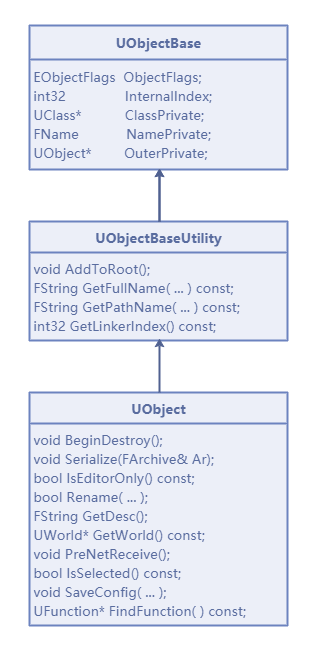
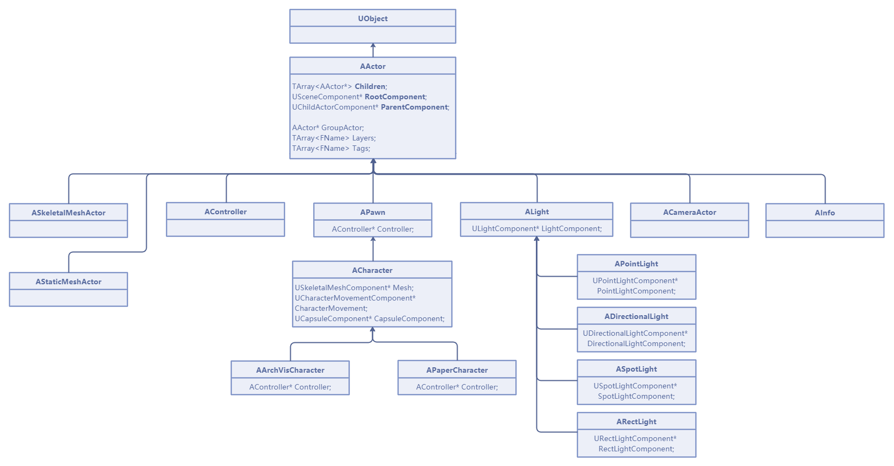
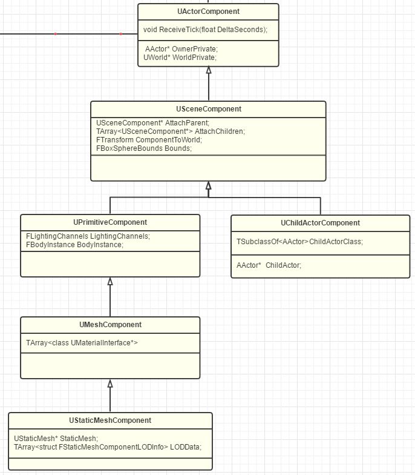
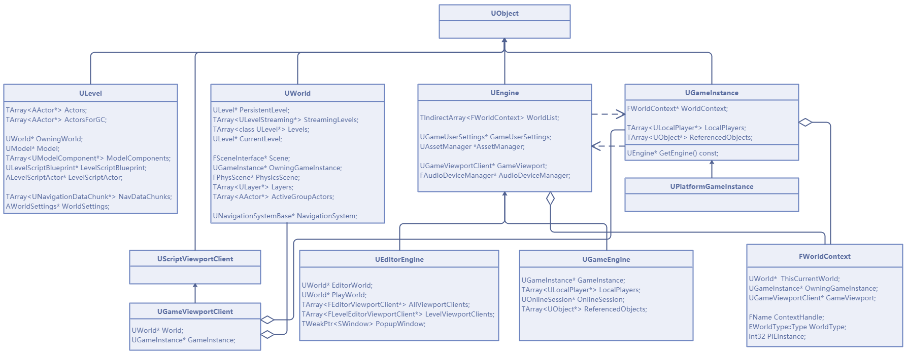

https://www.cnblogs.com/timlly/p/13877623.html#111-unreal-engine-11995

#### UObject

UObject是UE所有物体类型的基类，它继承于UObjectBaseUtility，而UObjectBaseUtility又继承于UObjectBase。它提供了元数据、反射生成、GC垃圾回收、序列化、部分编辑器信息、物体创建销毁、事件回调等功能，子类具体的类型由UClass描述而定。它们的继承关系如下图：

#### AActor

Actor无疑是UE中最重要的角色之一**Actor不像GameObject一样自带Transform**

AActor是UE体系中最主要且最重要的概念和类型，继承自UObject，是所有可以放置到游戏关卡中的物体的基类，相当于Unity引擎的GameObject。它提供了网络同步（Replication）、创建销毁物体、帧更新（Tick）、组件操作、Actor嵌套操作、变换等功能。AActor对象是可以嵌套AActor对象的，由以下接口提供支持：

- ASkeletalMeshActor：蒙皮骨骼体，用于渲染带骨骼蒙皮的动态模型。
- AStaticMeshActor：静态模型。
- ACameraActor：摄像机物体。
- APlayerCameraManager：摄像机管理器，管理着当前世界所有的摄像机（ACameraActor）实例。
- ALight：灯光物体，下面又衍生出点光源（APointLight）、平行光（ADirectionalLight）、聚光灯（ASpotLight）、矩形光（ARectLight）等类型。
- AReflectionCapture：反射捕捉器，用于离线生成环境图。
- AController：角色控制器。下面还衍生出AAIController、APlayerController等子类。
- APawn：描述动态角色或带有AI的物体。它的子类还有ACharacter、ADefaultPawn、AWheeledVehicle等。
- AMaterialInstanceActor：材质实例体。
- ALightmassPortal：全局光照入口，用于加速和提升离线全局的光照效率和效果。
- AInfo：配置信息类的基类，继承自它的常见子类有AWorldSettings、AGameModeBase、AAtmosphericFog、ASkyAtmosphere、ASkyLight等。

#### UActorComponent

UActorComponent继承自UObject和接口IInterface_AssetUserData，是所有组件类型的基类，可以作为子节点加入到AActor实例中。可以更加直观地说，Actor可被视为包含一系列组件的容器，Actor的功能特性和性质主要由附加在它身上的组件们决定。

常用的主要的UActorComponent子组件类型有：

- USceneComponent：SceneComponents是拥有变换的ActorComponents。变换是场景中的位置，由位置、旋转和缩放定义。SceneComponents能以层级的方式相互附加。Actor的位置、旋转和缩放取自位于层级根部的SceneComponent。
- UPrimitiveComponent：继承自SceneComponent，是所有可见（可渲染，如网格体或粒子系统）物体的基类，还提供了物理、碰撞、灯光通道等功能。
- UMeshComponent：继承自UPrimitiveComponent，所有具有可渲染三角形网格集合（静态模型、动态模型、程序生成模型）的基类。
- UStaticMeshComponent：继承自UMeshComponent，是静态网格体的几何体，常用于创建UStaticMesh实例。
- USkinnedMeshComponent：继承自UMeshComponent，支持蒙皮网格渲染的组件，提供网格、骨骼资源、网格LOD等接口。
- USkeletalMeshComponent：继承自USkinnedMeshComponent，通常用于创建带动画的USkeletalMesh资源的实例。

它们的继承关系如下图：

ULevel、UWorld、FWorldContext、UEngine之间的继承、依赖、引用关系如下图所示：

