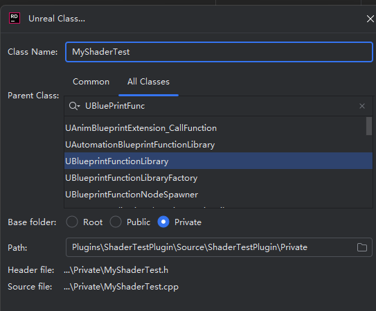

<font color=#4db8ff>Link: </font>https://itscai.us/blog/post/ue-view-extensions/#step-3-shaders

<font color=#4db8ff>官方Link：</font>https://dev.epicgames.com/documentation/en-us/unreal-engine/adding-global-shaders-to-unreal-engine?application_version=5.4

<font color=#4db8ff>Link:</font>https://blog.csdn.net/weixin_40821143/article/details/129161865?ops_request_misc=&request_id=&biz_id=102&utm_term=global%20SHader&utm_medium=distribute.pc_search_result.none-task-blog-2~all~sobaiduweb~default-4-129161865.142=


## UAV

UAV用于保存ComputeShader的计算结果，它的创建步骤如下：

#### 一、

https://www.youtube.com/watch?v=arPFxTrOkog&t=38s

自定义插件

随后设置Build

```c++
PublicDependencyModuleNames.AddRange(
			new string[]
			{
				"Core",
				"Engine",
				"RHI",
				"Renderer",
				"RenderCore"
				// ... add other public dependencies that you statically link with here ...
			}
			);
			
		
		PrivateDependencyModuleNames.AddRange(
			new string[]
			{
				"CoreUObject",
				"Engine",
				"Slate",
				"SlateCore",
				"Projects",
				"RHI",
				"Renderer",
				"RenderCore"
				// ... add private dependencies that you statically link with here ...	
			}
			);
```

.plugin

```c++
"Modules": [
		{
			"Name": "ShaderTestPlugin",
			"Type": "Runtime",
			"LoadingPhase": "PostConfigInit"
		}
	]
```


##### 1.2 UEngineSubsystem

负责初始化

```c++
class FCustomSceneViewExtension;
UCLASS()
class SHADERTESTPLUGIN_API UCustomShaderSubsystem : public UEngineSubsystem
{
	GENERATED_BODY()
private:
	TSharedPtr< FCustomSceneViewExtension, ESPMode::ThreadSafe > CustomSceneViewExtension;
	
public:
	virtual void Initialize(FSubsystemCollectionBase& Collection) override;
	virtual void Deinitialize() override;
};

```

传递

```c++
#include "CustomShaderSubsystem.h"

#include "SceneViewExtension.h"

void UCustomShaderSubsystem::Initialize(FSubsystemCollectionBase& Collection)
{
	Super::Initialize(Collection);
	CustomSceneViewExtension = FSceneViewExtensions::NewExtension<FCustomSceneViewExtension>();
}

void UCustomShaderSubsystem::Deinitialize()
{
	Super::Deinitialize();
	CustomSceneViewExtension.Reset();
	CustomSceneViewExtension = nullptr;
}

```

##### 1.3 ush 辅助

```c++
#include "/Engine/Private/Common.ush"

// Functions for converting between colour spaces
// https://www.easyrgb.com/en/math.php

// Colour to greyscale using Luminosity method
// https://www.johndcook.com/blog/2009/08/24/algorithms-convert-color-grayscale/#:~:text=Three%20algorithms%20for%20converting%20color%20to%20grayscale&text=The%20lightness%20method%20averages%20the,G%20%2B%20B)%20%2F%203.


float3 RGBtoLinear(const float3 InColour)
{
	float3 LinearColour;
	
	FLATTEN
	if(InColour.r > 0.04045)
	{
		LinearColour.r = pow((InColour.r + 0.055) / 1.055, 2.4);
	} else
	{
		LinearColour.r = InColour.r / 12.92;
	}

	FLATTEN
	if(InColour.g > 0.04045)
	{
		LinearColour.g = pow((InColour.g + 0.055) / 1.055, 2.4);
	} else
	{
		LinearColour.g = InColour.g / 12.92;
	}

	FLATTEN
	if(InColour.b > 0.04045)
	{
		LinearColour.b = pow((InColour.b + 0.055) / 1.055, 2.4);
	} else
	{
		LinearColour.b = InColour.b / 12.92;
	}

	return LinearColour;
}

float3 RGBtoHSL(float3 InColour)
{
	InColour = RGBtoLinear(InColour);
	//Min. value of RGB
	const float Min = min(InColour.r, min(InColour.g, InColour.b));    
	//Max. value of RGB
	const float Max = max(InColour.r, max(InColour.g, InColour.b));    
	//Delta RGB value
	const float Delta = Max - Min;            

	const float L = (Max + Min) / 2;

	float H = 0;
	float S = 0;

	//Chromatic data...
	BRANCH
	if (Delta > 0)                                     
	{
		if (L < 0.5)
		{
			S = Delta / (Max + Min);
		}
		else
		{
			S = Delta / (2 - Max - Min);
		}

		const float DeltaR = (((Max - InColour.r) / 6) + (Delta / 2)) / Delta;
		const float DeltaG = (((Max - InColour.g) / 6) + (Delta / 2)) / Delta;
		const float DeltaB = (((Max - InColour.b) / 6) + (Delta / 2)) / Delta;

		FLATTEN
		if(InColour.r == Max)
		{
			H = DeltaB - DeltaG;
		}
		else if(InColour.g == Max)
		{
			H = (1 / 3) + DeltaR - DeltaB;
		}
		else if(InColour.b == Max)
		{
			H = (2 / 3) + DeltaG - DeltaR;
		}

		if(H < 0)
		{
			H += 1;
		}
		
		if(H > 1)
		{
			H -= 1;
		}
	}

	return float3(H, S, L);
}

float3 RGBtoXYZ(float3 InColour)
{
	// InColour = RGBtoLinear(InColour);

	float R = InColour.r;
	float G = InColour.g;
	float B = InColour.b;

	if(R > 0.04045)
	{
		R = pow(((R + 0.055) / 1.055), 2.4);
	} else
	{
		R = R / 12.92;
	}
	if(G > 0.04045)
	{
		G = pow(((G + 0.055) / 1.055), 2.4);
	}
	else
	{
		G = G / 12.92;
	}
	if (B > 0.04045)
	{
		B = pow(((B + 0.055) / 1.055), 2.4);
	}
	else
	{
		B = B / 12.92;
	}

	R = R * 100;
	G = G * 100;
	B = B * 100;

	const float X = R * 0.4124 + G * 0.3576 + B * 0.1805;
	const float Y = R * 0.2126 + G * 0.7152 + B * 0.0722;
	const float Z = R * 0.0193 + G * 0.1192 + B * 0.9505;

	return float3(X, Y, Z);
}

float3 XYZtoCIELab(float3 InXYZ)
{
	// Found here https://www.easyrgb.com/en/math.php
	// Under XYZ (Tristimulus) Reference values of a perfect reflecting diffuser
	// D65 illuminant, 2° observer
	const float Xn = 95.047;
	const float Yn = 100.000;
	const float Zn = 108.883;

	const float X = InXYZ.x / Xn;
	const float Y = InXYZ.y / Yn;
	const float Z = InXYZ.z / Zn;

	const float Epsilon = 0.008856;
	const float Kappa = 903.3;
	const float Third = 1.0 / 3.0;

	const float fX = (X > Epsilon) ? pow(X, Third) : (Kappa * X + 16.0) / 116.0;
	const float fY = (Y > Epsilon) ? pow(Y, Third) : (Kappa * Y + 16.0) / 116.0;
	const float fZ = (Z > Epsilon) ? pow(Z, Third) : (Kappa * Z + 16.0) / 116.0;

	const float L = (116.0 * fY) - 16.0;
	const float a = 500.0 * (fX - fY);
	const float b = 200.0 * (fY - fZ);

	return float3(L, a, b);
}

//Function returns CIE-H° value
float CIELabtoHue(const float InA, const float InB)          
{
	float Bias = 0;

	BRANCH
	if (InA >= 0 && InB == 0)
	{
		return 0;
	}
	BRANCH
	if (InA < 0 && InB == 0)
	{
		return 180;
	}
	BRANCH
	if (InA == 0 && InB > 0)
	{
		return 90;
	}
	BRANCH
	if (InA == 0 && InB < 0)
	{
		return 270;
	}

	FLATTEN
	if (InA > 0 && InB > 0)
	{
		Bias = 0;
	}
	FLATTEN
	if (InA < 0)
	{
		Bias = 180;
	}
	FLATTEN
	if (InA > 0 && InB < 0)
	{
		Bias = 360;
	}

	return degrees(atan(InB / InA)) + Bias;
}

float3 RGBtoLab(float3 InColour)
{
	return XYZtoCIELab(RGBtoXYZ(InColour));
}

float DeltaE2000(float3 CIEA, float3 CIEB, float LWeight, float CWeight, float HWeight)
{
	//Color #1 CIE-L*ab values
	const float CIEL1 = CIEA.x;
	const float CIEa1 = CIEA.y;
	const float CIEb1 = CIEA.z;
	//Color #2 CIE-L*ab values
	const float CIEL2 = CIEB.x;
	const float CIEa2 = CIEB.y;
	const float CIEb2 = CIEB.z;

	float xC1 = sqrt(CIEa1 * CIEa1 + CIEb1 * CIEb1);
	float xC2 = sqrt(CIEa2 * CIEa2 + CIEb2 * CIEb2);
	const float xCX = (xC1 + xC2) / 2;
	const float xGX = 0.5 * (1 - sqrt(pow(xCX,7) / (pow(xCX, 7) + pow(25, 7))));
	float xNN = (1 + xGX) * CIEa1;
	xC1 = sqrt(xNN * xNN + CIEb1 * CIEb1);
	float xH1 = CIELabtoHue(xNN, CIEb1);
	xNN = (1 + xGX) * CIEa2;
	xC2 = sqrt(xNN * xNN + CIEb2 * CIEb2);
	float xH2 = CIELabtoHue(xNN, CIEb2);
	float xDL = CIEL2 - CIEL1;
	float xDC = xC2 - xC1;

	float xDH = 0;
	
	if ((xC1 * xC2) == 0)
	{
		xDH = 0;
	}
	else
	{
		xNN = round(xH2 - xH1);
		if (abs(xNN) <= 180)
		{
			xDH = xH2 - xH1;
		}
		else
		{
			if (xNN > 180)
			{
				xDH = xH2 - xH1 - 360;
			}
			else
			{
				xDH = xH2 - xH1 + 360;
			}
		}
	}

	xDH = 2 * sqrt(xC1 * xC2) * sin(radians(xDH / 2));
	float xLX = (CIEL1 + CIEL2) / 2;
	float xCY = (xC1 + xC2) / 2;

	float xHX = 0;
	
	if ((xC1 * xC2) == 0)
	{
		xHX = xH1 + xH2;
	}
	else
	{
		xNN = abs(round(xH1 - xH2));

		if (xNN > 180)
		{
			if ((xH2 + xH1) < 360)
			{
				xHX = xH1 + xH2 + 360;
			}
			else
			{
				xHX = xH1 + xH2 - 360;
			}
		}
		else
		{
			xHX = xH1 + xH2;
		}

		xHX /= 2;
	}
	const float xTX = 1 - 0.17 * cos(radians(xHX - 30)) + 0.24
		* cos(radians(2 * xHX)) + 0.32
		* cos(radians(3 * xHX + 6)) - 0.20
		* cos(radians(4 * xHX - 63));
	const float xPH = 30 * exp(-((xHX - 275) / 25) * ((xHX - 275) / 25));
	const float xRC = 2 * sqrt(pow(xCY, 7) / (pow(xCY, 7) + pow(25, 7)));
	const float xSL = 1 + ((0.015 * ((xLX - 50) * (xLX - 50)))
		/ sqrt(20 + ((xLX - 50) * (xLX - 50))));

	const float xSC = 1 + 0.045 * xCY;
	const float xSH = 1 + 0.015 * xCY * xTX;
	const float xRT = -sin(radians(2 * xPH)) * xRC;
	xDL = xDL / (LWeight * xSL);
	xDC = xDC / (CWeight * xSC);
	xDH = xDH / (HWeight * xSH);

	return sqrt(pow(xDL, 2) + pow(xDC, 2) + pow(xDH, 2) + xRT * xDC * xDH);
}
```


##### 1.4  usf

```c++
// Include this
// #include "/Engine/Private/Common.ush"
// Or this, this is included in Common.ush
#include "/Engine/Public/Platform.ush"
#include "/Engine/Private/DeferredShadingCommon.ush"
#include "Example.ush"

// For this effect, using stencils would be more efficient
//为了达到这种效果，使用模板会更有效
//目标颜色
float3 TargetColour;

Texture2D<float4> SceneColorTexture;

float4 MainPS(float4 SvPosition : SV_POSITION) : SV_Target0
{
	const float3 TargetColourLab = RGBtoLab(TargetColour);

	const float4 SceneColour = SceneColorTexture.Load(int3(SvPosition.xy, 0));
	
#if USE_UNLIT_SCENE_COLOUR
	FScreenSpaceData ScreenSpaceData = GetScreenSpaceDataUint(SvPosition.xy, false);
	const float4 SceneColourUnlit = float4(ScreenSpaceData.GBuffer.BaseColor, 0);
	const float3 SceneColourLab = RGBtoLab(SceneColourUnlit.rgb);
#else
	const float3 SceneColourLab = RGBtoLab(SceneColour.rgb);
#endif

	const float DeltaE = DeltaE2000(TargetColourLab, SceneColourLab, 1, 1, 1);
	
	// If the scene is within the threshold, return scene colour
	// 	Delta E	Perception
	// <= 1.0	Not perceptible by human eyes.
	// 1 - 2	Perceptible through close observation.
	// 2 - 10	Perceptible at a glance.
	// 11 - 49	Colors are more similar than opposite
	// 100	Colors are exact opposite
	FLATTEN
	if(DeltaE < 45)
	{
		return SceneColour;
	}
	
	// Otherwise return greyscale version of scene colour
	return 0.21 * SceneColour.r + 0.72 * SceneColour.g + 0.07 * SceneColour.b; 
}
```

##### 1.5 FGlobalShader

```c++
#pragma once

#include "CoreMinimal.h"
#include "DataDrivenShaderPlatformInfo.h"
#include "SceneTexturesConfig.h"
#include "PostProcess/PostProcessInputs.h"

// This can be included in your FGlobalShader class
// Handy to keep them separate as you can use the same Params for multiple shaders

//这可以包含在你的FGlobalShader类中
//方便保持他们分开，因为你可以使用相同的参数多个着色器
BEGIN_SHADER_PARAMETER_STRUCT(FColourExtractParams,)
	// Make sure it's a float vector and not a double vector
	SHADER_PARAMETER(FVector3f, TargetColour)

	// Texture type is same as set in shader 
	SHADER_PARAMETER_RDG_TEXTURE(Texture2D, SceneColorTexture)
	SHADER_PARAMETER_STRUCT_REF(FViewUniformShaderParameters, View)
	SHADER_PARAMETER_STRUCT_INCLUDE(FSceneTextureShaderParameters, SceneTextures)

	// Only needed if we're outputting to a render target
	RENDER_TARGET_BINDING_SLOTS()
END_SHADER_PARAMETER_STRUCT()

class FColourExtractPS : public FGlobalShader
{
	DECLARE_EXPORTED_SHADER_TYPE(FColourExtractPS, Global, );
	using FParameters = FColourExtractParams;
	SHADER_USE_PARAMETER_STRUCT(FColourExtractPS, FGlobalShader);

	static bool ShouldCompilePermutation(const FGlobalShaderPermutationParameters& Parameters)
	{
		return IsFeatureLevelSupported(Parameters.Platform, ERHIFeatureLevel::SM5);
	}
	
	static void ModifyCompilationEnvironment(const FGlobalShaderPermutationParameters& Parameters, FShaderCompilerEnvironment& OutEnvironment)
	{
		FGlobalShader::ModifyCompilationEnvironment(Parameters, OutEnvironment);

		// When changing this, you may need to change something in the shader for it to take effect
		// A simple comment with a bit of gibberish seems to be enough
		SET_SHADER_DEFINE(OutEnvironment, USE_UNLIT_SCENE_COLOUR, 0);
	}
};
```

##### 1.6 Shader CPp

随后将绑定Shader 入口函数，以及宏

```c++
#include "E:\UnrealEngineItem\UEFork\UnrealEngine5.4\Engine\Intermediate\Build\Win64\x64\UnrealEditorGPF\Development\UnrealEd\SharedPCH.UnrealEd.Project.ValApi.Cpp20.h"
#include "ColourExtractRenderPass.h"

#include "SceneRenderTargetParameters.h"
#include "SceneTexturesConfig.h"

// The location is set as VirtualMappingSetInModuleInitialise/private/NameOfShader.usf
// MainPS is the entry point for the pixel shader - You can have multiple in a file but you have to specify separately
IMPLEMENT_SHADER_TYPE(, FColourExtractPS, TEXT("/ShaderTest/private/TutorialShader.usf"), TEXT("MainPS"), SF_Pixel);
```

##### 1.7 FSceneView


```c++
#pragma once

#include "CoreMinimal.h"
#include "SceneViewExtension.h"


class SHADERTESTPLUGIN_API FCustomSceneViewExtension : public FSceneViewExtensionBase
{
public:
	FCustomSceneViewExtension(const FAutoRegister& AutoRegister);

	virtual void SetupViewFamily(FSceneViewFamily& InViewFamily) override {};
	virtual void SetupView(FSceneViewFamily& InViewFamily, FSceneView& InView) override {};
	virtual void BeginRenderViewFamily(FSceneViewFamily& InViewFamily) override {};

	virtual void PostRenderBasePassDeferred_RenderThread(FRDGBuilder& GraphBuilder, FSceneView& InView, const FRenderTargetBindingSlots& RenderTargets, TRDGUniformBufferRef<FSceneTextureUniformParameters> SceneTextures) override {};
	virtual void PreRenderViewFamily_RenderThread(FRDGBuilder& GraphBuilder, FSceneViewFamily& InViewFamily) override {};
	virtual void PreRenderView_RenderThread(FRDGBuilder& GraphBuilder, FSceneView& InView) override {};
	virtual void PostRenderView_RenderThread(FRDGBuilder& GraphBuilder, FSceneView& InView) override {};
	virtual void PrePostProcessPass_RenderThread(FRDGBuilder& GraphBuilder, const FSceneView& View, const FPostProcessingInputs& Inputs) override;
	virtual void PostRenderViewFamily_RenderThread(FRDGBuilder& GraphBuilder, FSceneViewFamily& InViewFamily) override {};
	
};
```

##### 1.8 FSceneView.cpp


```c++
#include "CustomSceneViewExtension.h"

#include "PixelShaderUtils.h"
#include "RenderGraphEvent.h"
#include "SceneRenderTargetParameters.h"

//会在渲染线程函数中使用到
DECLARE_GPU_DRAWCALL_STAT(ColourExtract); // Unreal Insights

FCustomSceneViewExtension::FCustomSceneViewExtension(const FAutoRegister& AutoRegister) : FSceneViewExtensionBase(AutoRegister)
{
}
```


#### 二、





```c++
#include "GlobalShader.h"

// This can go on a header or cpp file
class FMyTestVS : public FGlobalShader
{
	//生成着色器类型序列化所需的导出
	DECLARE_EXPORTED_SHADER_TYPE(FMyTestVS, Global, /*MYMODULE_API*/);

	FMyTestVS() { }
	FMyTestVS(const ShaderMetaType::CompiledShaderInitializerType& Initializer)
		: FGlobalShader(Initializer)
	{
	}

	//确定在某些情况下是否应该编译该着色器
	static bool ShouldCache(EShaderPlatform Platform)
	{
		return true;
	}
};

//将着色器类型注册到虚幻引擎的类型列表：
IMPLEMENT_SHADER_TYPE(, FMyTestVS, TEXT("MyTest"), TEXT("MainVS"), SF_Vertex);
 

```

IMPLEMENT_SHADER_TYPE

该宏将类型 ( `FMyTestVS` ) 映射到 .usf 文件 ( `MyTest.usf` )、着色器入口点 ( `MainVS` ) 和频率/着色器阶段 ( `SF_Vertex` )。它还会导致着色器被添加到编译列表中，只要其`ShouldCache()`方法返回*true* 。