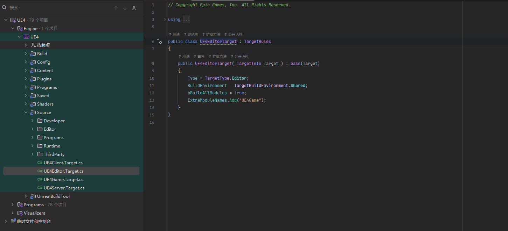
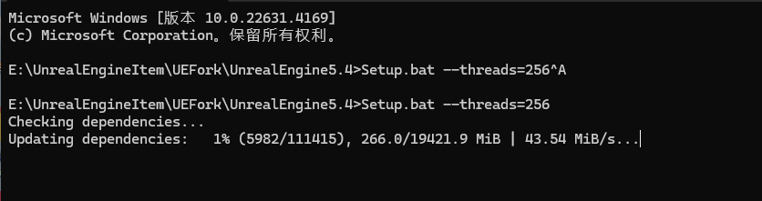

#### 源码构建

#### 4.27

Link：https://www.youtube.com/watch?v=gh_tBY8BMS0



```c++
public UE4EditorTarget( TargetInfo Target ) : base(Target)
	{
		Type = TargetType.Editor;
		BuildEnvironment = TargetBuildEnvironment.Shared;
		bBuildAllModules = true;
		ExtraModuleNames.Add("UE4Game");

		bCompileChaos = true;
		bUseChaos = true;
	}
```

如果是旧项目用编译的开发则需要加

```c++
bCompileChaos = true;
bUseChaos = true;
bOverrideBuildEnvironment = true;
```

加快下载

```c++
Setup.bat --threads=256
```



```c++
git clone --depth=1 --branch=release --config pack.threads=8 https://github.com/Tyz-Kotono/UnrealEngine.git


git fetch --unshallow
```

```c++
✅ 结论（推荐组合）：
如果你要让你的主分支长期和 UE 官方同步：

bash
复制
编辑
# 添加上游远程
git remote add upstream https://github.com/EpicGames/UnrealEngine.git

# 获取上游分支
git fetch upstream

# 强制同步你的 release 分支
git checkout release
git reset --hard upstream/release

# 设置跟踪关系
git branch --set-upstream-to=upstream/release release
之后只需用：

bash
复制
编辑
git pull
就能同步官方更新，非常干净稳定。


    
    git fetch --tags

```

加速编译

```c++
添加到 DefaultEngine.ini 或 BaseEngine.ini
[DevOptions.Shaders]
NumUnusedShaderCompilingThreads=24  ; 启用最大线程数
MaxShaderCompileThreads=16
MaxShaderJobBatchSize=512
    
    
; 打开shader开发模式，报错时给出错误提示和可以选择重试
r.ShaderDevelopmentMode=1
        
        
; 保留shader编译失败时的信息到Saved/ShaderDebugInfo
r.DumpShaderDebugInfo=2
    
    
; ShadingModel shader step 0-3
; 下面两条是为了Renderdoc分析代码时开启的，可以保留一些注释信息
r.Shaders.Optimize=0
r.Shaders.Symbols=1
r.Shaders.KeepDebugInfo =1
```


```c++
git clean -xdf

rd /s /q Engine\Intermediate
rd /s /q Engine\Saved
```


#### 

```c++
git tag
```

运行以下命令确认该 Tag 是否存在：

```c++
git show 5.5.4-release
```

或查看所有 `5.5.x` 版本的 Tag：

```c++
git tag -l "5.5.*"
```

使用以下命令从 Tag 创建新分支（假设分支名为 `my-5.5.4`）：

```c++
git checkout -b 5.6.0 5.6.0-release
```

重置到 Tag：

```c++
git reset --hard 5.5.4-release
```

建立分支

```c++
git push -u origin 5.5.4 -f
```


```c++
git push -u origin refs/heads/5.6.0-release
```


```c++
git reset --hard
git clean -xdf
    
D:\UESource\UnrealEngine>git branch
  5.5.4
* 5.6.0
  release

D:\UESource\UnrealEngine>git reset --hard
HEAD is now at 803688920e03 5.6.0 release

D:\UESource\UnrealEngine>git clean -xdf
    
    Setup.bat --threads=256
    GenerateProjectFiles.bat
```

