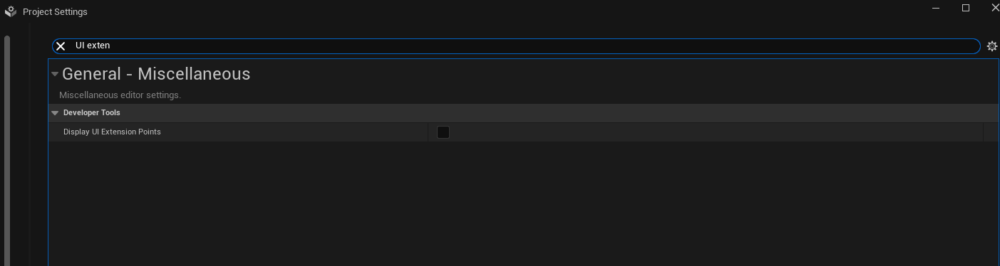
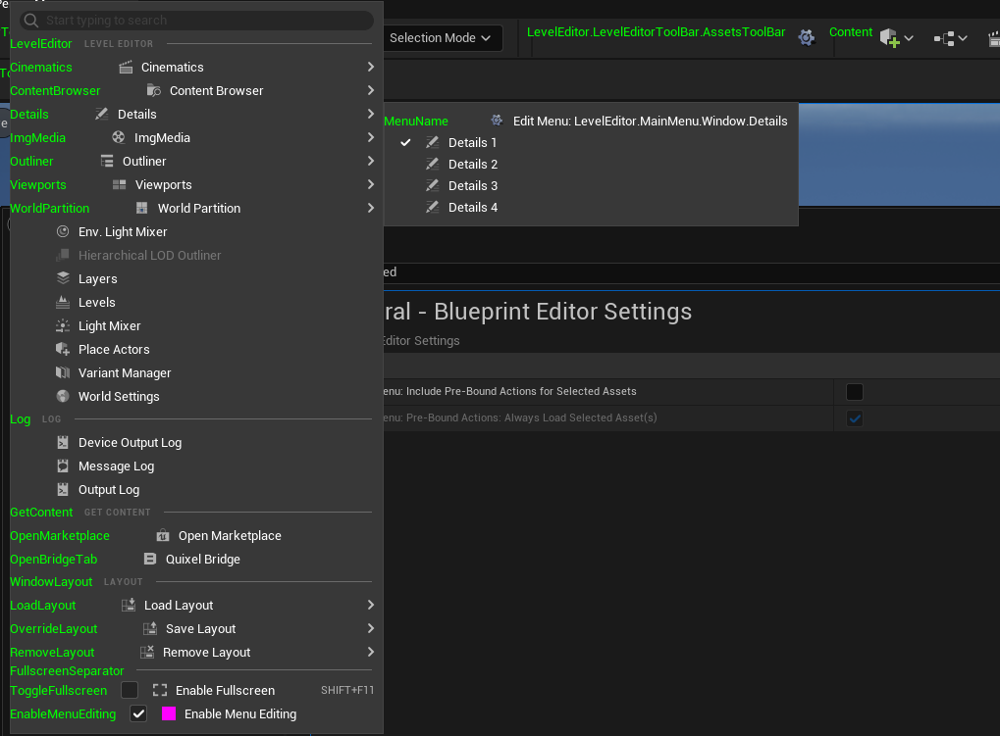
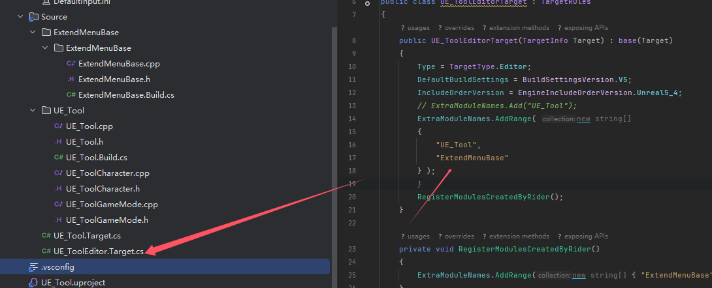

首先需要添加


https://zhuanlan.zhihu.com/p/605181368





```c++
// .../Config/DefaultEditorPerProjectUserSettings.ini

[/Script/UnrealEd.EditorExperimentalSettings]
bEnableEditToolMenusUI=True
```


1. - 

