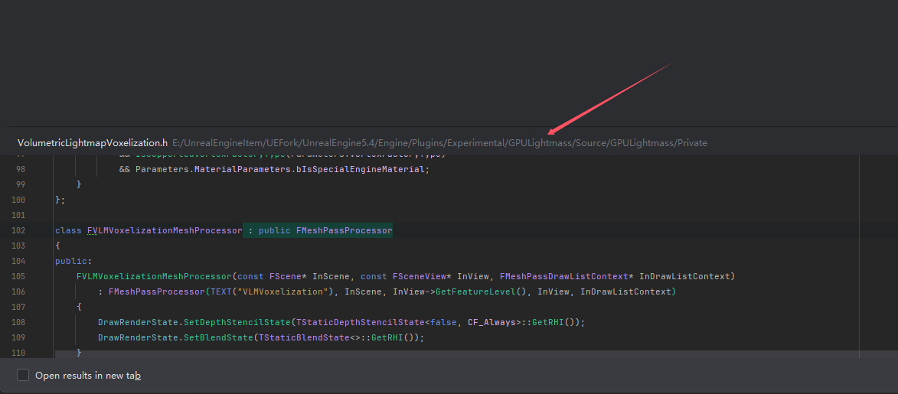

<font color=#4db8ff>Link：</font>https://dev.epicgames.com/documentation/en-us/unreal-engine/mesh-drawing-pipeline-in-unreal-engine


##### 1.1 MeshPassProcessor

MeshPassProcessor.h

UnrealEngine5.4\Engine\Source\Runtime\Renderer\Public


以前需要在PSOPrecache.h中将MaxPSOCollectorCount + 1

PSOPrecacheMaterial.h  

```c++
FPSOCollectorCreateManager
\Engine\Source\Runtime\Engine\Public
```


##### 1.2 MeshDrawCommad

UnrealEngine5.4\Engine\Source\Runtime\Renderer\Public

```c++
FMeshPassProcessor::BuildMeshDrawCommands
```


```c++
ToonMeshPass
    
ToonMeshPassRendering
```


1.3 FMeshPassProcessor





##### 1.3 Processor

```c++
HairStrandsVisibility.cpp
```


```c++
#pragma once

#include "MeshPassProcessor.h"

class FPrimitiveSceneProxy;
class FScene;
class FStaticMeshBatch;
class FViewInfo;


class FToonMeshPassProcessor: public FMeshPassProcessor
{
public:
	FToonMeshPassProcessor(
		const FScene* Scene,
		const FSceneView* InViewIfDynamicMeshCommand,
		const FMeshPassProcessorRenderState& InPassDrawRenderState,
		FMeshPassDrawListContext* InDrawListContext
	);

	virtual void AddMeshBatch(
		const FMeshBatch& RESTRICT MeshBatch,
		uint64 BatchElementMask,
		const FPrimitiveSceneProxy* RESTRICT PrimitiveSceneProxy,
		int32 StaticMeshId = -1
	) override final;

};

```


```c++
#pragma once

#include "MeshPassProcessor.h"

class FPrimitiveSceneProxy;
class FScene;
class FStaticMeshBatch;
class FViewInfo;
class FPrimitiveSceneProxy;
class FScene;
class FStaticMeshBatch;
class FViewInfo;


class FToonMeshPassProcessor: public FMeshPassProcessor
{
public:
	FToonMeshPassProcessor(
		const FScene* Scene,
		const FSceneView* InViewIfDynamicMeshCommand,
		const FMeshPassProcessorRenderState& InPassDrawRenderState,
		FMeshPassDrawListContext* InDrawListContext
	);

	virtual void AddMeshBatch(
		const FMeshBatch& RESTRICT MeshBatch,
		uint64 BatchElementMask,
		const FPrimitiveSceneProxy* RESTRICT PrimitiveSceneProxy,
		int32 StaticMeshId = -1
	) override final;

private:

	bool Process(
		const FMeshBatch& MeshBatch,
		uint64 BatchElementMask,
		int32 StaticMeshId,
		const FPrimitiveSceneProxy* RESTRICT PrimitiveSceneProxy,
		const FMaterialRenderProxy& RESTRICT MaterialRenderProxy,
		const FMaterial& RESTRICT MaterialResource,
		ERasterizerFillMode MeshFillMode,
		ERasterizerCullMode MeshCullMode
	);

	FMeshPassProcessorRenderState PassDrawRenderState;
};

```


函数的参数包括：

- const FMeshBatch& RESTRICT MeshBatch：这是一个对FMeshBatch对象的引用，FMeshBatch对象包含了一批需要渲染的网格数据。RESTRICT关键字是一种优化，它告诉编译器这个对象在函数内部不会被其他方式修改，因此编译器可以进行一些优化。
- uint64 BatchElementMask：这是一个掩码，通常用于决定哪些元素需要被渲染。
- const FPrimitiveSceneProxy* RESTRICT PrimitiveSceneProxy：这是一个指向FPrimitiveSceneProxy对象的指针，FPrimitiveSceneProxy对象包含了渲染场景中的原始数据。同样，RESTRICT关键字用于优化。
- int32 StaticMeshId = -1：这是一个可选参数，表示静态网格的ID。如果没有提供，它的默认值是-1。

##### 1.4 usf

##### 1.5 FMeshMaterialShader


但是，还是不够的，我们需要绑定一下Shader和Mesh 