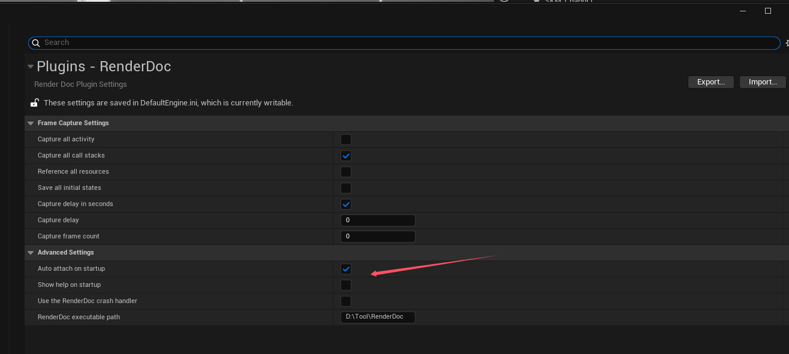

1. Editor->ProjectSetting->RenderDoc，勾选“Auto Attach on startup”
2. 
3. 去项目的config目录下，打开DefaultEngine.ini输入以下

```c++
[/Script/Engine.RendererSettings]
r.Shaders.Optimize = 0
r.Shaders.Symbols=1
r.Shaders.SkipCompression=1
r.ShaderDevelopmentMode=1
```

