https://zhuanlan.zhihu.com/p/551343308

Ctrl Shift .

##### 第一步

Engine\Source\Runtime\Engine\Classes\Engine

EngineTypes.h

```
EMaterialShadingModel
```

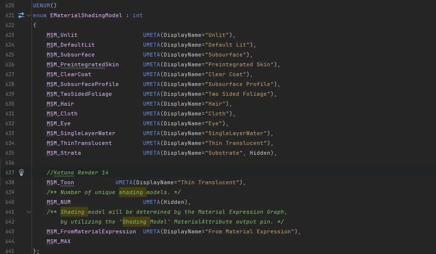

##### 1.2

Engine\Source\Runtime\Engine\Private\Materials>

```c++
GetShadingModelString
```

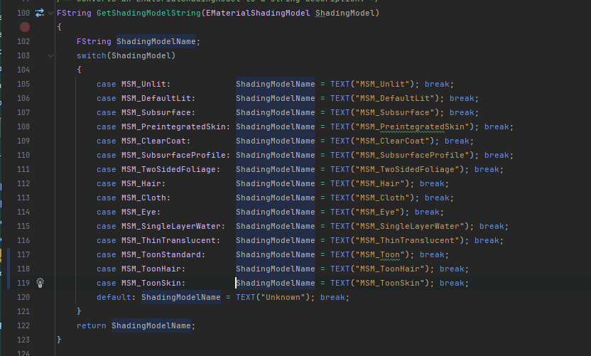

##### 1.3 HLSLMaterialTranslator

Engine\Source\Runtime\Engine\Private\Materials

```
void FHLSLMaterialTranslator::GetMaterialEnvironment
```

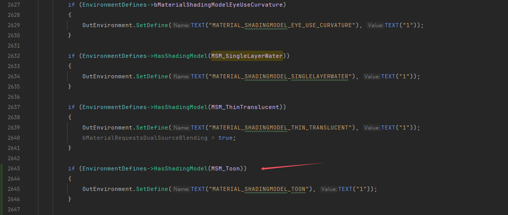

##### 1.4 Material.cpp

```
static bool IsPropertyActive_Internal
```

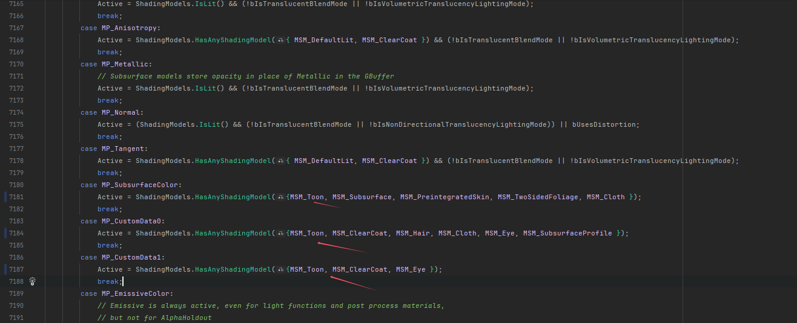

##### 1.5 MaterialShared.cpp

\Engine\Source\Runtime\Engine\Private\Materials\MaterialShared.cpp

```c++
// My Toon Shading Model CustomPinNames
/* -------------------------------------------
// Metallic		-> Specular Range
// Specular		-> Specular Intensity
// Roughness		-> Shadow Threshold
// Subsurface Color     -> SSS Color
// Custom Data 0	-> Inner Line
// Custom Data 1	-> Other (Unused)
------------------------------------------- */
```

5.4 之前：MaterialShared.cpp

5.4：MaterialAttributeDefinitionMap.cpp

位于：FMaterialAttributeDefinitionMap::GetAttributeOverrideForMaterial

材质上面

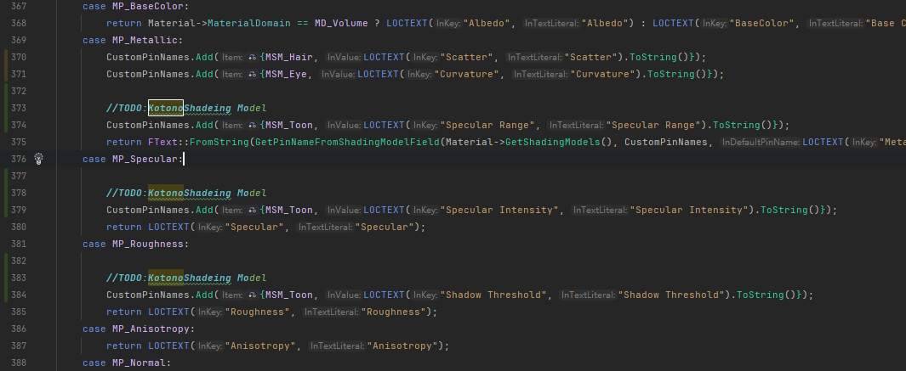

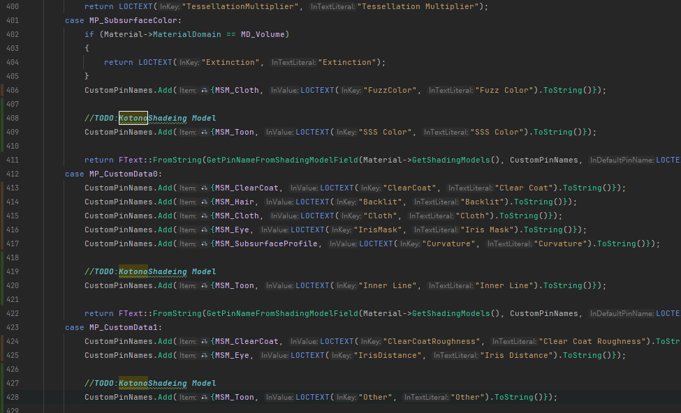


##### 1.6 MaterialShared

\Engine\Source\Runtime\Engine\Public\MaterialShared.h

IsSubsurfaceShadingModel


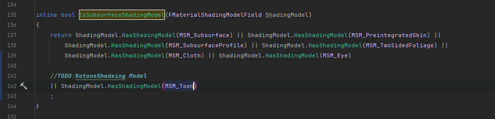


##### 1.7 ShaderMaterial.h

\Engine\Source\Runtime\RenderCore\Public\ShaderMaterial.h

```
FShaderMaterialPropertyDefines
```

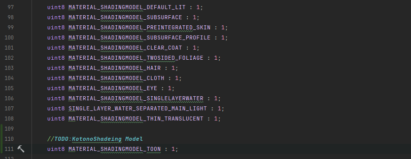

##### 1.8 ShaderMaterialDerivedHelpers

Engine\Source\Runtime\RenderCore\Private\ShaderMaterialDerivedHelpers.cpp

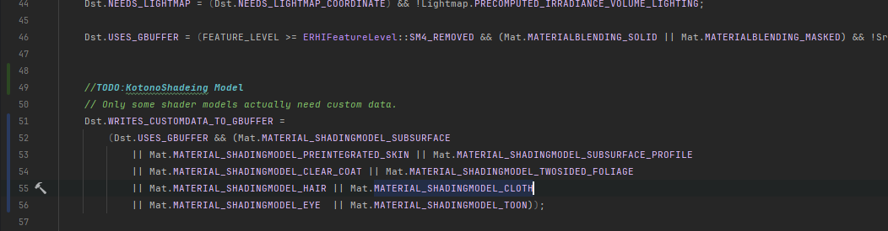


##### 1.9 ShaderGenerationUtil

\Engine\Source\Runtime\Engine\Private\ShaderCompiler\ShaderGenerationUtil.cpp

```
void ApplyFetchEnvironmentInternal(FShaderMaterialPropertyDefines& SrcDefines, const EnvironmentType& Environment)
```

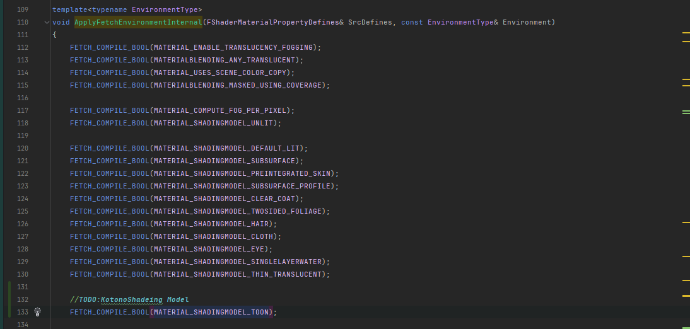

```
static void DetermineUsedMaterialSlots
```


```c++
if(Mat.MATERIAL_SHADINGMODEL_TOON)
{
    SetStandardGBufferSlots(Slots, bWriteEmissive, bHasTangent, bHasVelocity, bWritesVelocity, bHasStaticLighting, bIsSubstrateMaterial);
    Slots[GBS_CustomData] = GetGBufferSlotUsage(bUseCustomData);
}
```

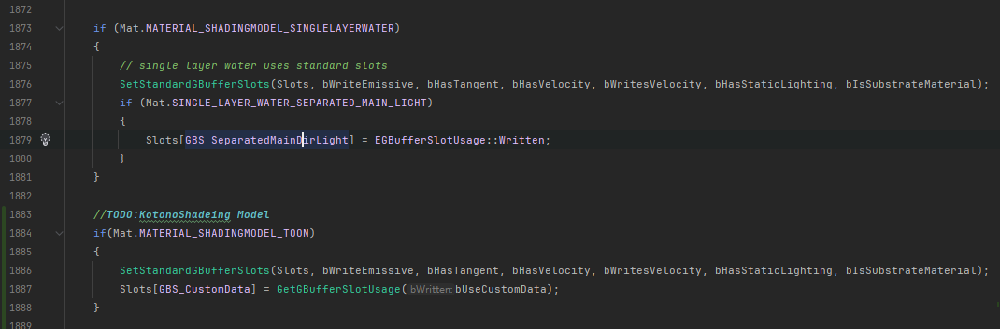

##### 1.10 PixelInspectorResult

\Engine\Source\Editor\PixelInspector\Private

PixelInspectorResult.h

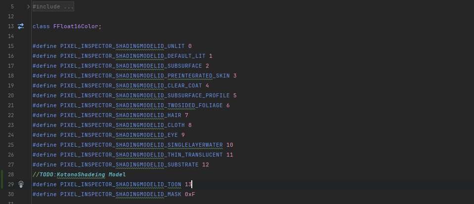

PixelInspectorResult.cpp

```
EMaterialShadingModel PixelInspectorResult::DecodeShadingModel
```

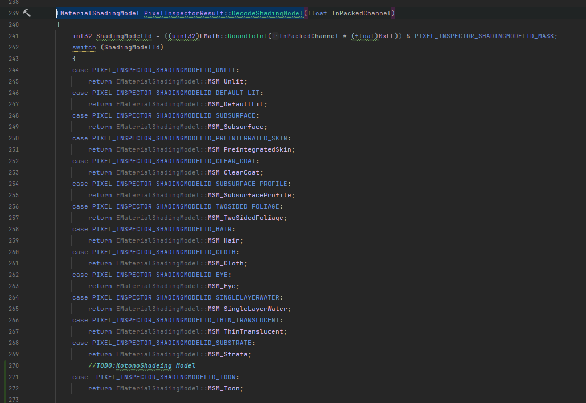

PixelInspectorDetailsCustomization.cpp

```
void FPixelInspectorDetailsCustomization::CustomizeDetails
```

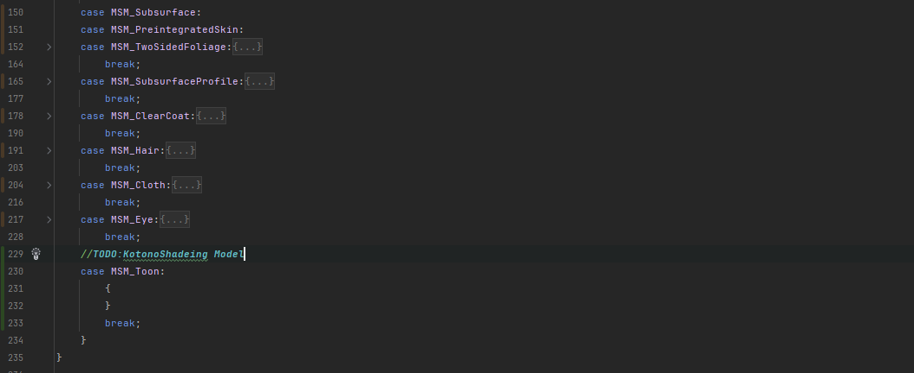


#### 二、Shader

##### 2.1 ShadingCommon

\Engine\Shaders\Private>

ShadingCommon.ush

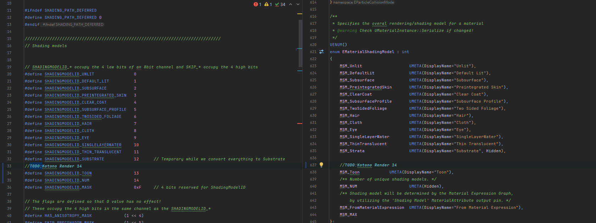

```c++
GetShadingModelColor
```

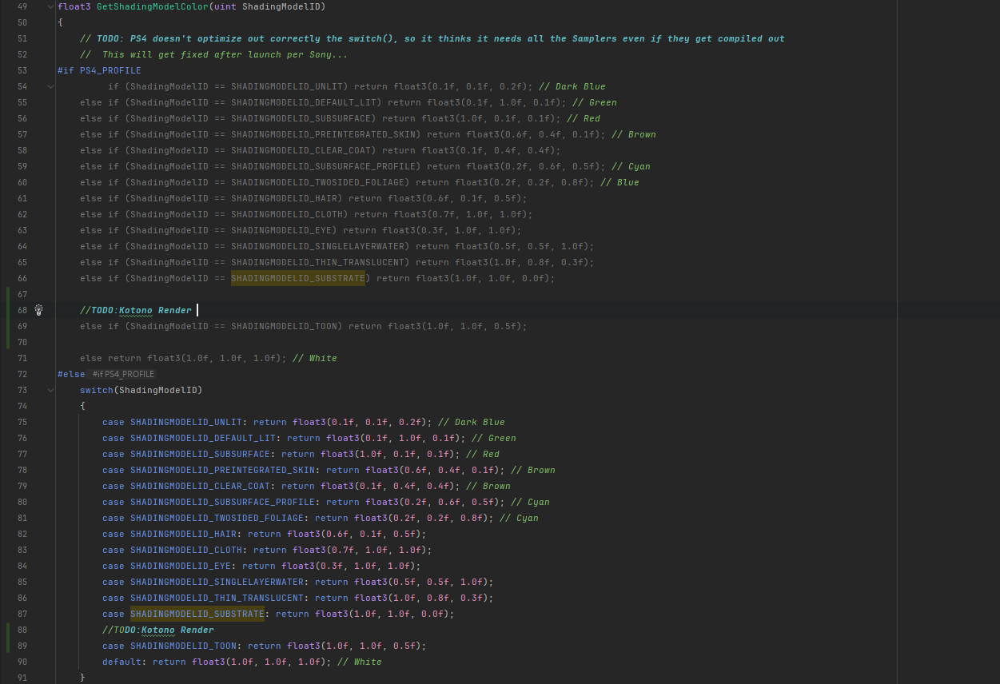


##### 2.2 Definitions.usf

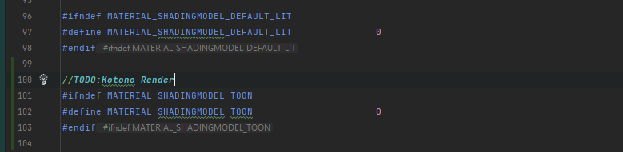

ShadingCommon.ush中`SHADINGMODELID_TOON`宏定义的位次必须与之前EngineTypes.h里`EMaterialShadingModel`枚举类中的枚举位次一致，我这里是顺位第14（从0开始计数为13） 。

##### 2.3 BasePassCommon

BasePassCommon.ush

```
Only some shader models actually need custom data.
```


```c++
// Only some shader models actually need custom data.
//TODO:Kotono Render 
#define WRITES_CUSTOMDATA_TO_GBUFFER		(USES_GBUFFER && (MATERIAL_SHADINGMODEL_SUBSURFACE || MATERIAL_SHADINGMODEL_PREINTEGRATED_SKIN || MATERIAL_SHADINGMODEL_SUBSURFACE_PROFILE || MATERIAL_SHADINGMODEL_CLEAR_COAT || MATERIAL_SHADINGMODEL_TWOSIDED_FOLIAGE || MATERIAL_SHADINGMODEL_HAIR || MATERIAL_SHADINGMODEL_CLOTH || MATERIAL_SHADINGMODEL_EYE || MATERIAL_SHADINGMODEL_TOON))
```

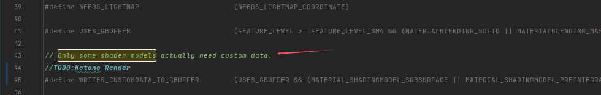


##### 2.4  BasePassPixelShader

 BasePassPixelShader.usf

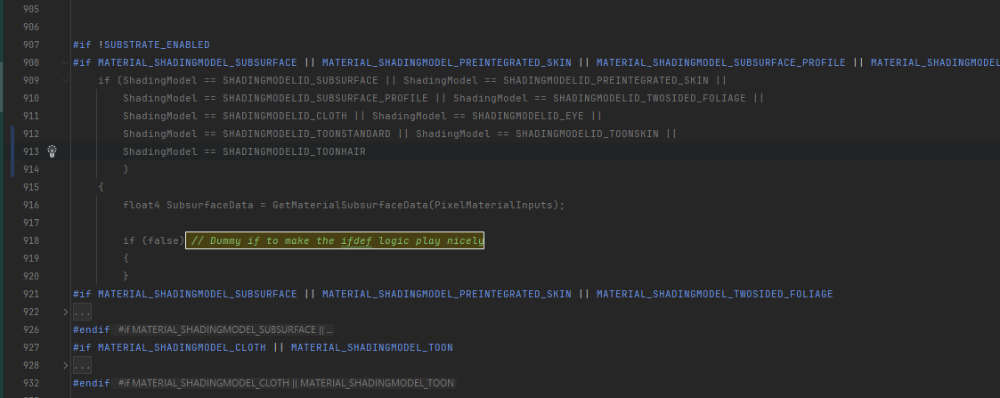

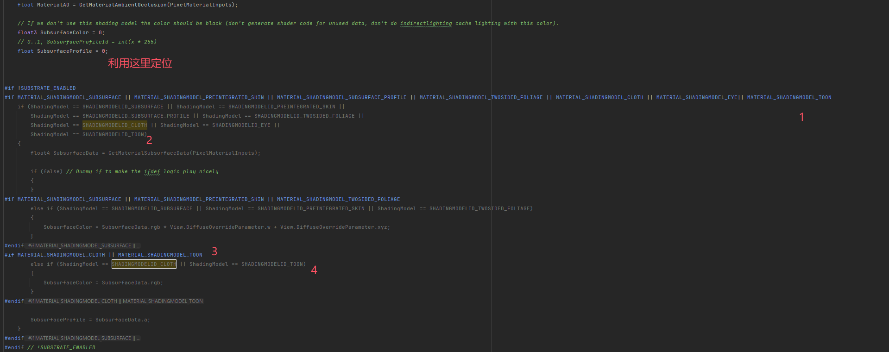

```c++
#if !SUBSTRATE_ENABLED
#if MATERIAL_SHADINGMODEL_SUBSURFACE || MATERIAL_SHADINGMODEL_PREINTEGRATED_SKIN || MATERIAL_SHADINGMODEL_SUBSURFACE_PROFILE || MATERIAL_SHADINGMODEL_TWOSIDED_FOLIAGE || MATERIAL_SHADINGMODEL_CLOTH || MATERIAL_SHADINGMODEL_EYE|| MATERIAL_SHADINGMODEL_TOON
	if (ShadingModel == SHADINGMODELID_SUBSURFACE || ShadingModel == SHADINGMODELID_PREINTEGRATED_SKIN ||
		ShadingModel == SHADINGMODELID_SUBSURFACE_PROFILE || ShadingModel == SHADINGMODELID_TWOSIDED_FOLIAGE ||
		ShadingModel == SHADINGMODELID_CLOTH || ShadingModel == SHADINGMODELID_EYE ||
		ShadingModel == SHADINGMODELID_TOON)
	{
		float4 SubsurfaceData = GetMaterialSubsurfaceData(PixelMaterialInputs);

		if (false) // Dummy if to make the ifdef logic play nicely
		{
		}
#if MATERIAL_SHADINGMODEL_SUBSURFACE || MATERIAL_SHADINGMODEL_PREINTEGRATED_SKIN || MATERIAL_SHADINGMODEL_TWOSIDED_FOLIAGE
		else if (ShadingModel == SHADINGMODELID_SUBSURFACE || ShadingModel == SHADINGMODELID_PREINTEGRATED_SKIN || ShadingModel == SHADINGMODELID_TWOSIDED_FOLIAGE)
		{
			SubsurfaceColor = SubsurfaceData.rgb * View.DiffuseOverrideParameter.w + View.DiffuseOverrideParameter.xyz;
		}
#endif
#if MATERIAL_SHADINGMODEL_CLOTH || MATERIAL_SHADINGMODEL_TOON
		else if (ShadingModel == SHADINGMODELID_CLOTH || ShadingModel == SHADINGMODELID_TOON)
		{
			SubsurfaceColor = SubsurfaceData.rgb;
		}
#endif

		SubsurfaceProfile = SubsurfaceData.a;
	}
#endif
#endif // !SUBSTRATE_ENABLED
```

##### 2.5 DeferredShadingCommon

DeferredShadingCommon.ush

```
IsSubsurfaceModel
```

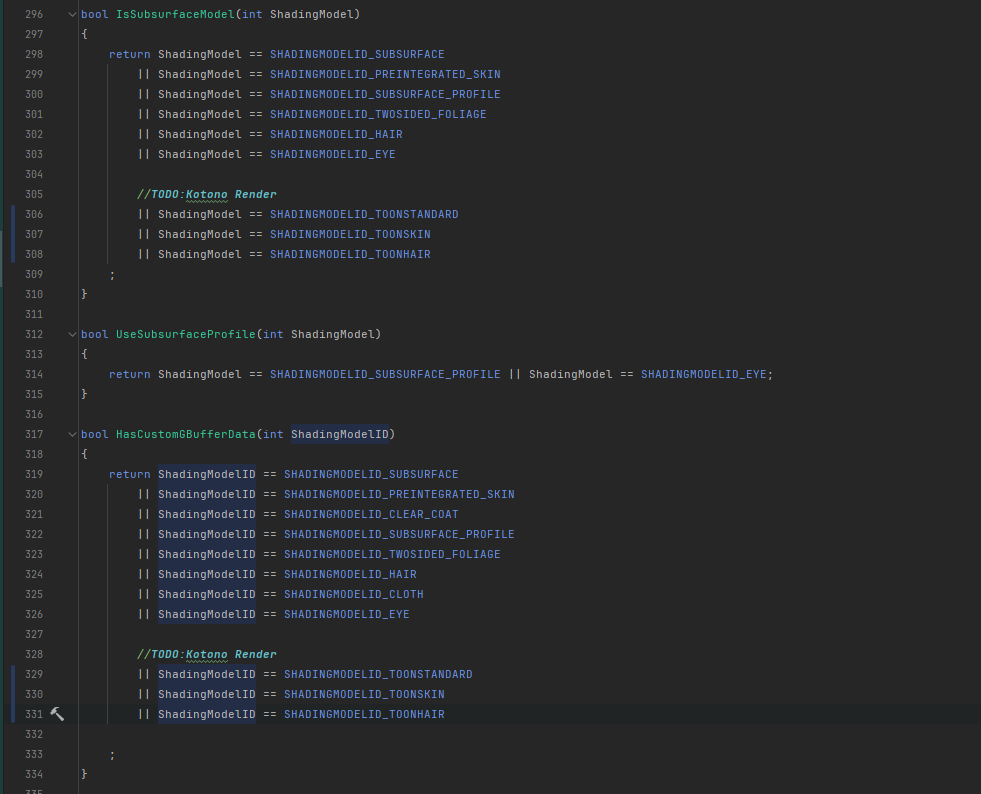


##### 2.6 ShadingModelsMaterial

ShadingModelsMaterial.ush

```c++
#if MATERIAL_SHADINGMODEL_TOON
	else if (ShadingModel == SHADINGMODELID_TOON)
	{
		GBuffer.CustomData.rgba = float4(EncodeSubsurfaceColor(SubsurfaceColor),GetMaterialCustomData0(MaterialParameters));
	}
#endif
	
```

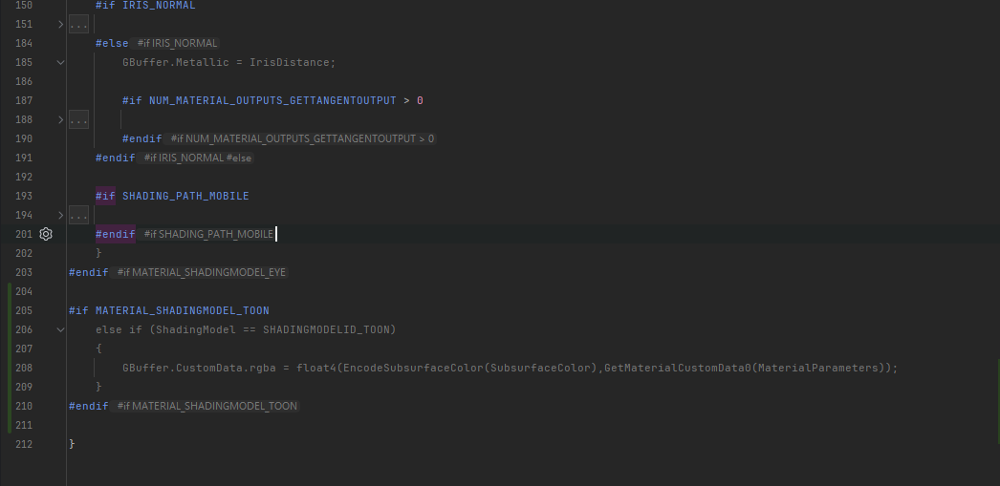

##### 2.7 ReflectionEnvironmentPixelShader

修改ReflectionEnvironmentPixelShader.usf里`ReflectionEnvironment()`的返回结果：

```c++
ReflectionEnvironment
```

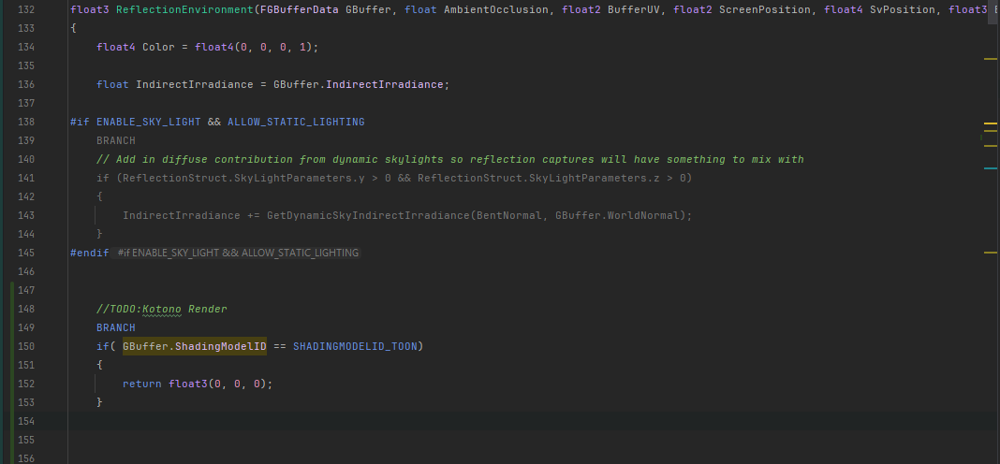


##### 2.8 BasePassPixelShader

\Engine\Shaders\Private\BasePassPixelShader.usf

```c++
// So that the following code can still use DiffuseColor and SpecularColor.
```

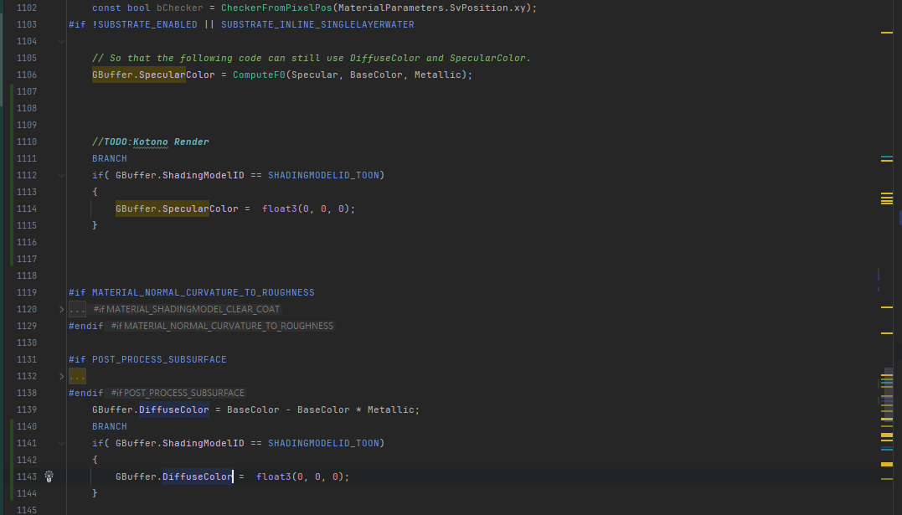


##### 2.9 ShadingModels

ShadingModels.ush

IntegrateBxDF

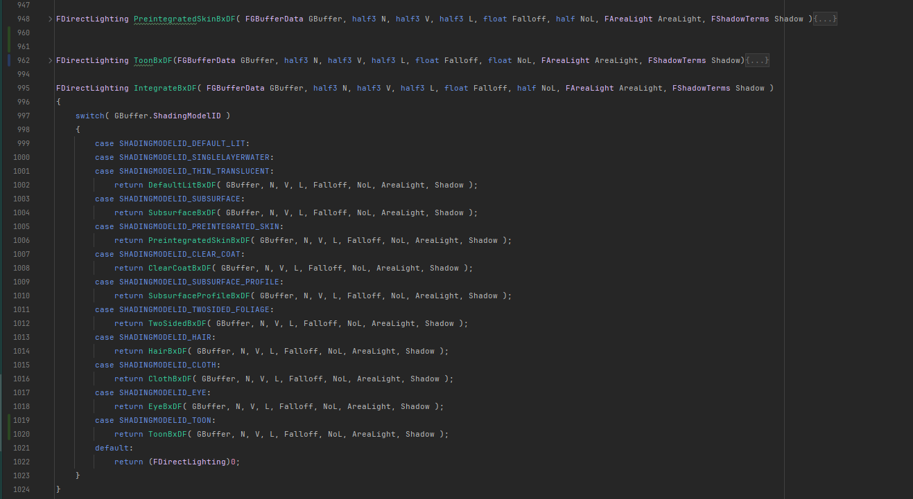

```c++
FDirectLighting ToonBxDF( FGBufferData GBuffer, half3 N, half3 V, half3 L, float Falloff, half NoL, FAreaLight AreaLight, FShadowTerms Shadow )
{
	//并不是真正光源颜色
	//真正的光源颜色在DeferredLightingCommon.ush中通过LightAccumulator_AddSplit()叠加
	float3 LightColor = AreaLight.FalloffColor * Falloff;
	//解GBuffer
	float SpecularRange 	= GBuffer.Metallic;
	float SpecularIntensity = GBuffer.Specular;
	float ShadowThreshold 	= GBuffer.Roughness;
	float InnerLine 	= GBuffer.CustomData.a;
	float3 SSSColor	 	= ExtractSubsurfaceColor(GBuffer); //解码SSS
	//明暗颜色
	float3 BrightColor = GBuffer.BaseColor;
	float3 ShadowColor = GBuffer.BaseColor * SSSColor;
	//加粗内描边
	if (InnerLine < 0.8f)
	{
		InnerLine *= 0.5f;
	}
	float3 InnerLineColor = float3(InnerLine, InnerLine, InnerLine);

	half3 H = normalize(V + L);
	float NoH = saturate(dot(N, H));
	//阴影区计算
	float IsShadow = step(ShadowThreshold, NoL * Shadow.SurfaceShadow);
	//光照计算
	FDirectLighting Lighting;
	Lighting.Diffuse = InnerLineColor * LightColor * Diffuse_Lambert(lerp(ShadowColor, BrightColor, IsShadow));
	Lighting.Specular = LightColor * BrightColor * IsShadow * InnerLineColor * step(0.2f, SpecularRange * pow(NoH, SpecularIntensity));
	Lighting.Transmission = 0;
	return Lighting;
}
```

##### 2.10 SkyLightingDiffuseShared

SkyLightingDiffuseShared.ush


```c++
	BRANCH
	if(GBuffer.ShadingModelID == SHADINGMODELID_TOON)
	{
		float InnerLine = GBuffer.CustomData.a;
		if (InnerLine < 0.8f)
		{
			InnerLine *= 0.5f;
		}
		float3 InnerLineColor = float3(InnerLine, InnerLine, InnerLine);
		Lighting = InnerLineColor * GBuffer.BaseColor * View.SkyLightColor.rgb * 0.05f; //削弱天光影响 
		return Lighting;
	}
```

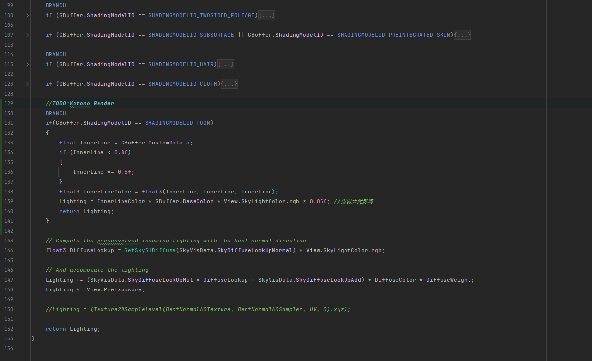

#### 三、Bug

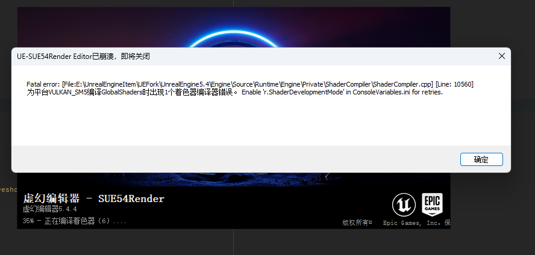

DefaultEngine.ini

```c++
[SystemSettings]
r.ShaderDevelopmentMode=1
```

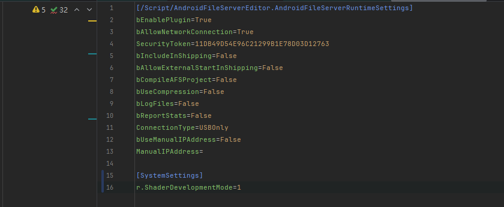

#### 四、

##### 4.1 DeferredLightingCommon


#### 五、

##### 5.1 ClusteredDeferredShadingPixelShader

 ClusteredDeferredShadingPixelShader.usf

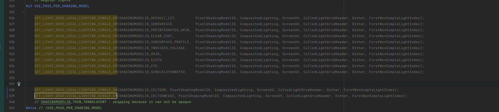

```c++
#if USE_PASS_PER_SHADING_MODEL

	GET_LIGHT_GRID_LOCAL_LIGHTING_SINGLE_SM(SHADINGMODELID_DEFAULT_LIT,			PixelShadingModelID, CompositedLighting, ScreenUV, CulledLightGridHeader, Dither, FirstNonSimpleLightIndex);
	GET_LIGHT_GRID_LOCAL_LIGHTING_SINGLE_SM(SHADINGMODELID_SUBSURFACE,			PixelShadingModelID, CompositedLighting, ScreenUV, CulledLightGridHeader, Dither, FirstNonSimpleLightIndex);
	GET_LIGHT_GRID_LOCAL_LIGHTING_SINGLE_SM(SHADINGMODELID_PREINTEGRATED_SKIN,	PixelShadingModelID, CompositedLighting, ScreenUV, CulledLightGridHeader, Dither, FirstNonSimpleLightIndex);
	GET_LIGHT_GRID_LOCAL_LIGHTING_SINGLE_SM(SHADINGMODELID_CLEAR_COAT,			PixelShadingModelID, CompositedLighting, ScreenUV, CulledLightGridHeader, Dither, FirstNonSimpleLightIndex);
	GET_LIGHT_GRID_LOCAL_LIGHTING_SINGLE_SM(SHADINGMODELID_SUBSURFACE_PROFILE,	PixelShadingModelID, CompositedLighting, ScreenUV, CulledLightGridHeader, Dither, FirstNonSimpleLightIndex);
	GET_LIGHT_GRID_LOCAL_LIGHTING_SINGLE_SM(SHADINGMODELID_TWOSIDED_FOLIAGE,	PixelShadingModelID, CompositedLighting, ScreenUV, CulledLightGridHeader, Dither, FirstNonSimpleLightIndex);
	GET_LIGHT_GRID_LOCAL_LIGHTING_SINGLE_SM(SHADINGMODELID_HAIR,				PixelShadingModelID, CompositedLighting, ScreenUV, CulledLightGridHeader, Dither, FirstNonSimpleLightIndex);
	GET_LIGHT_GRID_LOCAL_LIGHTING_SINGLE_SM(SHADINGMODELID_CLOTH,				PixelShadingModelID, CompositedLighting, ScreenUV, CulledLightGridHeader, Dither, FirstNonSimpleLightIndex);
	GET_LIGHT_GRID_LOCAL_LIGHTING_SINGLE_SM(SHADINGMODELID_EYE,					PixelShadingModelID, CompositedLighting, ScreenUV, CulledLightGridHeader, Dither, FirstNonSimpleLightIndex);
	GET_LIGHT_GRID_LOCAL_LIGHTING_SINGLE_SM(SHADINGMODELID_SINGLELAYERWATER,	PixelShadingModelID, CompositedLighting, ScreenUV, CulledLightGridHeader, Dither, FirstNonSimpleLightIndex);


	GET_LIGHT_GRID_LOCAL_LIGHTING_SINGLE_SM(SHADINGMODELID_CELTOON,	PixelShadingModelID, CompositedLighting, ScreenUV, CulledLightGridHeader, Dither, FirstNonSimpleLightIndex);
	GET_LIGHT_GRID_LOCAL_LIGHTING_SINGLE_SM(SHADINGMODELID_CELTOONFACE,	PixelShadingModelID, CompositedLighting, ScreenUV, CulledLightGridHeader, Dither, FirstNonSimpleLightIndex);
	// SHADINGMODELID_THIN_TRANSLUCENT - skipping because it can not be opaque
#else // !USE_PASS_PER_SHADING_MODEL
```


##### 5.2 DeferredLightingCommon

**DeferredLightingCommon.ush**


##### 5.3 天光

**ReflectionEnvironmentPixelShader**