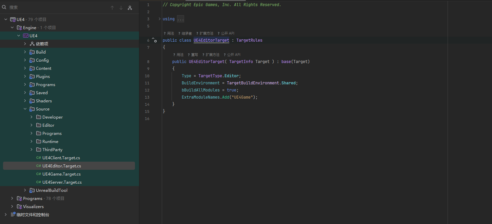
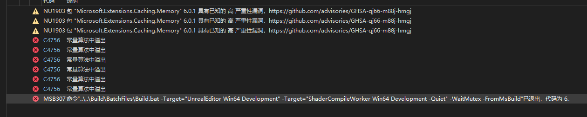

#### 4.27

Link：https://www.youtube.com/watch?v=gh_tBY8BMS0



```c++
public UE4EditorTarget( TargetInfo Target ) : base(Target)
	{
		Type = TargetType.Editor;
		BuildEnvironment = TargetBuildEnvironment.Shared;
		bBuildAllModules = true;
		ExtraModuleNames.Add("UE4Game");

		bCompileChaos = true;
		bUseChaos = true;
	}
```

如果是旧项目用编译的开发则需要加

```c++
bCompileChaos = true;
bUseChaos = true;
bOverrideBuildEnvironment = true;
```

#### UE5

浅克隆

```c++
git clone --depth=1 --branch=release --config pack.threads=8 https://github.com/Tyz-Kotono/UnrealEngine.git


git fetch --unshallow
```

或者直接克隆

同步UE上游

```c++
# 添加上游远程
git remote add upstream https://github.com/EpicGames/UnrealEngine.git

# 获取上游分支
git fetch upstream

# 强制同步你的 release 分支
git checkout release
git reset --hard upstream/release
```

拉取依赖文件加速

```c++
Setup.bat --threads=256
```

加速编译

```c++
添加到 DefaultEngine.ini 或 BaseEngine.ini
[DevOptions.Shaders]
NumUnusedShaderCompilingThreads=24  ; 启用最大线程数
MaxShaderCompileThreads=16
MaxShaderJobBatchSize=512
    
    
; 打开shader开发模式，报错时给出错误提示和可以选择重试
r.ShaderDevelopmentMode=1
        
        
; 保留shader编译失败时的信息到Saved/ShaderDebugInfo
r.DumpShaderDebugInfo=2
    
    
; ShadingModel shader step 0-3
; 下面两条是为了Renderdoc分析代码时开启的，可以保留一些注释信息
r.Shaders.Optimize=0
r.Shaders.Symbols=1
r.Shaders.KeepDebugInfo =1
```

Tag拉取

```c++
git tag
```

运行以下命令确认该 Tag 是否存在：

```c++
git show 5.6.0-release
```

或查看所有 `5.5.x` 版本的 Tag：

```c++
git tag -l "5.5.*"
```

使用以下命令从 Tag 创建新分支（假设分支名为 `5.6.0`）：

```c++
git checkout -b 5.6.0 5.6.0-release
```

重置到 Tag：

```c++
git reset --hard 5.6.0-release
```


#### 编译修复

```c++
命令“..\..\Build\BatchFiles\Build.bat -Target="UnrealEditor Win64 Development" -Target="ShaderCompileWorker Win64 Development -Quiet" -WaitMutex -FromMsBuild”已退出，代码为 6。
```



```c++
Engine\Build\BatchFiles\Build.bat ShaderCompileWorker Win64 Development -Verbose

```


```c++
cd Engine
.\Build\BatchFiles\Build.bat ShaderCompileWorker Win64 Development -Verbose
```


```c++
 return INFINITY;

改为
return BIG_NUMBER;
```

