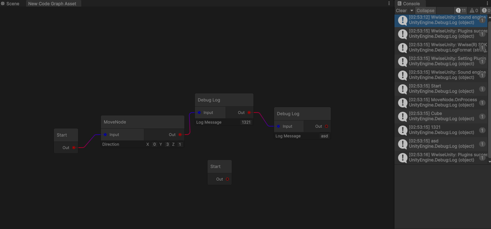

#### 一、Port链接

确认只有一个InputPort ，多个outPort修改逻辑

```c++
 public class CodeEditorNode : Node
{
    private CodeGraphNode m_node;
    public CodeGraphNode Node => m_node;

    private Port m_outputPort;
    private Port m_inputPort;
    private List<Port> m_Ports;


    private SerializedObject m_serializedObject;
    private SerializedProperty m_serializedProperty;
    public List<Port> Ports => m_Ports;
    public Port InputPort => m_inputPort;

private void CreateFlowInputPort()
    {
        m_inputPort = InstantiatePort(Orientation.Horizontal, Direction.Input, Port.Capacity.Single, typeof(PortTypes.FlowPort));
        m_inputPort.portColor = Color.blue; // 设置输入端口颜色
        m_inputPort.portName = "Input";
        m_inputPort.tooltip = "Flow input Port";


        // m_Ports.Add(inputPort);
        inputContainer.Add(m_inputPort);
    }

    private void CreateFlowOutputPort()
    {
        m_outputPort = InstantiatePort(Orientation.Horizontal, Direction.Output, Port.Capacity.Single, typeof(PortTypes.FlowPort));
        m_outputPort.portColor = Color.red; // 设置输出端口颜色
        m_outputPort.portName = "Out";
        m_outputPort.tooltip = "Flow out Port";


        m_Ports.Add(m_outputPort);
        outputContainer.Add(m_outputPort);
    }
 }
```

CodeGraphNode因此Get Next 可以直接从Outport 中获取 

```c++
public virtual string OnProcess(CodeGraphAsset currentGraph)
{
    //先默认只有一个出口
    CodeGraphNode nextNodeInFlow = currentGraph.GetNodeFromOutput(m_guid, 0);
    if (nextNodeInFlow != null)
    {
        return nextNodeInFlow.id;
    }
    return string.Empty;
}
```

Save Connection

```c++
private void CreateEdge(Edge edge)
{
    CodeEditorNode inputNode = (CodeEditorNode)edge.input.node;
    //默认只有一个入口
    // int inputIndex = inputNode.Ports.IndexOf(edge.input);
    int inputIndex = 0;
    CodeEditorNode outputNode = (CodeEditorNode)edge.output.node;
    int outputIndex = outputNode.Ports.IndexOf(edge.output);


    CodeGraphConnection connection = new  CodeGraphConnection(inputNode.Node.id, inputIndex, outputNode.Node.id,outputIndex);
    m_codeGraph.Connections.Add(connection);
}
```

Draw Connection

```c++
private void DrawConnection(CodeGraphConnection connetction)
{
    CodeEditorNode inputNode = GetNode(connetction.inputPort.nodeID);
    CodeEditorNode outputNode = GetNode(connetction.outputPort.nodeID);

    if (inputNode == null || outputNode == null)
    {
        return;
    }

    //默认一个入口 InputPort
    // Port inPort = inputNode.Ports[connetction.inputPort.portIndex];
    Port inPort = inputNode.InputPort;
    Port outPort = outputNode.Ports[connetction.outputPort.portIndex];

    Edge edge = inPort.ConnectTo(outPort);
    AddElement(edge);

    m_CodeGraphConnectionDictionary.Add(edge,connetction);
}
```




#### 二、Data Flow

扩展CodeGraphConnection通过它知道下一个Node， 改为字典存储，避免foreach性能消耗

```c++
namespace Kotono.Code
{
    [System.Serializable]
    public class CodeGraphConnection
    {
        public string  guid;
        public CodeGraphConnectionPort inputPort;
        public CodeGraphConnectionPort outputPort;

        public CodeGraphConnection(string id, CodeGraphConnectionPort input, CodeGraphConnectionPort output)
        {
            this.guid = id;
            this.inputPort = input;
            this.outputPort = output;
        }

        public CodeGraphConnection(string id,string inputPortID, int inputIndex, string outputPortID, int outputIndex)
        {
            this.guid = id;
            this.inputPort = new CodeGraphConnectionPort(inputPortID, inputIndex);
            this.outputPort = new CodeGraphConnectionPort(outputPortID, outputIndex);
        }
    }
    [System.Serializable]
    public struct CodeGraphConnectionPort
    {
        public string nodeID;
        public int portIndex;

        public CodeGraphConnectionPort(string nodeID, int portIndex)
        {
            this.nodeID = nodeID;
            this.portIndex = portIndex;
        }
    }
}
```

##### 2.1 Data Flow

装箱和拆箱的集成

```c++
using UnityEngine;

namespace Kotono.Code
{
    public class KotonoDataFlow : CodeGraphConnection
    {
        private object value;
        
        public KotonoDataFlow(string id, CodeGraphConnectionPort input, CodeGraphConnectionPort output)
            : base(id, input, output)
        {
            value = null; 
        }

        public KotonoDataFlow(string id, string inputPortID, int inputIndex, string outputPortID, int outputIndex)
            : base(id, inputPortID, inputIndex, outputPortID, outputIndex)
        {
            value = null; 
        }

        
        public void SetValue<T>(T data)
        {
            value = data; 
        }

      
        public T GetValue<T>()
        {
            if (value is T)
            {
                return (T)value;  
            }
            else
            {
                Debug.LogWarning($"无法将存储的数据拆箱为类型: {typeof(T)}");
                return default;  // 如果类型不匹配，返回默认值
            }
        }

        // 检查是否有存储的数据
        public bool HasValue()
        {
            return value != null;
        }

        // 重置数据
        public void ClearValue()
        {
            value = null;
        }
    }
}
```

**继承构造函数**：

- `KotonoDataFlow` 继承了 `CodeGraphConnection` 的构造函数，允许传递连接相关的信息（如输入输出端口）。

**`SetValue<T>(T data)`**：泛型方法，用于将任意类型的值存储到 `value` 字段中。

- 这是 **装箱** 操作，因为 `T` 可以是任何类型（包括值类型如 `int` 或引用类型如 `string`），存储在 `object` 类型的 `value` 中。

**`GetValue<T>()`**：泛型方法，用于将 `value` 字段中的数据拆箱并转换为指定类型 `T`。

- 这是 **拆箱** 操作，确保从 `object` 类型还原成具体类型 `T`。

**`HasValue()`**：用于检查 `value` 是否为空，以判断是否存储了有效的数据。

**`ClearValue()`**：用于重置 `value`，清除存储的数据。