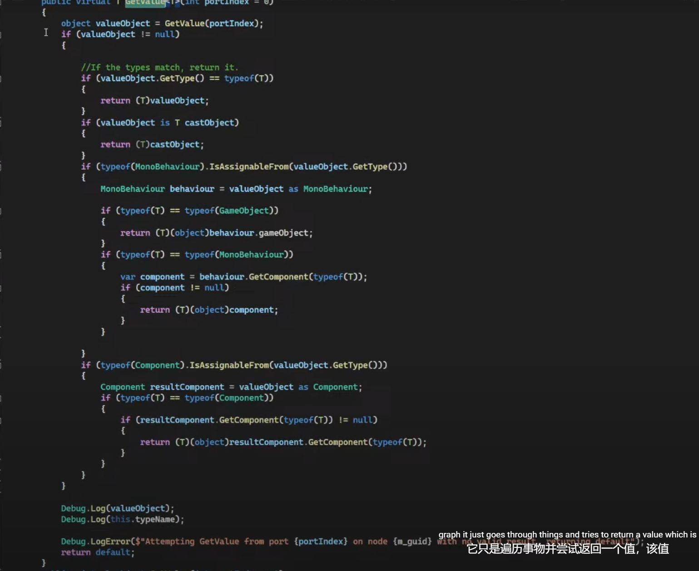
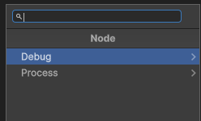
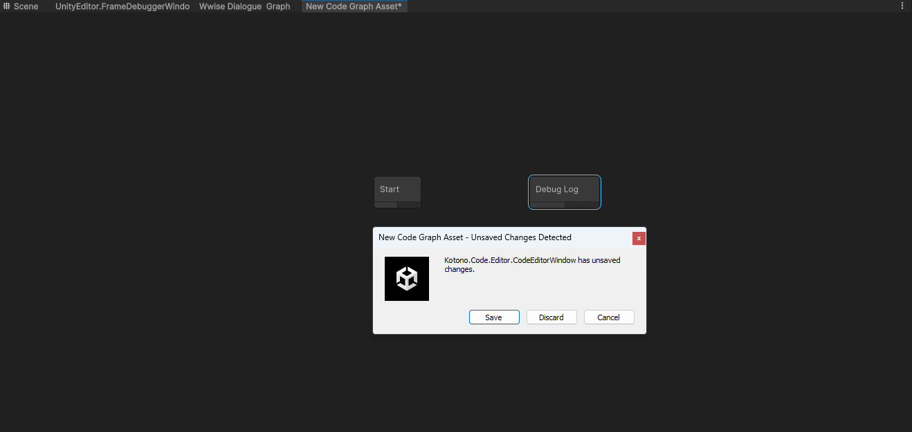
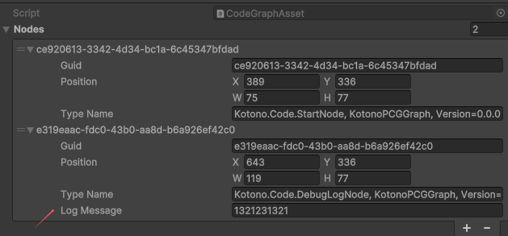

### 一、

<font color=#4db8ff>Link：</font>https://www.youtube.com/watch?v=uXxBXGI-05k&list=PLXD0wONGOSCIVpzPIGMCTCU_h7FW93H_O&index=2

42分钟开始看



#### 1.1 Window

创建一个窗口

```c++
using UnityEditor;
using UnityEngine;

namespace Kotono.Code.Editor
{
    
    public class CodeEditorWindow : EditorWindow
    {
        public static void Open(CodeGraphAsset target)
        {
            CodeEditorWindow[] windows = Resources.FindObjectsOfTypeAll<CodeEditorWindow>();
            foreach (var window in windows)
            {
                if (window.m_currentGraph == target)
                {
                    window.Focus();
                    return;
                }
            }
            
            CodeEditorWindow codeWindow = CreateWindow<CodeEditorWindow>(typeof(CodeEditorWindow),typeof(SceneView));
            codeWindow.titleContent = new GUIContent($"{target.name}",EditorGUIUtility.ObjectContent(null,typeof(CodeEditorWindow)).image);
            codeWindow.Load(target);
        }

        [SerializeField]
        private CodeGraphAsset m_currentGraph;
        [SerializeField]
        private SerializedObject m_serializedGraphAsset;
        [SerializeField]
        private CodeGraphView m_currentGraphView;

        #region Load

        public void Load(CodeGraphAsset target)
        {
            m_currentGraph=  target;
            DrawGraph();
        }

        public void DrawGraph()
        {
            m_serializedGraphAsset = new SerializedObject(m_currentGraph);
            m_currentGraphView = new CodeGraphView();
            rootVisualElement.Add(m_currentGraphView);
        }
        #endregion
    }
}

```

#### 1.2 Asset

随后创建，一个资源

```c++
using UnityEngine;

namespace Kotono.Code
{
    [CreateAssetMenu(menuName = "Kotono/Code Graph Asset")]
    public class CodeGraphAsset : ScriptableObject
    {}
}
```

将窗口打开链接到资源

```c++
using UnityEditor;
using UnityEngine;

namespace Kotono.Code.Editor
{
    [CustomEditor(typeof(CodeGraphAsset))]
    public class CodeGraphAssetEditor : UnityEditor.Editor
    {
        public override void OnInspectorGUI()
        {
            base.OnInspectorGUI();
            if (GUILayout.Button("Open CodeGraph Window"))
            {
                CodeEditorWindow.Open((CodeGraphAsset)target);
            }
        }
    }
}
```

#### 1.3 GraphView

```c++
using UnityEditor;
using UnityEditor.Experimental.GraphView;
using UnityEngine;

namespace Kotono.Code.Editor
{
    public class CodeGraphView : GraphView
    {
        private SerializedObject m_serializedGraphAsset;

        public CodeGraphView(SerializedObject serializedGraphAsset)
        {
            m_serializedGraphAsset = serializedGraphAsset;
            
            GridBackground background = new GridBackground();
            background.name = "Background";
            Add(background);
        }
    }
}

```

##### 1.3.1 序列化

1. 序列化管理

`SerializedObject` 允许你访问和修改 Unity 对象（如 `CodeGraphAsset`）的属性，而不需要直接操作对象的字段。这使得在编辑器中管理对象状态变得更简单和安全。

2. Undo/Redo 功能

在 `Add` 方法中，通过调用 `Undo.RecordObject(m_serializedObject.targetObject, "Add Graph Node")`，`m_serializedObject` 使得对节点的添加操作可以被记录到 Unity 的撤销/重做系统中。这意味着用户可以轻松地撤销或重做添加节点的操作。

3. 更新状态

`m_serializedObject.Update()` 被用来在修改对象后更新序列化状态，确保你所做的更改在序列化系统中是最新的。这是避免出现数据不一致的重要步骤。

4. 序列化字段的访问

使用 `SerializedObject` 还可以方便地访问和修改序列化字段，提供了一种在编辑器中操作 Unity 对象的标准化方式。例如，可以通过 `SerializedProperty` 来访问和设置对象的特定属性。

具体用途

- **添加和修改节点**：在 `Add` 方法中，通过 `m_serializedObject` 来管理节点的添加，确保所有操作都能被撤销/重做。
- **保持数据一致性**：在更新节点时，确保序列化的状态是最新的，以避免数据丢失或不一致。
- **支持自定义编辑器**：当自定义编辑器 UI 时，可以利用 `SerializedObject` 来简化与 Unity 对象的交互。

综上所述，`m_serializedObject` 是一个用于简化序列化和编辑器交互的重要工具，确保节点管理和操作的稳定性和一致性。


#### 1.4 styleSheets

```
this.styleSheets.Add(Resources.Load<StyleSheet>("USS/CodeGraphEditor")); 

public void AddManipulator()
{
    this.AddManipulator(new ContentDragger());
    this.AddManipulator(new SelectionDragger());
    this.AddManipulator(new RectangleSelector());
    this.AddManipulator(new ClickSelector());
}
```

#### 1.5 Node Asset

首先先创建资源保存的数据

Base Node

```c++
using System;
using UnityEditor.Experimental.GraphView;
using UnityEngine;

namespace Kotono.Code
{
    [Serializable]
    public class CodeGraphNode 
    {
      [SerializeField]
      public string m_guid;
      [SerializeField]
      public Rect m_Position;

      public string typeName;

      public string id => m_guid;
      public Rect position => m_Position;

      public CodeGraphNode()
      {
          NewGUID();
      }

      private void NewGUID()
      {
          m_guid = System.Guid.NewGuid().ToString();
          
      }

      private void SetPosition(Rect position)
      {
          m_Position = position;
      }
    }
}

```

##### 1.5.1 StartNode

```
namespace Kotono.Code
{
  	[Uclass("Start","Process/Start")]
    public class StartNode : CodeGraphNode{}
}
```

#### 1.6 反射搜索树

```c++
using System;

namespace Kotono.Code
{
    public class NodeInfoAttribute : Attribute
    {
        private string m_nodeTitle;
        private string m_menuItem;
    
        public string title =>this.m_nodeTitle;
        public string menuItem =>this.m_menuItem;

        public NodeInfoAttribute(string title, string menuItem = " ")
        {
            this.m_nodeTitle = title;
            this.m_menuItem = menuItem;
        }
    }
}
```

首先创建搜索器容器

```c++
public struct SearchContextElement
{
    public object target { get; private set; }
    public string title { get; private set; }

    public SearchContextElement(object target, string title)
    {
        this.target = target;
        this.title = title;
    }
}

public class CodeGraphWindowSearchProvider : ScriptableObject,ISearchWindowProvider
{
    public CodeGraphView graph;
    public VisualElement target;

    public static List<SearchContextElement> elements;

    public List<SearchTreeEntry> CreateSearchTree(SearchWindowContext context)
    {
        List<SearchTreeEntry> tree = new List<SearchTreeEntry>();
        tree.Add(new SearchTreeGroupEntry(new GUIContent("Node"),0));
        elements = new List<SearchContextElement>();
    }
}
```

随后利用程序集反射去判断是否有我们的Attribute

```c++
//程序集搜索
Assembly[] assemblies = AppDomain.CurrentDomain.GetAssemblies();

foreach (var assemblie in assemblies)
{
    foreach (var type in assemblie.GetTypes())
    {
        if (type.CustomAttributes.ToList() != null)
        {
            var attribute = type.GetCustomAttribute(typeof(NodeInfoAttribute));
            if (attribute != null)
            {
                NodeInfoAttribute att = (NodeInfoAttribute)attribute;
                var node = Activator.CreateInstance(type);

                if (string.IsNullOrEmpty(att.menuItem))
                {
                    continue;
                }
                elements.Add(new SearchContextElement(node, att.menuItem));
            }

        }

    }
}
```

随后排序

- `elements.Sort(...)` 使用一个自定义的比较器来对列表进行排序。
- 首先将 `entry1` 和 `entry2` 的 `title` 属性按斜杠（`/`）分割成字符串数组。
- 使用循环比较两个数组的元素：
  - 如果某一数组的长度较短，则它排在后面。
  - 如果某个元素不相等，直接返回比较结果。
  - 如果比较到最后，且长度不相等，则根据数组长度决定排序顺序。

这种排序方式可以实现按节点名称的层级结构进行排序，从而便于在搜索树中显示。

```c++
elements.Sort((entry1, entry2) =>
{
    string[] splits1 = entry1.title.Split('/');
    string[] splits2 = entry2.title.Split('/');
    for (int i = 0; i < splits1.Length; i++)
    {
        if (i >= splits2.Length)
        {
            return 1;
        }
        int value = splits1[i].CompareTo(splits2[i]);

        if (value != 0)
        {
            if (splits1.Length != splits2.Length && (i == splits1.Length - 1 || i == splits2.Length - 1))
            {
                return   splits1.Length <splits2.Length ? 1 : -1;
            }

            return value;
        }
    }

    return 0;

});
```

- 创建一个 `groups` 列表，用于存储已经添加到树中的组名，以避免重复添加。
- 遍历 elements 中的每一个 SearchContextElement：
  - 将每个元素的 `title` 按斜杠（`/`）分割，得到分级结构。
  - 使用 `groupName` 逐级构建每个组名。
  - 如果该组名不在 `groups` 列表中，则创建一个新的 `SearchTreeGroupEntry` 并添加到 `tree` 中，同时将组名记录到 `groups` 中。
  - 最后，将实际的搜索条目（即每个元素的最后部分）添加到树中。

这样做的目的是构建一个分层的搜索树，使用户能够更方便地找到不同类别的节点。

```c++
//基于标题进行遍历
List<string> groups = new List<string>();

foreach (SearchContextElement element in elements)
{
    string[] entryTitle = element.title.Split('/');
    string groupName = "";

    for (int i = 0; i < entryTitle.Length-1; i++)
    {
        groupName += entryTitle[i];
        if (!groups.Contains(groupName))
        {
            //组
            tree.Add(new SearchTreeGroupEntry(new GUIContent(entryTitle[i]),i+1));
            groups.Add(groupName);
        }

        groupName += "/";
    }

    Debug.Log("搜索树 "  +entryTitle.Last());
    //元素
    SearchTreeEntry entry = new SearchTreeEntry(new GUIContent(entryTitle.Last()));
    entry.level = entryTitle.Length;
    entry.userData = new SearchContextElement(element.target, element.title);
    tree.Add(entry);
}
```

##### 1.6.1 构建搜索树

```c++
public class CodeGraphWindowSearchProvider : ScriptableObject,ISearchWindowProvider
{
public CodeGraphView graph;
public VisualElement target;

public static List<SearchContextElement> elements;

public List<SearchTreeEntry> CreateSearchTree(SearchWindowContext context)
{
    List<SearchTreeEntry> tree = new List<SearchTreeEntry>();
    tree.Add(new SearchTreeGroupEntry(new GUIContent("Node"),0));
    elements = new List<SearchContextElement>();

    //程序集搜索
    Assembly[] assemblies = AppDomain.CurrentDomain.GetAssemblies();

    foreach (var assemblie in assemblies)
    {
        foreach (var type in assemblie.GetTypes())
        {
            if (type.CustomAttributes.ToList() != null)
            {
                var attribute = type.GetCustomAttribute(typeof(NodeInfoAttribute));
                if (attribute != null)
                {
                    NodeInfoAttribute att = (NodeInfoAttribute)attribute;
                    var node = Activator.CreateInstance(type);

                    if (string.IsNullOrEmpty(att.menuItem))
                    {
                        continue;
                    }
                    elements.Add(new SearchContextElement(node, att.menuItem));
                }

            }

        }
    }

    //Sort by Name 创建实际的树
    elements.Sort((entry1, entry2) =>
    {
        string[] splits1 = entry1.title.Split('/');
        string[] splits2 = entry2.title.Split('/');
        for (int i = 0; i < splits1.Length; i++)
        {
            if (i >= splits2.Length)
            {
                return 1;
            }
            int value = splits1[i].CompareTo(splits2[i]);

            if (value != 0)
            {
                if (splits1.Length != splits2.Length && (i == splits1.Length - 1 || i == splits2.Length - 1))
                {
                    return   splits1.Length <splits2.Length ? 1 : -1;
                }

                return value;
            }
        }

        return 0;

    });

    //基于标题进行遍历
    List<string> groups = new List<string>();

    foreach (SearchContextElement element in elements)
    {
        string[] entryTitle = element.title.Split('/');
        string groupName = "";

        for (int i = 0; i < entryTitle.Length-1; i++)
        {
            groupName += entryTitle[i];
            if (!groups.Contains(groupName))
            {
                tree.Add(new SearchTreeGroupEntry(new GUIContent(entryTitle[i]),i+1));
                groups.Add(groupName);
            }

            groupName += "/";
        }

        //Debug.log(entryTitle.last())
       SearchTreeEntry entry = new SearchTreeEntry(new GUIContent(entryTitle.Last()));
        entry.level = entryTitle.Length;
        entry.userData = new SearchContextElement(element.target, element.title);
        tree.Add(entry);

    }
    return tree;            
}
```

##### 1.6.2 搜索树创建node

将Userdata传递装箱

```c++
public bool OnSelectEntry(SearchTreeEntry SearchTreeEntry, SearchWindowContext context)
    {
        var windowMousePosition = graph.ChangeCoordinatesTo(graph,context.screenMousePosition - graph.m_EditorWindow.position.position);
        var graphMousePosition = graph.contentViewContainer.WorldToLocal(windowMousePosition);

        SearchContextElement element = (SearchContextElement)SearchTreeEntry.userData;

        CodeGraphNode node = (CodeGraphNode)element.target;
        node.SetPosition(new Rect(graphMousePosition, new Vector2()));
         //在Graph Viwe中添加方法
        graph.Add(node);
        return true;
    }
```

随后在Graph view这里，利用数据先保存，随后创建节点而不是节点去保存

```c++
public void Add(CodeGraphNode node)
{
    Undo.RecordObject(m_serializedObject.targetObject, "Add Graph Node");
    //添加进资源中
    m_codeGraph.Nodes.Add(node);
    m_serializedObject.Update();

    //转换为Node
    AddNodeToGraph(node);
}

public void AddNodeToGraph(CodeGraphNode node)
{
    node.typeName = node.GetType().AssemblyQualifiedName;

    CodeEditorNode editorNode = new CodeEditorNode();
    editorNode.SetPosition(node.position);

    //保存
    m_graphNodes.Add(editorNode);
    m_nodeDictionary.Add(node.id, editorNode);


    AddElement(editorNode);
}
```

其中

node.GetType(): 这个方法用于获取 node 实例的运行时类型。

AssemblyQualifiedName: 这个属性返回一个字符串，包含类型的名称（包括其命名空间）以及定义该类型的程序集名称。格式通常是：

**序列化**：在动态保存或加载类型时。

**反射**：用于动态创建类型的实例或调用方法。

**类型识别**：在你的图形系统中跟踪不同的节点类型。


Graph view添加搜索树

```c++
private CodeGraphAsset m_codeGraph;
        private SerializedObject m_serializedObject;
        
        
        public CodeEditorWindow m_EditorWindow;
        
        //
        public List<CodeEditorNode>  m_graphNodes;
        public Dictionary<string, CodeEditorNode> m_nodeDictionary;
        
        private CodeGraphWindowSearchProvider m_searchProvider;
        
        public CodeGraphView(SerializedObject serializedGraphAsset,CodeEditorWindow CodeEditorWindow)
        {
            m_serializedObject = serializedGraphAsset;
            m_codeGraph =(CodeGraphAsset) m_serializedObject.targetObject;
            m_EditorWindow = CodeEditorWindow;
            
            m_graphNodes = new List<CodeEditorNode>();
            m_nodeDictionary = new Dictionary<string, CodeEditorNode>();
            
            m_searchProvider = ScriptableObject.CreateInstance<CodeGraphWindowSearchProvider>();
            m_searchProvider.graph = this;
            this.nodeCreationRequest = ShowSearchWindow;

            AddManipulator();
            
            GridBackground background = new GridBackground();
            background.name = "Background";
            Add(background);
            
            this.styleSheets.Add(Resources.Load<StyleSheet>("USS/CodeGraphEditor"));
        }

        #region 搜索树
        private void ShowSearchWindow(NodeCreationContext obj)
        {
            m_searchProvider.target = (VisualElement)focusController.focusedElement;
            SearchWindow.Open(new SearchWindowContext(obj.screenMousePosition), m_searchProvider);
        }

        #endregion
```

#### 1.7 Add Node

<font color=#4db8ff>Link：</font>https://www.youtube.com/watch?v=uXxBXGI-05k&list=PLXD0wONGOSCIVpzPIGMCTCU_h7FW93H_O&index=3

1:45:00

```
using UnityEngine;

namespace Kotono.Code
{
    [NodeInfo("Debug Log","Debug/Log Message")]
    public class DebugLogNode : CodeGraphNode
    {}
}

```



在Graph View中

```c++
 public CodeGraphView(SerializedObject serializedGraphAsset,CodeEditorWindow CodeEditorWindow)
{
    GridBackground background = new GridBackground();
    background.name = "Background";
    Add(background);
    //显示节点
    background.SendToBack();
}

public void AddNodeToGraph(CodeGraphNode node)
{
    node.typeName = node.GetType().AssemblyQualifiedName;
    Debug.Log($"节点类型: {node.typeName}");
    //传递数据
    CodeEditorNode editorNode = new CodeEditorNode(node);
    editorNode.SetPosition(node.position);

    //保存
    m_graphNodes.Add(editorNode);
    m_nodeDictionary.Add(node.id, editorNode);

    AddElement(editorNode);
}
```

节点数据

```c++

namespace Kotono.Code.Editor
{
    public class CodeEditorNode : Node
    {
       private CodeGraphNode m_node;
        public CodeEditorNode(CodeGraphNode node)
        {
            this.AddToClassList("code-graph-code");
            
            m_node = node;
            Type typeInfo = node.GetType();
            NodeInfoAttribute info = typeInfo.GetCustomAttribute<NodeInfoAttribute>();
           
            title = info.title;

            string[] depths = info.menuItem.Split('/');
            foreach (string depth in depths)
            {
                this.AddToClassList(depth.ToLower().Replace(' ','-'));
            }
            
            name = typeInfo.Name;
            
            this.AddToClassList("code-graph-code");
        }
    }
}

```

#### 1.8 Draw

因为数据存在了资源上，所以直接打开加载

```c++

public CodeGraphView(SerializedObject serializedGraphAsset,CodeEditorWindow CodeEditorWindow)
{
    m_serializedObject = serializedGraphAsset;
    m_codeGraph =(CodeGraphAsset) m_serializedObject.targetObject;
    m_EditorWindow = CodeEditorWindow;

    m_graphNodes = new List<CodeEditorNode>();
    m_nodeDictionary = new Dictionary<string, CodeEditorNode>();

    m_searchProvider = ScriptableObject.CreateInstance<CodeGraphWindowSearchProvider>();
    m_searchProvider.graph = this;
    this.nodeCreationRequest = ShowSearchWindow;

    AddManipulatorToGraph();

    GridBackground background = new GridBackground();
    background.name = "Background";
    Add(background);

    background.SendToBack();

    this.styleSheets.Add(Resources.Load<StyleSheet>("USS/CodeGraphEditor"));

    //绘制节点
    DrawNodes();
}

#region Draw Node

private void DrawNodes()
{
    foreach (var node in m_codeGraph.Nodes)
    {
        AddNodeToGraph(node);
    }
}


#endregion

```


### 二、

<font color=#4db8ff>Link：</font>https://www.youtube.com/watch?v=iBukERGzEz0&list=PLXD0wONGOSCIVpzPIGMCTCU_h7FW93H_O&index=3

#### 2.1 Onenable

CodeEditorWindow编译自动绘制

```c++
private void OnEnable()
{
    if (m_currentGraph != null)
    {
        DrawGraph();
    }
}
```

#### 2.2 Asset Open

```c++
namespace Kotono.Code.Editor
{
    [CustomEditor(typeof(CodeGraphAsset))]
    public class CodeGraphAssetEditor : UnityEditor.Editor
    {
        //双击资源打开
        [OnOpenAsset]
        public static bool OpenAsset(int instanceID, int line)
        {
            Object asset = EditorUtility.InstanceIDToObject(instanceID);
            if (asset.GetType() == typeof(CodeGraphAsset))
            {
                CodeEditorWindow.Open((CodeGraphAsset)asset);
                return true;
            }

            return false;
        }
        
        public override void OnInspectorGUI()
        {
            base.OnInspectorGUI();
            if (GUILayout.Button("Open CodeGraph Window"))
            {
                CodeEditorWindow.Open((CodeGraphAsset)target);
            }
        }
    }
}

```

#### 2.3 graphviewchange 

##### 2.3.1 Remove

订阅graphViewChanged，随后移除Remove Node，本质是移除数据，所以需要在Node中访问自己的数据

```c++
public CodeGraphView(SerializedObject serializedGraphAsset,CodeEditorWindow CodeEditorWindow)
{
	...
    //绘制节点
    DrawNodes();

    graphViewChanged += OnGraphViewChanged;
}
```

具体逻辑如下

```
#region Graph View Change 删除 增加
private GraphViewChange OnGraphViewChanged(GraphViewChange graphviewchange)
{
    if (graphviewchange.elementsToRemove != null)
    {
        List<CodeEditorNode> nodesToRemove = graphviewchange.elementsToRemove.OfType<CodeEditorNode>().ToList();
        // Debug.Log("remove" + nodesToRemove.Count );
        if (nodesToRemove.Count > 0)
        {
            Undo.RecordObject(m_serializedObject.targetObject, "Remove Node");
            foreach (var node in nodesToRemove)
            {
                RemoveNode(node);
            }
        }

    }


    return graphviewchange;
}

private void RemoveNode(CodeEditorNode NodeData)
{

    m_codeGraph.Nodes.Remove(NodeData.Node);
    m_nodeDictionary.Remove(NodeData.Node.id);
    m_graphNodes.Remove(NodeData);
    m_serializedObject.Update();
}

#endregion
```

##### 2.3.2 Set Position


```c++
if (graphviewchange.movedElements != null)
{
    if (graphviewchange.movedElements != null)
    {
        Undo.RecordObject(m_serializedObject.targetObject, "Move Node");

        List<CodeEditorNode> nodesToMove = graphviewchange.movedElements.OfType<CodeEditorNode>().ToList();
        {
            if (nodesToMove.Count > 0)
            {
                foreach (var node in nodesToMove)
                {
                    node.SvaPosition();
                }
            }
        }
    }

    if (graphviewchange.elementsToRemove != null)
    {
        Undo.RecordObject(m_serializedObject.targetObject, "Remove Node");

        List<CodeEditorNode> nodesToRemove = graphviewchange.elementsToRemove.OfType<CodeEditorNode>().ToList();

        if (nodesToRemove.Count > 0)
        {

            foreach (var node in nodesToRemove)
            {
                RemoveNode(node);
            }
        }

    }
}
```

保存位置

```c++
public class CodeEditorNode : Node
{
   private CodeGraphNode m_node;
   public CodeGraphNode Node => m_node;

    public CodeEditorNode(CodeGraphNode node)
    {
        this.AddToClassList("code-graph-code");

        m_node = node;
        Type typeInfo = node.GetType();
        NodeInfoAttribute info = typeInfo.GetCustomAttribute<NodeInfoAttribute>();

        title = info.title;

        string[] depths = info.menuItem.Split('/');
        foreach (string depth in depths)
        {
            this.AddToClassList(depth.ToLower().Replace(' ','-'));
        }

        name = typeInfo.Name;

        this.AddToClassList("code-graph-code");
    }

    public void SvaPosition()
    {
        m_node.SetPosition(GetPosition());
    }
}
```

#### 2.4 Dirty

```c++
public void DrawGraph()
{
    m_serializedGraphAsset = new SerializedObject(m_currentGraph);
    m_currentGraphView = new CodeGraphView(m_serializedGraphAsset,this);

    //脏标记
    m_currentGraphView.graphViewChanged += OnGraphViweChanged;
    rootVisualElement.Add(m_currentGraphView);
}

private void OnGUI()
{
    if (m_currentGraph != null)
    {
        if( EditorUtility.IsDirty(m_currentGraph))
        {
            this.hasUnsavedChanges = true;
        }
        else
        {
            this.hasUnsavedChanges = false;
        }
    }
}

private GraphViewChange OnGraphViweChanged(GraphViewChange graphviewchange)
{
    EditorUtility.SetDirty(m_currentGraph);
    return graphviewchange;
}
```



#### 2.5 Port

通过Attribute去定义，通过数据去构建Port 而不是自己写死


```c++
namespace Kotono.Code
{
    public class NodeInfoAttribute : Attribute
    {
        private string m_nodeTitle;
        private string m_menuItem;
        private bool m_hasFlowInput;
        private bool m_hasFlowOutput;
        public string title =>this.m_nodeTitle;
        public string menuItem =>this.m_menuItem;
        public bool hasFlowInput => this.m_hasFlowInput;
        public bool hasFlowOutput => this.m_hasFlowOutput;

        public NodeInfoAttribute(string title, string menuItem = " ",bool hasFlowInput = true , bool hasFlowOutput = true)
        {
            this.m_nodeTitle = title;
            this.m_menuItem = menuItem;
            this.m_hasFlowInput = hasFlowInput;
            this.m_hasFlowOutput = hasFlowOutput;
        }
    }
}
```

启动针对节点，通过程序集去抓取

```c++
using System;
using System.Reflection;
using UnityEditor.Experimental.GraphView;


namespace Kotono.Code.Editor
{
    public class CodeEditorNode : Node
    {
       private CodeGraphNode m_node;
       public CodeGraphNode Node => m_node;
        
        private Port m_outputPort;
       private List<Port> m_Ports;
       
        public CodeEditorNode(CodeGraphNode node)
        {
            this.AddToClassList("code-graph-code");
            
            m_node = node;
            Type typeInfo = node.GetType();
            NodeInfoAttribute info = typeInfo.GetCustomAttribute<NodeInfoAttribute>();
           
            title = info.title;

            string[] depths = info.menuItem.Split('/');
            foreach (string depth in depths)
            {
                this.AddToClassList(depth.ToLower().Replace(' ','-'));
            }
            
            name = typeInfo.Name;
            m_Ports = new List<Port>();

            if (info.hasFlowInput)
            {
                CreateFlowInputPort();
            }

            if (info.hasFlowOutput)
            {
                CreateFlowOutputPort();
            }
            
            
            this.AddToClassList("code-graph-code");
        }

        private void CreateFlowOutputPort()
        {
            throw new NotImplementedException();
        }

        private void CreateFlowInputPort()
        {
            throw new NotImplementedException();
        }

        public void SvaPosition()
        {
            m_node.SetPosition(GetPosition());
        }
    }
}

```

自定义Port类型

```c++
private void CreateFlowInputPort()
{
    Port inputPort = InstantiatePort(Orientation.Horizontal, Direction.Input, Port.Capacity.Single, typeof(PortTypes.FlowPort));
    inputPort.portName = "Input";
    inputPort.tooltip = "Flow input Port";
    m_Ports.Add(inputPort);
    inputContainer.Add(inputPort);
}

private void CreateFlowOutputPort()
{
    m_outputPort = InstantiatePort(Orientation.Horizontal, Direction.Output, Port.Capacity.Single, typeof(PortTypes.FlowPort));
    m_outputPort.portName = "Out";
    m_outputPort.tooltip = "Flow out Port";
    m_Ports.Add(m_outputPort);
    outputContainer.Add(m_outputPort);
}
```

#### 2.6 LinkPort

```c++
public override List<Port> GetCompatiblePorts(Port startPort, NodeAdapter nodeAdapter)
{
    List<Port> allPorts = new List<Port>();
    List<Port> ports = new List<Port>();

    foreach (var node in m_graphNodes)
    {
        allPorts.AddRange(node.Ports);
    }

    foreach (Port p in allPorts)
    {
        if(p == startPort) {continue;}
        if (p.node == startPort.node) {continue;}
        if(p.direction == startPort.direction) {continue;}

        if (p.portType == startPort.portType)
        {
            ports.Add(p);
        }  
    }


    return ports;
}
```

#### 2.7 Save Connect

构建数据结构

```c++
namespace Kotono.Code.Editor
{
    [System.Serializable]
    public class CodeGraphConnection
    {
        public CodeGraphConnectionPort inputPort;
        public CodeGraphConnectionPort outputPort;

        public CodeGraphConnection(CodeGraphConnectionPort input, CodeGraphConnectionPort output)
        {
            this.inputPort = input;
            this.outputPort = output;
        }

        public CodeGraphConnection(string inputPortID, int inputIndex, string outputPortID, int outputIndex)
        {
            this.inputPort = new CodeGraphConnectionPort(inputPortID, inputIndex);
            this.outputPort = new CodeGraphConnectionPort(outputPortID, outputIndex);
        }
    }

    public struct CodeGraphConnectionPort
    {
        public string nodeID;
        public int portIndex;

        public CodeGraphConnectionPort(string nodeID, int portIndex)
        {
            this.nodeID = nodeID;
            this.portIndex = portIndex;
        }
    }
}

```

同时写入资源管理器

```c++
using System.Collections.Generic;
using Kotono.Code.Editor;
using UnityEngine;

namespace Kotono.Code
{
    [CreateAssetMenu(menuName = "Kotono/Code Graph Asset")]
    public class CodeGraphAsset : ScriptableObject
    {
        [SerializeReference]
        private List<CodeGraphNode> m_nodes;
        [SerializeReference]
        private List<CodeGraphConnection> m_connections;
        
        
        public List<CodeGraphNode> Nodes => m_nodes;
        public List<CodeGraphConnection> Connections => m_connections;
        
        public CodeGraphAsset()
        {
            m_nodes = new List<CodeGraphNode>();
            m_connections = new List<CodeGraphConnection>();
        }
    }
}
```

同样的在GraphViewChange函数修改和保存

```c++
private GraphViewChange OnGraphViewChanged(GraphViewChange graphviewchange)
{

	 if (graphviewchange.edgesToCreate != null)
    {
        Undo.RecordObject(m_serializedObject.targetObject, "Connection");

        var connections = graphviewchange.edgesToCreate;

        if (connections.Count > 0)
        {
            foreach (var edge in connections)
            {
                CreateEdge(edge);
            }
        }
    }

    return graphviewchange;
}

private void CreateEdge(Edge edge)
{
    CodeEditorNode inputNode = (CodeEditorNode)edge.input.node;
    int inputIndex = inputNode.Ports.IndexOf(edge.input);
    CodeEditorNode outputNode = (CodeEditorNode)edge.output.node;
    int outputIndex = outputNode.Ports.IndexOf(edge.output);


    CodeGraphConnection connection = new  CodeGraphConnection(inputNode.Node.id, inputIndex, outputNode.Node.id,outputIndex);
    m_codeGraph.Connections.Add(connection);
}
```

其中

`inputNode.Ports` 是一个包含 `CodeEditorNode` 输入端口的列表（或集合）。

`edge.input` 是该连接 (`Edge`) 的输入端端口，表示从其他节点连接到当前节点的端口。

`IndexOf(edge.input)` 是在 `inputNode.Ports` 列表中查找 `edge.input` 的索引位置。这个方法会遍历列表中的所有端口，并返回 `edge.input` 在列表中的位置索引（从 `0` 开始）。

#### 2.8 Load Edge

首先需要创建一个数据结构，当添加的时候，可以保存，删除的时候可以保存

```c++
public List<CodeEditorNode>  m_graphNodes;
public Dictionary<string, CodeEditorNode> m_nodeDictionary;
public Dictionary<Edge, CodeGraphConnection> m_CodeGraphConnectionDictionary;

public CodeGraphView(SerializedObject serializedGraphAsset,CodeEditorWindow CodeEditorWindow)
{
     m_graphNodes = new List<CodeEditorNode>();
            m_nodeDictionary = new Dictionary<string, CodeEditorNode>();
            m_CodeGraphConnectionDictionary = new Dictionary<Edge, CodeGraphConnection>();
}
```


```c++
private void DrawConnections()
{
    if (m_codeGraph.Connections == null)
    {
        return;
    }

    foreach (CodeGraphConnection connetction in m_codeGraph.Connections)
    {
        DrawConnection(connetction);
    }
}

private void DrawConnection(CodeGraphConnection connetction)
{
    CodeEditorNode inputNode = GetNode(connetction.inputPort.nodeID);
    CodeEditorNode outputNode = GetNode(connetction.outputPort.nodeID);

    if (inputNode == null || outputNode == null)
    {
        return;
    }

    Port inPort = inputNode.Ports[connetction.inputPort.portIndex];
    Port outPort = outputNode.Ports[connetction.outputPort.portIndex];

    Edge edge = inPort.ConnectTo(outPort);
    AddElement(edge);
    m_CodeGraphConnectionDictionary.Add(edge,connetction);
}

private CodeEditorNode GetNode(string nodeID)
{
    CodeEditorNode node = null;
    m_nodeDictionary.TryGetValue(nodeID, out node);
    return node;
}
```

#### 2.9 Remove Edge


```c++
//移除物体
if (graphviewchange.elementsToRemove != null)
{
    Undo.RecordObject(m_serializedObject.targetObject, "Remove Node");

    List<CodeEditorNode> nodesToRemove = graphviewchange.elementsToRemove.OfType<CodeEditorNode>().ToList();

    if (nodesToRemove.Count > 0)
    {

        foreach (var node in nodesToRemove)
        {
            RemoveNode(node);
        }
    }

    List<Edge> edges = graphviewchange.elementsToRemove.OfType<Edge>().ToList();
    if (edges.Count > 0)
    {
        foreach (Edge edge in edges)
        {
          RemoveConnection(edge);
        }
    }
}
```


```c++
private void RemoveConnection(Edge e)
{
    if (m_CodeGraphConnectionDictionary.TryGetValue(e, out CodeGraphConnection connection))
    {
        m_codeGraph.Connections.Remove(connection);
        m_CodeGraphConnectionDictionary.Remove(e);
    }

}
```

### 三、Execute


一个执行循环节点

```c++
using System;
using UnityEngine;

namespace Kotono.Code
{
    public class CodeGraphObject : MonoBehaviour
    {
        [SerializeField]
        private CodeGraphAsset m_graphAsset;

        private void OnEnable()
        {
            ExecuteAsset(Instantiate(m_graphAsset));
        }

        private void ExecuteAsset(CodeGraphAsset m_graphAsset)
        {
            CodeGraphNode startNode =  m_graphAsset.GetStartNode();
            
            processAndMoveToNextNOde(startNode);
            
         
        }

        private void processAndMoveToNextNOde(CodeGraphNode startNode)
        {
            string nextNodeID =  startNode.OnProcess();
            if (!string.IsNullOrEmpty(nextNodeID))
            {
                CodeGraphNode node = m_graphAsset.GetNode(nextNodeID);
                processAndMoveToNextNOde(node);
            }
        }
    }
}

```

从资源中获取节点

```c++
using System;
using UnityEngine;

namespace Kotono.Code
{
    public class CodeGraphObject : MonoBehaviour
    {
        [SerializeField]
        private CodeGraphAsset m_graphAsset;

        private CodeGraphAsset graphInstance;
        private void OnEnable()
        {
            graphInstance = Instantiate(m_graphAsset);
            ExecuteAsset();
        }

        private void ExecuteAsset()
        {
            graphInstance.Init();
            
            CodeGraphNode startNode =  graphInstance.GetStartNode();
            processAndMoveToNextNode(startNode);
        }

        private void processAndMoveToNextNode(CodeGraphNode startNode)
        {
            string nextNodeID =  startNode.OnProcess();
            if (!string.IsNullOrEmpty(nextNodeID))
            {
                CodeGraphNode node = graphInstance.GetNode(nextNodeID);
                processAndMoveToNextNode(node);
            }
        }
    }
}

```

其中从资源中获取Start

```c++
using System.Collections.Generic;
using System.Linq;
using UnityEngine;

namespace Kotono.Code
{
    [CreateAssetMenu(menuName = "Kotono/Code Graph Asset")]
    public class CodeGraphAsset : ScriptableObject
    {
        [SerializeReference]
        private List<CodeGraphNode> m_nodes;
        [SerializeReference]
        private List<CodeGraphConnection> m_connections;

        private Dictionary<string, CodeGraphNode> m_nodeDictionary;
        
        public List<CodeGraphNode> Nodes => m_nodes;
        public List<CodeGraphConnection> Connections => m_connections;
        
        public CodeGraphAsset()
        {
            m_nodes = new List<CodeGraphNode>();
            m_connections = new List<CodeGraphConnection>();
        }

        public void Init()
        {
            m_nodeDictionary = new Dictionary<string, CodeGraphNode>();
            foreach (var node in Nodes)
            {
                m_nodeDictionary.Add(node.id, node);
            }
        }
        
        public CodeGraphNode GetStartNode()
        {
            StartNode[] startNodes = Nodes.OfType<StartNode>().ToArray();
            if (startNodes.Length == 0)
            {
                Debug.LogError("this not the StartNode");
                return null;
            }
            return startNodes.FirstOrDefault();
        }

        public CodeGraphNode GetNode(string nextNodeID)
        {
            if (m_nodeDictionary.TryGetValue(nextNodeID, out CodeGraphNode node))
            {
                return node;
            }
            return null;
        }
    }
}
```

修改逻辑

```c++
using System;
using UnityEditor.Experimental.GraphView;
using UnityEngine;

namespace Kotono.Code
{
    [Serializable]
    public class CodeGraphNode 
    {
        [SerializeField]
        public string m_guid;
        [SerializeField]
        public Rect m_Position;

        public string typeName;

        public string id => m_guid;
        public Rect position => m_Position;

        public CodeGraphNode()
        {
            NewGUID();
        }

        public void NewGUID()
        {
            m_guid = System.Guid.NewGuid().ToString();
          
        }

        public void SetPosition(Rect position)
        {
            m_Position = position;
        }

        public virtual string OnProcess()
        {
            return string.Empty;
        }

        public virtual void Execute()
        {
            return;
        }
    }
}
```

#### 3.1 Get Next

CodeGraphAsset里面增加函数

```c++
public CodeGraphNode GetNodeFromOutput(string outputNodeId, int index)
{
    foreach (CodeGraphConnection Connection in Connections)
    {
        if (Connection.outputPort.nodeID == outputNodeId && Connection.outputPort.portIndex == index)
        {
            string nodeID = Connection.inputPort.nodeID;
            CodeGraphNode inputNode = m_nodeDictionary[nodeID];
            return inputNode;
        }
    }

    return null;
}
```

随后在CodeGraphNode中调用

```c++
public virtual string OnProcess(CodeGraphAsset currentGraph)
{
    CodeGraphNode nextNodeInFlow = currentGraph.GetNodeFromOutput(m_guid, 0);
    if (nextNodeInFlow != null)
    {
        return nextNodeInFlow.id;
    }
    return string.Empty;
}
```

#### 3.2 Property

创建一个新的Attribute 暴露给Node

```c++
using System;

namespace Kotono.Code
{
    public class ExposedProperty : Attribute
    {
      
    }
}

```

DebugNode

```c++
using UnityEngine;

namespace Kotono.Code
{
    [NodeInfo("Debug Log","Debug/Log Message")]
    public class DebugLogNode : CodeGraphNode
    {
        [ExposedProperty]
        public string logMessage;
        public override string OnProcess(CodeGraphAsset currentGraph)
        {
            Debug.Log(logMessage);
            return base.OnProcess(currentGraph);
        }
    }
}

```

这个时候数据上就会显示



随后在基础的节点上遍历

```c++
using System;
using System.Collections.Generic;
using System.Reflection;
using UnityEditor.Experimental.GraphView;
using UnityEngine;


namespace Kotono.Code.Editor
{
    public class CodeEditorNode : Node
    {
       private CodeGraphNode m_node;
       public CodeGraphNode Node => m_node;
       
       private Port m_outputPort;
       private List<Port> m_Ports;
       
       public List<Port> Ports => m_Ports;
       
        public CodeEditorNode(CodeGraphNode node)
        {
            this.AddToClassList("code-graph-code");
            
            m_node = node;
            Type typeInfo = node.GetType();
            NodeInfoAttribute info = typeInfo.GetCustomAttribute<NodeInfoAttribute>();
           
            title = info.title;
            m_Ports = new List<Port>();
            
            
            string[] depths = info.menuItem.Split('/');
            foreach (string depth in depths)
            {
                this.AddToClassList(depth.ToLower().Replace(' ','-'));
            }
            
            name = typeInfo.Name;

            if (info.hasFlowInput)
            {
                CreateFlowInputPort();
            }

            if (info.hasFlowOutput)
            {
                CreateFlowOutputPort();
            }

            foreach (FieldInfo property in typeInfo.GetFields())
            {
                if (property.GetCustomAttribute<ExposedPropertyAttribute>() is ExposedPropertyAttribute exposedProperty)
                {
                    //抓取参数
                    Debug.Log(property.Name);
                }
            }
            
            RefreshExpandedState();
            RefreshPorts();
            
            this.AddToClassList("code-graph-code");
        }


        private void CreateFlowInputPort()
        {
            Port inputPort = InstantiatePort(Orientation.Horizontal, Direction.Input, Port.Capacity.Single, typeof(PortTypes.FlowPort));
            inputPort.portName = "Input";
            inputPort.tooltip = "Flow input Port";
            m_Ports.Add(inputPort);
            inputContainer.Add(inputPort);
        }
        
        private void CreateFlowOutputPort()
        {
            m_outputPort = InstantiatePort(Orientation.Horizontal, Direction.Output, Port.Capacity.Single, typeof(PortTypes.FlowPort));
            m_outputPort.portName = "Out";
            m_outputPort.tooltip = "Flow out Port";
            m_Ports.Add(m_outputPort);
            outputContainer.Add(m_outputPort);
        }

        public void SvaPosition()
        {
            m_node.SetPosition(GetPosition());
        }
    }
}

```

#### 3.3 PropertyField

主要作用是通过反射（`Reflection`）获取 `CodeGraphNode` 类型中带有 `ExposedPropertyAttribute` 特性的字段，然后使用 `DrawProperty` 方法在编辑器中生成对应的 `PropertyField` 控件，从而允许用户在编辑器中修改这些字段的值。

```c++
foreach (FieldInfo property in typeInfo.GetFields())
{
    if (property.GetCustomAttribute<ExposedPropertyAttribute>() is ExposedPropertyAttribute exposedProperty)
    {
        //抓取参数
        // Debug.Log(property.Name);
        PropertyField field =  DrawProperty(property.Name);

        // field.RegisterValueChangeCallback(OnFieldValueChangeCallback);
    }
}

RefreshExpandedState();
RefreshPorts();
```

**`typeInfo.GetFields()`**：`typeInfo` 是通过 `node.GetType()` 获取的 `CodeGraphNode` 的类型信息。`GetFields()` 方法会返回该类型中所有公共的字段信息 (`FieldInfo`)。

**`property.GetCustomAttribute<ExposedPropertyAttribute>()`**：

这行代码通过 `Reflection` 获取每个字段上是否有 `ExposedPropertyAttribute` 自定义特性。如果字段上确实存在这个特性，它就会被捕获到 `exposedProperty` 变量中。

**`DrawProperty(property.Name)`**：当找到一个字段有 `ExposedPropertyAttribute` 时，会调用 `DrawProperty` 方法，并传入该字段的名称（`property.Name`）。

#### 3.4 Bind

`field.bindingPath = prop.propertyPath;` 这一行代码的作用确实是**<font color="red">同步数据</font>**，确保在编辑器中对 `field` 的修改会直接影响到 `prop`，从而同步修改到 `SerializedObject` 对象的实际数据。


**`bindingPath`**：`PropertyField` 的 `bindingPath` 属性定义了 UI 控件与序列化数据之间的绑定路径。通过设置 `bindingPath`，你让 `PropertyField` 知道它需要绑定和显示 `SerializedProperty` 对应的字段。

**`prop.propertyPath`**：这是 `SerializedProperty` 的属性路径，表示该属性在对象中的路径（通常是一个字符串）。当你通过 `SerializedObject.FindProperty()` 找到 `SerializedProperty` 时，它已经持有了这个路径信息。`propertyPath` 就是 `SerializedObject` 中该属性的唯一标识。

**双向绑定**：当 `PropertyField` 的 `bindingPath` 设置为 `prop.propertyPath` 后：

- **UI到数据的同步**：当你在编辑器中修改 `PropertyField`（UI 控件）中的值时，这些更改会通过 `bindingPath` 自动同步回 `SerializedProperty`。
- **数据到UI的同步**：反过来，当你通过代码或其他方式修改 `SerializedProperty` 的值时，这些变化也会反映在对应的 `PropertyField` 上。


 **工作流程**：

1. **用户修改 `PropertyField`**：当用户在 Unity 编辑器中通过 `PropertyField` 控件修改某个值时，Unity 的序列化系统会自动将这些更改应用到绑定的 `SerializedProperty`，即 `prop`。
2. **`SerializedProperty` 同步到对象**：`SerializedProperty` 本质上是 `SerializedObject` 的一个字段代理，任何对 `SerializedProperty` 的修改都会最终影响到 `SerializedObject` 对象的底层数据。

**代码执行流程总结**：

- **绑定路径**：`field.bindingPath = prop.propertyPath;` 确保了 `PropertyField` 控件和 `SerializedProperty` 之间的数据双向绑定。
- **数据同步**：当编辑器中的 `PropertyField` 发生修改时，`SerializedProperty` 中的数据会同步更新，从而最终影响到实际的序列化对象。

1. **用户修改 `PropertyField`**：当用户在 Unity 编辑器中通过 `PropertyField` 控件修改某个值时，Unity 的序列化系统会自动将这些更改应用到绑定的 `SerializedProperty`，即 `prop`。
2. **`SerializedProperty` 同步到对象**：`SerializedProperty` 本质上是 `SerializedObject` 的一个字段代理，任何对 `SerializedProperty` 的修改都会最终影响到 `SerializedObject` 对象的底层数据。

```c++
private PropertyField DrawProperty(string propertyName)
{
    if (m_serializedProperty == null)
    {
        // 如果还没有序列化的属性对象，先获取它
        FetchSerializedProperty(); 
    }
    // m_serializedProperty.target 是 当前绑定的Node
    SerializedProperty prop = m_serializedProperty.FindPropertyRelative(propertyName);

    PropertyField field = new PropertyField(prop);
    field.bindingPath = prop.propertyPath; // 设置绑定路径
    extensionContainer.Add(field); // 添加字段到UI容器
    return field;
}
```

**`m_serializedObject.FindProperty(propertyName)`**：

- 这里使用 `SerializedObject.FindProperty` 方法通过字段名（`propertyName`）查找与 `SerializedObject` 关联的属性。这个方法会返回一个 `SerializedProperty`，用于在编辑器中与实际的数据绑定。

**`new PropertyField(prop)`**：

- 创建一个 `PropertyField` UI 元素，它负责在 Unity 的 UI 中显示并允许用户修改 `SerializedProperty` 对应的值。`PropertyField` 是 Unity Editor 的 UI 控件，专门用于绑定 `SerializedProperty` 对象。

**`field.bindingPath = prop.propertyPath`**：

- 设置 `PropertyField` 的 `bindingPath`，以确保 UI 和序列化对象之间正确的数据绑定。

**`extensionContainer.Add(field)`**：

- 将生成的 `PropertyField` 添加到 `extensionContainer` 中，`extensionContainer` 可能是节点的某个 UI 容器，负责显示所有的自定义字段。

  

  ```c++
  // 如果还没有序列化的属性对象，先获取它
  private void FetchSerializedProperty()
  {
      // m_serializedProperty.target 是 当前绑定的Graph View
      SerializedProperty nodes = m_serializedObject.FindProperty("m_nodes");
      if (nodes == null)
      {
          Debug.Log("No Nodes found");
      }
  
      if (nodes.isArray)
      {
          int size = nodes.arraySize;
          for (int i = 0; i < size; i++)
          {
              var element = nodes.GetArrayElementAtIndex(i);
              var elementId = element.FindPropertyRelative("m_guid");
              if (elementId.stringValue == m_node.id)
              {
                  m_serializedProperty = element;
              }
          }
      }
  }
  ```

  **小结**：

  `FetchSerializedProperty` 方法的作用是从 `m_nodes` 数组中找到与当前 `m_node` 对象对应的序列化属性，并将它存储在 `m_serializedProperty` 变量中。这保证了后续通过 `SerializedObject` 修改属性时，能够正确定位到当前节点的数据。

  **资源和参数查找的**API总结：

  - **`GetFields()`**：用于获取类型的所有字段信息。
  - **`GetCustomAttribute<T>()`**：用于检查字段是否带有某个自定义特性。
  - **`FindProperty(name)`**：用于在 `SerializedObject` 中通过字段名查找对应的 `SerializedProperty`。
  - **`FindPropertyRelative(name)`**：在数组元素或嵌套对象中查找子属性。

  **总结**：

  - 这段代码首先通过反射获取类的字段，检查字段是否带有 `ExposedPropertyAttribute` 特性。
  - 如果字段带有该特性，代码会使用 `DrawProperty` 创建一个 `PropertyField` 控件，并将其绑定到 `SerializedProperty` 上，以便在编辑器中显示和编辑。
  - 如果需要，代码会通过 `FetchSerializedProperty` 查找与当前节点关联的序列化属性，确保属性和 UI 正确绑定。

```c++
using System;
using System.Collections.Generic;
using System.Reflection;
using UnityEditor;
using UnityEditor.Experimental.GraphView;
using UnityEditor.UIElements;
using UnityEngine;


namespace Kotono.Code.Editor
{
public class CodeEditorNode : Node
{
    private CodeGraphNode m_node;
    public CodeGraphNode Node => m_node;

    private Port m_outputPort;
    private List<Port> m_Ports;

    private SerializedObject m_serializedObject;
    private SerializedProperty m_serializedProperty;
    public List<Port> Ports => m_Ports;

    public CodeEditorNode(CodeGraphNode node,SerializedObject codeGraphObject)
    {
        this.AddToClassList("code-graph-code");

        m_node = node;
        m_serializedObject = codeGraphObject;

        Type typeInfo = node.GetType();
        NodeInfoAttribute info = typeInfo.GetCustomAttribute<NodeInfoAttribute>();

        title = info.title;
        m_Ports = new List<Port>();


        string[] depths = info.menuItem.Split('/');
        foreach (string depth in depths)
        {
            this.AddToClassList(depth.ToLower().Replace(' ','-'));
        }

        name = typeInfo.Name;

        if (info.hasFlowInput)
        {
            CreateFlowInputPort();
        }

        if (info.hasFlowOutput)
        {
            CreateFlowOutputPort();
        }

        foreach (FieldInfo property in typeInfo.GetFields())
        {
            if (property.GetCustomAttribute<ExposedPropertyAttribute>() is ExposedPropertyAttribute exposedProperty)
            {
                //抓取参数
                // Debug.Log(property.Name);
                PropertyField field =  DrawProperty(property.Name);

                // field.RegisterValueChangeCallback(OnFieldValueChangeCallback);
            }
        }

        RefreshExpandedState();
        RefreshPorts();

        this.AddToClassList("code-graph-code");
    }

    // 如果还没有序列化的属性对象，先获取它
    private void FetchSerializedProperty()
    {
        // m_serializedProperty.target 是 当前绑定的Graph View
        SerializedProperty nodes = m_serializedObject.FindProperty("m_nodes");
        if (nodes == null)
        {
            Debug.Log("No Nodes found");
        }

        if (nodes.isArray)
        {
            int size = nodes.arraySize;
            for (int i = 0; i < size; i++)
            {
                var element = nodes.GetArrayElementAtIndex(i);
                var elementId = element.FindPropertyRelative("m_guid");
                if (elementId.stringValue == m_node.id)
                {
                    m_serializedProperty = element;
                }
            }
        }
    }

    private PropertyField DrawProperty(string propertyName)
    {
        if (m_serializedProperty == null)
        {
            // 如果还没有序列化的属性对象，先获取它
            FetchSerializedProperty(); 
        }
        // m_serializedProperty.target 是 当前绑定的Node
        SerializedProperty prop = m_serializedProperty.FindPropertyRelative(propertyName);

        PropertyField field = new PropertyField(prop);
        field.bindingPath = prop.propertyPath; // 设置绑定路径
        extensionContainer.Add(field); // 添加字段到UI容器
        return field;
    }


    private void OnFieldValueChangeCallback(SerializedPropertyChangeEvent evt)
    {
        throw new NotImplementedException();
    }

    #region Port

    private void CreateFlowInputPort()
    {
        Port inputPort = InstantiatePort(Orientation.Horizontal, Direction.Input, Port.Capacity.Single, typeof(PortTypes.FlowPort));
        inputPort.portName = "Input";
        inputPort.tooltip = "Flow input Port";
        m_Ports.Add(inputPort);
        inputContainer.Add(inputPort);
    }

    private void CreateFlowOutputPort()
    {
        m_outputPort = InstantiatePort(Orientation.Horizontal, Direction.Output, Port.Capacity.Single, typeof(PortTypes.FlowPort));
        m_outputPort.portName = "Out";
        m_outputPort.tooltip = "Flow out Port";
        m_Ports.Add(m_outputPort);
        outputContainer.Add(m_outputPort);
    }

    #endregion

    public void SvaPosition()
    {
        m_node.SetPosition(GetPosition());
    }
}
}
```

