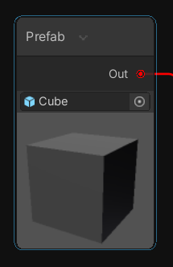

#### API将两个Node相连接

```c++
============== 在GraphView的派生类里实现 ===============
private void AddEdgeByPorts(Port _outputPort, Port _inputPort)
{
    Edge tempEdge = new Edge()
    {
        output = _outputPort,
        input = _inputPort
    };
    tempEdge.input.Connect(tempEdge);
    tempEdge.output.Connect(tempEdge);
    Add(tempEdge);
}
```

#### Element类型

- GraphView类
- Node类
- Edge类
- Pill类：类似一个Capsule，可以放text、icon，两个可选的child VisualElement，如下图所示：
  
- GraphElement
- GraphViewBlackboardWindow
- GraphViewEditorWindow
- GraphViewMinimapWindow
- GraphViewToolWindow
- GridBackground
- Group

- IconBadge
- MiniMap
- Placemat
- Stack
  
- StickyNote(2020.1开始支持)
  
- Token Node: 类似Capsule

额外注意，还有很多基本的UI Element可以用，都是好东西，比如：

- Box
- Label
- Rect
- Bounds
  等等。。

#### ObjectField

```c++
var objField = new ObjectField
{
	objectType = typeof(GameObject),
	allowSceneObjects = false,
	value = prefabNode.output,
};

// 给Object添加预览图
var preview = new Image();
objField.RegisterValueChangedCallback(v => {
	prefabNode.output = objField.value as GameObject;
	UpdatePreviewImage(preview, objField.value);
});


void UpdatePreviewImage(Image image, Object obj)
{
	image.image = AssetPreview.GetAssetPreview(obj) ?? AssetPreview.GetMiniThumbnail(obj);
}
```



#### **代码实现按F的效果**

```c++
GraphView.FrameAll();
```

#### Edge颜色并强制更新

```
// Edge本身的颜色不可以直接更改，需要获取其两端的port, 对port的portColor进行修改

// 强迫更新：
Edge edge;//假设已有Edge
edge.UpdateEdgeControl();
```

#### 高亮GraphView的节点

```c++
MyGraphView.ClearSelection();
MyGraphView.AddToSelection(MyNode);
```

#### 复制粘贴

关于复制粘贴，GraphView默认提供的委托形式如下

- string SerializeGraphElementsDelegate(IEnumerable<GraphElement> elements)，官方的注释是：//Callback for serializing graph elements for copy/paste and other actions.将图元素列表序列化为一个字符串。
- bool CanPasteSerializedDataDelegate(string data)，官方注释：//Ask whether or not the serialized data can be pasted.也就是根据上一步序列化得到的字符串，判断其能否被粘贴。
- void UnserializeAndPasteDelegate(string operationName, string data)，官方注释：//Callback for unserializing graph elements and adding them to the graph.若上一步判断能够粘贴，将序列化得到的字符串反序列化为图元素并放入视图中。

可见Unity对开发者的水平非常自信，认为开发者可以轻松将一堆图元素序列化为一个字符串。遗憾的是笔者的水平不足，只会克隆ScriptableObject。标准的复制粘贴，应该是只复制引用数据，粘贴时才完成拷贝工作。因为工作量较大，笔者还是选用了比较简单的步骤，在复制时就完成拷贝，在粘贴时再次拷贝。

这里使用一个”剪切板“类，用于根据图像元素完成位置和连接的记录。

Link：https://www.shuibo.moe/note/585/


public Port

```c++
int size = portData.sizeInPixel == 0 ? 8 : portData.sizeInPixel;
var connector = this.Q("connector");
var cap = connector.Q("cap");
connector.style.width = size + 8;
connector.style.height = size + 8;
cap.style.width = size ;
cap.style.height = size;

// Update connected edge sizes:
edges.ForEach(e => e.UpdateEdgeSize());
```

