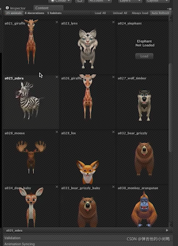
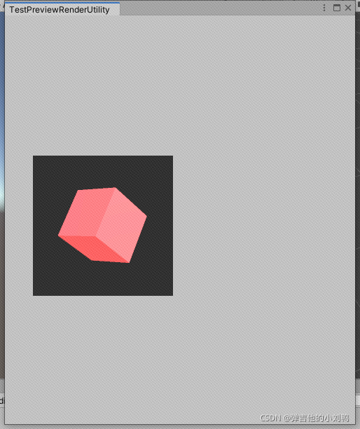
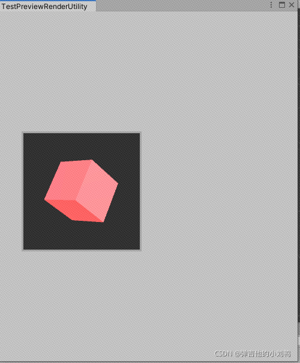
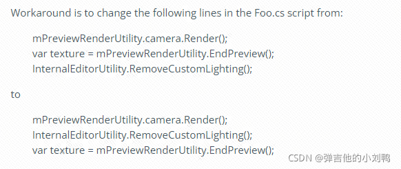
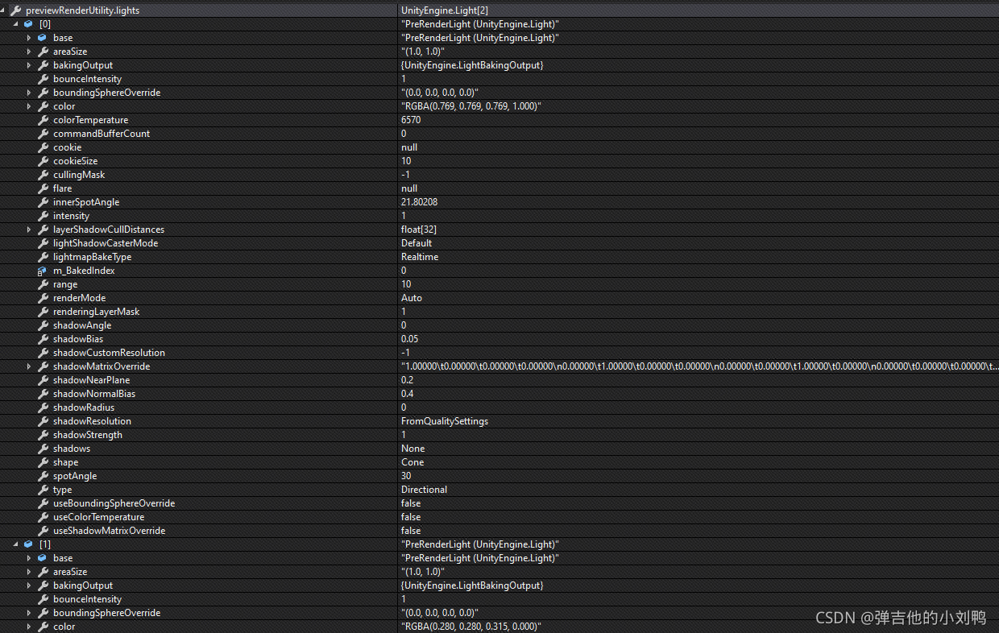
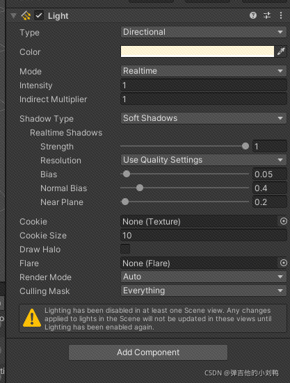

参考：https://answers.unity.com/questions/1332916/any-idea-how-to-use-previewrenderutility.html

代码如下：

```csharp
namespace UnityEditor
{
    public class PreviewRenderUtility
    {
        public Camera m_Camera;					// obsolete
        public float m_CameraFieldOfView;		// obsolete
        public Light[] m_Light;					// obsolete

        public PreviewRenderUtility();
        public PreviewRenderUtility(bool renderFullScene);
        public PreviewRenderUtility(bool renderFullScene, bool pixelPerfect);

        ~PreviewRenderUtility();

        public float cameraFieldOfView { get; set; }
        public Camera camera { get; }
        public Color ambientColor { get; set; }
        public Light[] lights { get; }

        protected static GameObject CreateLight();
        public void AddSingleGO(GameObject go, bool instantiateAtZero);		// obsolete
        public void AddSingleGO(GameObject go);
        public void BeginPreview(Rect r, GUIStyle previewBackground);

        public void BeginPreviewHDR(Rect r, GUIStyle previewBackground);		// obsolete
        public void BeginStaticPreview(Rect r);
        public void BeginStaticPreviewHDR(Rect r);		// obsolete
        public void Cleanup();
        public void DrawMesh(Mesh mesh, Matrix4x4 matrix, Material mat, int subMeshIndex);
        public void DrawMesh(Mesh mesh, Matrix4x4 matrix, Material mat, int subMeshIndex, MaterialPropertyBlock customProperties);
        public void DrawMesh(Mesh mesh, Vector3 pos, Quaternion rot, Material mat, int subMeshIndex);
        public void DrawMesh(Mesh mesh, Vector3 pos, Quaternion rot, Material mat, int subMeshIndex, MaterialPropertyBlock customProperties);
        public void DrawMesh(Mesh mesh, Vector3 pos, Quaternion rot, Material mat, int subMeshIndex, MaterialPropertyBlock customProperties, Transform probeAnchor);
        public void DrawMesh(Mesh mesh, Vector3 pos, Quaternion rot, Material mat, int subMeshIndex, MaterialPropertyBlock customProperties, Transform probeAnchor, bool useLightProbe);
        public void DrawMesh(Mesh mesh, Vector3 pos, Vector3 scale, Quaternion rot, Material mat, int subMeshIndex, MaterialPropertyBlock customProperties, Transform probeAnchor, bool useLightProbe);
        public void DrawMesh(Mesh mesh, Matrix4x4 m, Material mat, int subMeshIndex, MaterialPropertyBlock customProperties, Transform probeAnchor, bool useLightProbe);
        public void EndAndDrawPreview(Rect r);
        public Texture EndPreview();
        public Texture2D EndStaticPreview();
        public float GetScaleFactor(float width, float height);
        public GameObject InstantiatePrefabInScene(GameObject prefab);
        public void Render(bool allowScriptableRenderPipeline = false, bool updatefov = true);
    }
}
```

参考: https://www.programmerall.com/article/925324724/

> With PreviewRenderUtility, you don’t need to create a camera yourself to preview the model in the Editor.
> Note that the default is to use the scene skybox and scene lights. Refer to the ShaderForge editor to configure custom lights
> These Unity all provide interfaces, so you don’t need to create them yourself

这里默认使用场景的skybox和灯光，如果要改，需要去找到ShaderForge的Editor。

参考链接：https://www.youtube.com/watch?v=sd9KotQ2PhA&ab_channel=Unity

在视频的第八分钟，Unity专家在这里自定义了一个参考，鼠标放上去会播放对应的动画略缩图：


核心代码如下：

```csharp
PreviewRenderUtility previewRenderUtility = new PreviewRenderUtility();

void onGUI()
{
	Rect rect = new Rect(40,200,200,200); 
	previewRenderUtility .BeginPreview(rect, "");
	// 直接在onGUI函数里调用DrawMesh(我猜是在Editor Window的子类的onGUI函数里)
	previewRenderUtility .DrawMesh(previewModel.mesh, Vector3.one, Quaternion.identity, previewModel.material,0); 		 
	previewRenderUtility .EndAndDrawPreview(rect);
}
```

## 例子

```csharp
public class TestPreviewRenderUtility : EditorWindow
{
    static Mesh cubeMesh;
    static Material mat;
    static PreviewRenderUtility previewRenderUtility;

    [MenuItem("sss/ggg")]
    public static void OpenWnd()
    {
        var wnd = GetWindow<TestPreviewRenderUtility>();
        wnd.minSize = new Vector2(500, 500);
        wnd.Show();

        // 这里只是为了迅速得到Mesh和Material
        var go = GameObject.CreatePrimitive(PrimitiveType.Cube);
        cubeMesh = go.GetComponent<MeshFilter>().sharedMesh;
        mat = go.GetComponent<MeshRenderer>().sharedMaterial;
        previewRenderUtility = new PreviewRenderUtility();
        DestroyImmediate(go);

        // 设置相机参数
        previewRenderUtility.camera.farClipPlane = 500;
        previewRenderUtility.camera.clearFlags = CameraClearFlags.SolidColor;
        previewRenderUtility.camera.transform.position = new Vector3(0, 0, -10);
    }


    void OnGUI()
    {
        Rect rect = new Rect(40, 200, 200, 200);
        previewRenderUtility.BeginPreview(rect, GUIStyle.none);

        // 使用默认的light, 但是用红色的ambient color
        InternalEditorUtility.SetCustomLighting(previewRenderUtility.lights, new Color(1.0f, 0.0f, 0.0f, 1f));
        previewRenderUtility.DrawMesh(cubeMesh, Matrix4x4.TRS(Vector3.zero, Quaternion.Euler(30, 45, 0), Vector3.one), mat, 0);

        previewRenderUtility.camera.Render();
        InternalEditorUtility.RemoveCustomLighting();

        // 方法一, 直接绘制
	    previewRenderUtility.EndAndDrawPreview(rect);

        // // 方法二, 得到Texture, 再绘制
        //var texture = previewRenderUtility.EndPreview();
        //GUI.Box(rect, texture);
    }
}
```

效果如下图所示，这是方法一的绘制效果，多了个边框：

这是方法二的绘制效果：


额外的参考：
https://github.com/CyberFoxHax/Unity3D_PreviewRenderUtility_Documentation/wiki/PreviewRenderUtility

## 使用CleanUp时的Unity Crash问题

参考这里：https://issuetracker.unity3d.com/issues/editor-crashes-at-findactivelights-when-calling-mpreviewrenderutility-dot-cleanup

应该是Unity的Bug，把EndPreview函数的调用顺序放到RemoveCustomLighting之后即可，如下图所示，这里的代码是上面的Foo例子里的代码：



## 灯光问题

值得注意的是这一行代码：

```csharp
InternalEditorUtility.SetCustomLighting(previewRenderUtility.lights, new Color(1.0f, 0.0f, 0.0f, 1f));
```

也就是说，PreviewRenderUtility的对象，在你new出来之后，是自带了灯光信息的，具体一个`Light[]`的数组，默认为两个Light对象，我Debut进去看了一下，灯光的信息大概是这样：


看了下，Unity的Light类的继承关系：

```javascript
Light : Behaviour : Component : Object
```

说明Light是一个类似MonoBehaviour的东西，应该就是对应的Unity的默认光照组件：

说了这么多，只是为了提一句，这里使用灯光的时候，最好设置一下位置，比如像这样，不然容易看不到东西：

```csharp
previewRenderUtility.lights[0].transform.position = previewRenderUtility.camera.transform.position;
previewRenderUtility.lights[0].transform.rotation = previewRenderUtility.camera.transform.rotation;
```