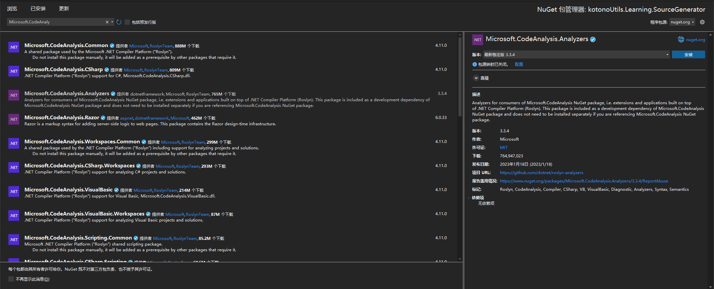
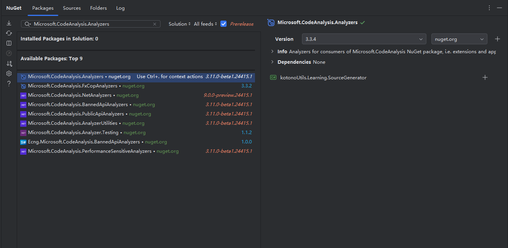
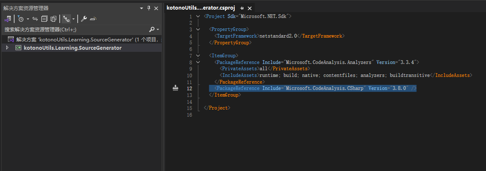
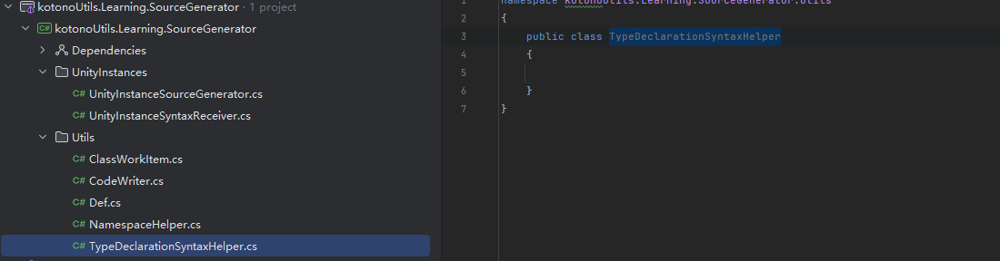
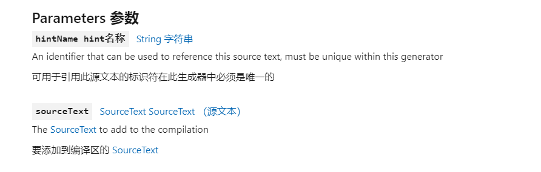

一、创建项目

RoslynAnaiyzer


https://docs.unity3d.com/Manual/roslyn-analyzers.html


选择2.0


#### 1.1 依赖

<font color=#4db8ff>LinK：</font>https://docs.unity3d.com/6000.0/Documentation/Manual/create-source-generator.html

依赖要求

Microsoft.CodeAnalysis.Analyzers







Microsoft.CodeAnalysis.CSharp

需要根据UNity版本选择

显示

```c++
<Project Sdk="Microsoft.NET.Sdk">

  <PropertyGroup>
    <TargetFramework>netstandard2.0</TargetFramework>
  </PropertyGroup>

  <ItemGroup>
    <PackageReference Include="Microsoft.CodeAnalysis.Analyzers" Version="3.3.4">
      <PrivateAssets>all</PrivateAssets>
      <IncludeAssets>runtime; build; native; contentfiles; analyzers; buildtransitive</IncludeAssets>
    </PackageReference>
    <PackageReference Include="Microsoft.CodeAnalysis.CSharp" Version="3.8.0" />
  </ItemGroup>

</Project>

```




#### 2.0 UnityInstances

创建类 UnityInstanceSourceGenerator


```c++
using Microsoft.CodeAnalysis;

namespace kotonoUtils.Learning.SourceGenerator.UnityInstances
{
    
    [Generator] //被编译器捕捉
    public sealed class UnityInstanceSourceGenerator:ISourceGenerator
    {
        //生成监听
        public void Initialize(GeneratorInitializationContext context)
        {
            throw new System.NotImplementedException();
        }

         //发生语法变动会执行
        public void Execute(GeneratorExecutionContext context)
        {
            throw new System.NotImplementedException();
        }
    }
}
```


UnityInstanceSyntaxReceiver

```c++
using Microsoft.CodeAnalysis;

namespace kotonoUtils.Learning.SourceGenerator.UnityInstances
{
    public sealed class UnityInstanceSyntaxReceiver:ISyntaxReceiver
    {
        public void OnVisitSyntaxNode(SyntaxNode syntaxNode)
        {
            throw new System.NotImplementedException();
        }
    }
}
```

其他类

并且全部为 internal Class 

CodeWriter

Def

批量工作定义

ClassWorkItem

命名空间

NamespaceHeler

可输入声明

TypeDeclarationSyntaxHelper




##### 2.2 Def

```c++
namespace kotonoUtils.Learning.SourceGenerator.Utils
{
    internal sealed class Def
    {
        //生成位置                                                                  //换空间生成代码
        public const string Dom_Generateds = "kotonoUtils.Learning.SourceGenerator.Generateds";
        public const string Dom_Declaration = "/// <summary>\r\n ///This is Generated by a Tools, you should avoid make direct modify it.\r\n///</summary>\r\n";

    }
}
```

##### 2.3  ClassWorkItem

 ClassDeclarationSyntax

https://learn.microsoft.com/en-us/dotnet/api/microsoft.codeanalysis.csharp.syntax.classdeclarationsyntax?view=roslyn-dotnet-4.9.0&viewFallbackFrom=netstandard-2.0

```c++
using Microsoft.CodeAnalysis.CSharp.Syntax;

namespace kotonoUtils.Learning.SourceGenerator.Utils
{
    //批量工作定义
    internal sealed class ClassWorkItem
    {
        public readonly ClassDeclarationSyntax ClassDeclarationSyntax;
        public bool IsExits { get; private set; }
        public string TypeName { get; private set; }


        public ClassWorkItem(ClassDeclarationSyntax classDeclarationSyntax)
        {
            ClassDeclarationSyntax = classDeclarationSyntax;
        }

        public void SetTypeName(string typeName)
        {
            TypeName = typeName;
        }

        public void SetIsExits(bool isExits)
        {
            IsExits = isExits;
        }
    }
}
```


#### 三、

##### 3.1 Attribute

生成Attribute


```c++
using kotonoUtils.Learning.SourceGenerator.Utils;
using Microsoft.CodeAnalysis;

namespace kotonoUtils.Learning.SourceGenerator.UnityInstances
{
    
    [Generator] //被编译器捕捉
    public sealed class UnityInstanceSourceGenerator:ISourceGenerator
    {
        public const string UnityInstanceAttributeName = "UnityInstance";
        
        //生成监听
        public void Initialize(GeneratorInitializationContext context)
        {
            throw new System.NotImplementedException();
        }

         //发生语法变动会执行
        public void Execute(GeneratorExecutionContext context)
        {
            //源代码
            string UnityInstanceAttributeSourceText = Def.Dom_Generateds;
        }
    }
}
```

<font color=#4db8ff> Def.Dom_Generateds</font>声明自己是生成的

```c++
using kotonoUtils.Learning.SourceGenerator.Utils;
using Microsoft.CodeAnalysis;
using Microsoft.CodeAnalysis.Text;

namespace kotonoUtils.Learning.SourceGenerator.UnityInstances
{
    
    [Generator] //被编译器捕捉
    public sealed class UnityInstanceSourceGenerator:ISourceGenerator
    {
        public const string UnityInstanceAttributeName = "UnityInstance";
        
        //生成监听
        public void Initialize(GeneratorInitializationContext context)
        {
            throw new System.NotImplementedException();
        }

         //发生语法变动会执行，一定会执行
        public void Execute(GeneratorExecutionContext context)
        {
            //源代码
            string UnityInstanceAttributeSourceText = Def.Dom_Generateds + 
                                                      $@"
            using System;
            namespace {Def.Dom_Generateds}
{{
    //声明Attribute 用于这个Class
    [AttributeUsage(Attribute.Class)]
    public sealed class {UnityInstanceAttributeName}Attribute : Attribute
{{

}}
}}
                                                      ";
            //当前程序集判断，才允许生成
            
            //得到当前已经编译好的结果
            var moduleName = context.Compilation.SourceModule.Name;
            
            if(moduleName.StartsWith("UnityEngine.")) return;
            if(moduleName.StartsWith("UnityEditor.")) return;
            if(moduleName.StartsWith("Unity.")) return;
            
            //生成Attribute 指定编码方式
            var sourceText0 = SourceText.From(UnityInstanceAttributeSourceText, System.Text.Encoding.UTF8);
        }
    }
}
```

这里注册了源代码，需要生效

<font color=#4db8ff>context.AddSource ： </font>https://learn.microsoft.com/en-us/dotnet/api/microsoft.codeanalysis.generatorexecutioncontext.addsource?view=roslyn-dotnet-4.9.0&viewFallbackFrom=netstandard-2.0



```c++
 //发生语法变动会执行，一定会执行
public void Execute(GeneratorExecutionContext context)
{
    //源代码
    string UnityInstanceAttributeSourceText = Def.Dom_Generateds + 
                                              $@"
    using System;
    namespace {Def.Dom_Generateds}
{{
//声明Attribute 用于这个Class
[AttributeUsage(Attribute.Class)]
public sealed class {UnityInstanceAttributeName}Attribute : Attribute
{{

}}
}}
                                              ";
    //当前程序集判断，才允许生成

    //得到当前已经编译好的结果
    var moduleName = context.Compilation.SourceModule.Name;

    if(moduleName.StartsWith("UnityEngine.")) return;
    if(moduleName.StartsWith("UnityEditor.")) return;
    if(moduleName.StartsWith("Unity.")) return;

    //生成Attribute 指定编码方式  注册了源代码  需要生效
    var sourceText0 = SourceText.From(UnityInstanceAttributeSourceText, System.Text.Encoding.UTF8);

    //生效源代码  第一
    context.AddSource($"{UnityInstanceAttributeName}Attribute.Generated.cs", sourceText0);
}
}
}
```

##### 3.2 Initialize

生成了Attribute 需要使用，需要判断逻辑

但是如果脚本没有写东西，没必要生成，所以需要监听，限制

```c++
//注册编辑器 生成监听
public void Initialize(GeneratorInitializationContext context)
{
    //监听
    context.RegisterForSyntaxNotifications(delegate { return new UnityInstanceSyntaxReceiver(); });
}
```

UnityInstanceSyntaxReceiver

```c++
using System.Collections.Generic;
using kotonoUtils.Learning.SourceGenerator.Utils;
using Microsoft.CodeAnalysis;

namespace kotonoUtils.Learning.SourceGenerator.UnityInstances
{
    public sealed class UnityInstanceSyntaxReceiver:ISyntaxReceiver
    {
        //在这里监听 此时已经需要被修改Candidate
        
        //需要被关注的ClassWorkItem 因为Attribute 针对Class 类型使用
        public Dictionary<string,List<ClassWorkItem>> CandidateWorkitems { get; } = new Dictionary<string, List<ClassWorkItem>>();
        
        public void OnVisitSyntaxNode(SyntaxNode syntaxNode)
        {
            throw new System.NotImplementedException();
        }

    }
}
```


```c++
public sealed class UnityInstanceSyntaxReceiver:ISyntaxReceiver
    {
        //在这里监听 此时已经需要被修改Candidate
        
        //需要被关注的ClassWorkItem 因为Attribute 针对Class 类型使用
        public Dictionary<string,List<ClassWorkItem>> CandidateWorkitems { get; } = new Dictionary<string, List<ClassWorkItem>>();
        
        public void OnVisitSyntaxNode(SyntaxNode syntaxNode)
        {
            throw new System.NotImplementedException();
        }

        private static bool TryGetWorkItem(SyntaxNode syntaxNode, out ClassWorkItem item)
        {
            //语法节点是Class的声明类型
            //ClassDeclarationSyntax专门说明定义类型 是Class 类型还是
            // syntaxNode is PropertyDeclarationSyntax
           
            //填什么取决于传进来的东西
            if (syntaxNode is ClassDeclarationSyntax)
            {
                
            }
        }
    }
```

传进来的东西在UnityInstanceSourceGenerator，这里定义了Attribute是Class类型

```c++
//声明Attribute 用于这个Class
[AttributeUsage(Attribute.Class)]
```

后续补充

这段代码的主要目的是在遍历语法树的过程中寻找具有特定属性的类声明。具体来说，它在寻找具有 `UnityInstanceSourceGenerator.UnityInstanceAttributeName` 属性的类声明。让我们逐行解析这段代码：

1. `if (syntaxNode is ClassDeclarationSyntax classDeclarationSyntax && classDeclarationSyntax.AttributeLists.Count > 0)`: 这行代码首先检查当前的语法节点是否是一个类声明（`ClassDeclarationSyntax`），并且这个类声明是否有任何属性（`AttributeLists.Count > 0`）。
2. `var attributes = from attributeList in classDeclarationSyntax.AttributeLists from attribute in attributeList.Attributes select attribute;`: 这行代码使用 LINQ 查询从所有的属性列表中获取所有的属性。
3. `var item = new ClassWorkItem(classDeclarationSyntax);`: 这行代码创建一个新的 `ClassWorkItem` 实例，将当前的类声明作为参数传入。
4. `foreach (var attribute in attributes)`: 这行代码遍历所有的属性。
5. `var attributeName = attribute.Name.ToString();`: 这行代码获取当前属性的名称。
6. 在 `switch` 语句中，它检查当前属性的名称是否等于 `UnityInstanceSourceGenerator.UnityInstanceAttributeName` 或者 `UnityInstanceSourceGenerator.UnityInstanceAttributeName + "Attribute"`，或者这个名称是否包含了 `Def.Dom_Generateds + "." + UnityInstanceSourceGenerator.UnityInstanceAttributeName` 或者 `Def.Dom_Generateds + "." + UnityInstanceSourceGenerator.UnityInstanceAttributeName + "Attribute"`。如果是，那么它就认为找到了具有特定属性的类声明。
7. `item.SetIsExits(true);`: 如果找到了具有特定属性的类声明，那么它就将 `ClassWorkItem` 实例的 `IsExits` 属性设置为 `true`。

这段代码的目的是为了找出所有具有特定属性的类声明，并将这些信息存储在 `ClassWorkItem` 实例中。这可能是为了在后续的代码生成阶段使用这些信息。


```c++
using System.Collections.Generic;
using System.Linq;
using System.Text;
using kotonoUtils.Learning.SourceGenerator.Utils;
using Microsoft.CodeAnalysis;
using Microsoft.CodeAnalysis.CSharp.Syntax;

namespace kotonoUtils.Learning.SourceGenerator.UnityInstances
{
    public sealed class UnityInstanceSyntaxReceiver:ISyntaxReceiver
    {
        public Dictionary<string,List<ClassWorkItem>> CandidateWorkItems { get; } = new Dictionary<string, List<ClassWorkItem>>();
        //在这里监听 此时已经需要被修改Candidate
        
        //需要被关注的ClassWorkItem 因为Attribute 针对Class 类型使用
        
        //语法通知
        public void OnVisitSyntaxNode(SyntaxNode syntaxNode)
        {
            if (TryGetWorkItem(syntaxNode, out var workItem))
            {
                if (CandidateWorkItems.ContainsKey(workItem.TypeName))
                {
                    CandidateWorkItems[workItem.TypeName].Add(workItem);
                }
                else
                {
                    CandidateWorkItems.Add(workItem.TypeName,new List<ClassWorkItem>{workItem});
                }
            }
        }

        private static bool TryGetWorkItem(SyntaxNode syntaxNode, out ClassWorkItem workItem)
        {
            //语法节点是Class的声明类型
            //ClassDeclarationSyntax专门说明定义类型 是Class 类型还是
            // syntaxNode is PropertyDeclarationSyntax
           
            //填什么取决于传进来的东西
            //传进来的东西在UnityInstanceSourceGenerator，这里定义了Attribute是Class类型
            if (syntaxNode is ClassDeclarationSyntax classDeclarationSyntax &&
                classDeclarationSyntax.AttributeLists.Count > 0)
            {
                var attributes = 
                    from attributeList in classDeclarationSyntax.AttributeLists    
                    from attribute in attributeList.Attributes
                    select attribute;

                var item = new ClassWorkItem(classDeclarationSyntax);
                foreach (var attribute in attributes)
                {
                    var attributeName = attribute.Name.ToString();

                    //检查是否出现
                    switch (attributeName)
                    {
                        case var name when name ==  UnityInstanceSourceGenerator.UnityInstanceAttributeName ||
                                           name ==  UnityInstanceSourceGenerator.UnityInstanceAttributeName  + "Attribute" ||
                                           name ==  Def.Dom_Generateds + "." + UnityInstanceSourceGenerator.UnityInstanceAttributeName   ||
                                           name ==  Def.Dom_Generateds + "." + UnityInstanceSourceGenerator.UnityInstanceAttributeName  + "Attribute":
                            
                            //找到了
                            item.SetIsExits(true);
                                                    
                           break;
                    }
                }

                if (item.IsExits)
                {
                    //可输入  利用声明语法转化为Type
                    var typeDeclarationSyntax = item.ClassDeclarationSyntax as TypeDeclarationSyntax;
                    var typeName = new StringBuilder()
                        .Append("partial ")
                        .Append(typeDeclarationSyntax.Keyword.ValueText)
                        .Append(" ")
                        //类的名字
                        .Append(typeDeclarationSyntax.Identifier.ToString())
                        .Append(typeDeclarationSyntax.TypeParameterList)
                        .Append(" ")
                        .Append(typeDeclarationSyntax.ConstraintClauses.ToString());
                    
                    item.SetTypeName(typeName.ToString());
                    workItem = item;
                    return true;
                }
            }
            
            workItem = null;
            return false;
        }
    }
}
```


